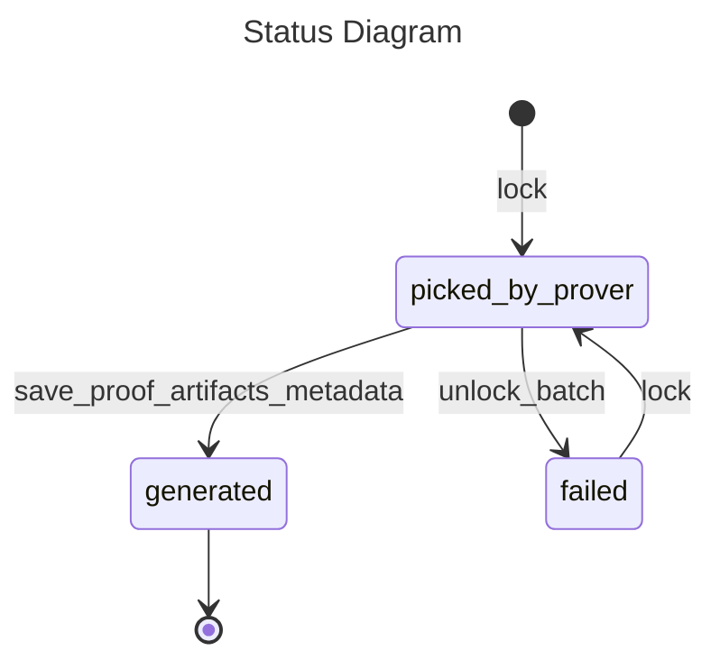

# AirbenderProofGenerationDal

## Table Name

`airbender_proof_generation_details`

## `status` Diagram

```mermaid
---
title: Status Diagram
---
stateDiagram-v2
[*] --> picked_by_prover : lock
picked_by_prover --> generated : save_proof_artifacts_metadata
picked_by_prover --> failed : unlock_batch
failed --> picked_by_prover : lock
generated --> [*]
```
