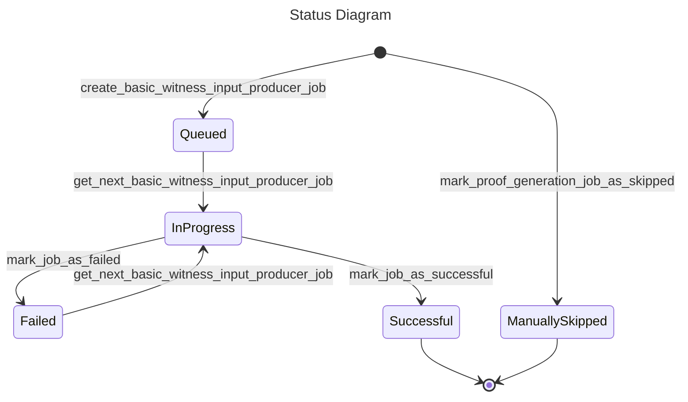

# BasicWitnessInputProducerDal

## Table Name

basic_witness_input_producer_jobs

## `status` Diagram

```mermaid
---
title: Status Diagram
---
stateDiagram-v2
    [*] --> Queued : create_basic_witness_input_producer_job
    Queued --> InProgress : get_next_basic_witness_input_producer_job
    Failed --> InProgress : get_next_basic_witness_input_producer_job

    InProgress --> Successful : mark_job_as_successful
    InProgress --> Failed : mark_job_as_failed
    Successful --> [*]

    [*] --> ManuallySkipped : mark_proof_generation_job_as_skipped
    ManuallySkipped --> [*]

```
