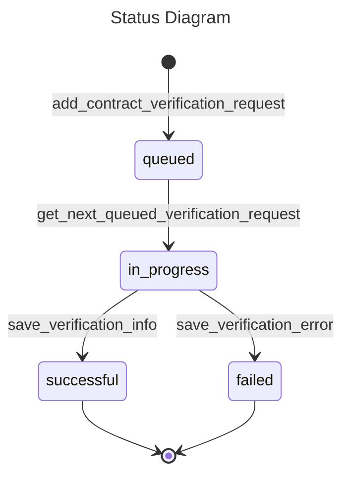

# ContractVerificationDal

## Table Name

contract_verification_requests

## `status` Diagram

```mermaid
---
title: Status Diagram
---
stateDiagram-v2
    [*] --> queued : add_contract_verification_request
    queued --> in_progress : get_next_queued_verification_request

    in_progress --> successful : save_verification_info
    in_progress --> failed : save_verification_error
    successful --> [*]
    failed --> [*]
```
