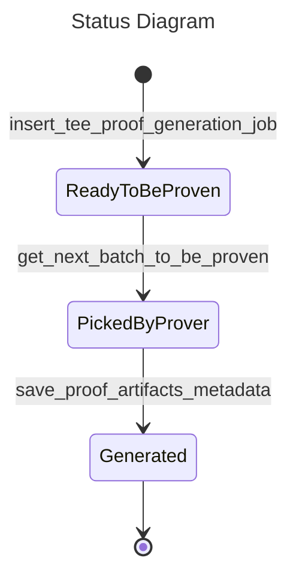

# ProofGenerationDal

## Table Name

proof_generation_details

## `status` Diagram

```mermaid
---
title: Status Diagram
---
stateDiagram-v2
[*] --> ReadyToBeProven : insert_tee_proof_generation_job
ReadyToBeProven --> PickedByProver : get_next_batch_to_be_proven
PickedByProver --> Generated : save_proof_artifacts_metadata
Generated --> [*]

```
