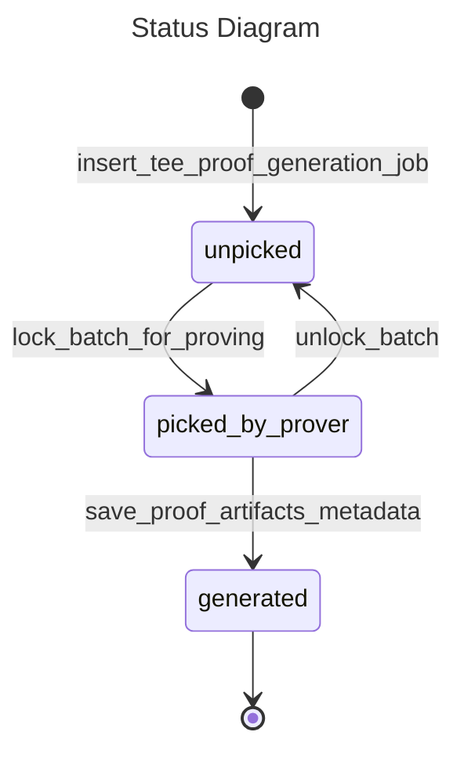

# TeeProofGenerationDal

## Table Name

`tee_proofs`

## `status` Diagram

```mermaid
---
title: Status Diagram
---
stateDiagram-v2
[*] --> unpicked : insert_tee_proof_generation_job
unpicked --> picked_by_prover : lock_batch_for_proving
picked_by_prover --> generated : save_proof_artifacts_metadata
picked_by_prover --> unpicked : unlock_batch
generated --> [*]
```
