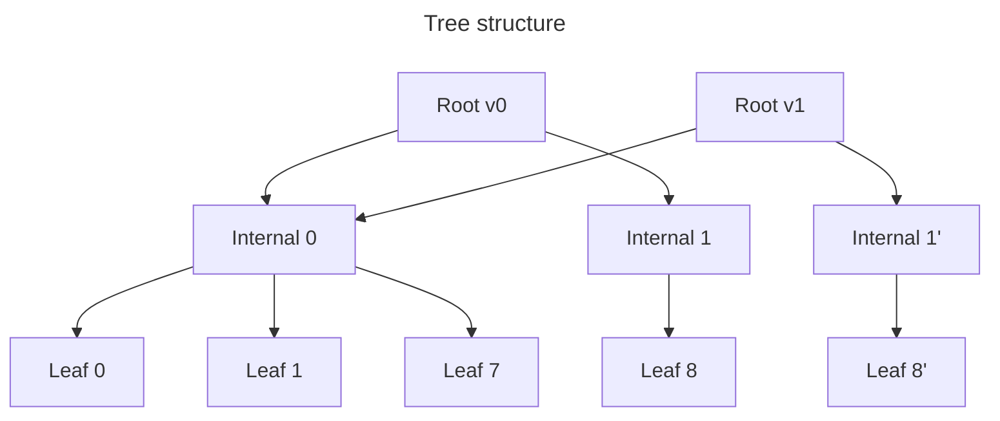

# Persistent ZK OS Merkle tree

Dense, doubly linked Merkle tree implementation with parameterized depth and amortization factor.

## Construction

- The tree is a dense binary Merkle tree with parametric depth (the default depth is currently set to 64; i.e., up to
  `2 ** 64` leaves).
- Hash function is parametric as well; the default one is Blake2s with 256-bit output. The tree is always considered to
  have fixed depth (i.e., no reduced hashing for lightly populated trees).
- The order of leaves is the insertion order; leaves are never removed from the tree.
- Leaves emulate a linked list. I.e., each leaf holds beside a 32-byte key and 32-byte value, 0-based index in the tree
  to a leaf with the lexicographically next key.
- There are 2 pre-inserted guard leaves with min / max keys (i.e., `[0_u8; 32]` and `[u8::MAX; 32]`). As such, all
  “real” leaves always have the next pointer well-defined.

Hashing specification:

```text
hash(leaf) = blake2s(leaf.key ++ leaf.value ++ leaf.next.to_le_bytes());
hash(node) = blake2s(hash(node.left) ++ hash(node.right));
```

where `++` is byte concatenation.

## Storage layout

RocksDB is used for tree persistence. The implementation uses versioning and parametric amortization strategy similar to
[Jellyfish Merkle tree] to reduce the amount of I/O at the cost of increased hashing. Here, parametric means that the
radix of internal nodes is configurable (obviously, it's fixed for a specific tree instance). More details on what
amortization means follow.

A tree is _versioned_; a new version is created for each batch update, and all past versions are available. (This is
necessary to be able to provide Merkle proofs for past versions.) Internally, the forest of all tree versions is built
like an immutable data structure, with tree nodes reused where possible (i.e., if not changed in an update).

As expected, the Merkle tree consists of leaves and internal nodes; the tree root is a special case of internal node
with additional data (for now, it's just the number of leaves).

- A **leaf** consists of a key, value and next index as expected.
- **Internal nodes** consist of refs to children; each ref is a version + hash. To reduce the amount of I/O ops (at the
  cost of read / write volume overhead), an internal node contains >2 child refs; that's what the radix mentioned above
  means (e.g., in a radix-8 tree each internal node _usually_ contains 8 child refs, with the only possible exception
  being the rightmost node on each tree level).

E.g., here's a radix-8 amortized tree with 2 versions and toy depth 8 (i.e., 1 internal node level excluding the root,
and 1 leaf level). The first version inserts 9 leaves, and the second version updates the last leaf.



Tree nodes are mapped to the RocksDB column family (CF) using _node keys_ consisting of a version, the number of
_nibbles_ (root has 0, its children 1 etc.), and the 0-based index on the level. Without pruning, it's easy to see that
storage is append-only.

Besides the tree, RocksDB also persists the key to leaf index lookup in a separate CF. This lookup is used during
updates and to get historic Merkle proofs. To accommodate for historic proofs, CF values contain the version at which
the leaf was inserted besides its index; leaves with future versions are skipped during lookup. The lookup CF is
insert-only even with pruning; the only exception is tree truncation. Unlike the tree CF, inserted entries are not
ordered though.

## Benchmarking

The `loadtest` example is a CLI app allowing to measure tree performance. It allows using the in-memory or RocksDB
storage backend, and Blake2s or no-op hashing functions. For example, the following command launches a benchmark with
1,000 batches each containing 4,000 insertions and 16,000 updates (= 20,000 writes / batch; 4M inserts in total),
generating an insertion proof for each batch.

```shell
RUST_LOG=debug cargo run --release \
  -p zk_os_merkle_tree --example loadtest_zk_os_merkle_tree -- \
  --updates=16000 --chunk-size=500 --proofs 1000 4000
```

The order of timings should be as follows (measured on MacBook Pro with 12-core Apple M2 Max CPU and 32 GB DDR5 RAM
using the command line above):

```text
2025-03-06T13:22:11.424921Z  INFO loadtest: Processing block #999
2025-03-06T13:22:11.446972Z DEBUG zk_os_merkle_tree::storage::rocksdb: completed looking up keys in RocksDB, get_latency: 13.920959ms, iterators_latency: 8.026958ms
2025-03-06T13:22:11.447005Z DEBUG zk_os_merkle_tree::storage::patch: loaded lookup info, elapsed: 21.989917ms
2025-03-06T13:22:11.520249Z DEBUG zk_os_merkle_tree::storage::patch: loaded tree nodes, elapsed: 71.171667ms, distinct_indices.len: 23957
2025-03-06T13:22:11.520980Z DEBUG zk_os_merkle_tree: loaded tree data, elapsed: 95.991375ms, inserts: 4000, updates: 16000, reads: 0, missing_reads: 0, loaded_internal_nodes: 52014
2025-03-06T13:22:11.544711Z DEBUG zk_os_merkle_tree::storage::patch: collected hashes for batch proof, hash_latency: 8.357416ms, traverse_latency: 13.081128ms
2025-03-06T13:22:11.544736Z DEBUG zk_os_merkle_tree: created batch proof, elapsed: 23.742333ms, proof.leaves.len: 23957, proof.hashes.len: 156163
2025-03-06T13:22:11.548526Z DEBUG zk_os_merkle_tree: updated tree structure, elapsed: 3.782583ms
2025-03-06T13:22:11.555859Z DEBUG zk_os_merkle_tree: hashed tree, elapsed: 7.317958ms
2025-03-06T13:22:11.573310Z DEBUG zk_os_merkle_tree::storage::rocksdb: writing to RocksDB, total_size: 18170664, new_leaves: 4000, total_leaves: 27957, total_internal_nodes: 52587, copied_hashes: 340018
2025-03-06T13:22:11.619629Z DEBUG zk_os_merkle_tree: persisted tree, elapsed: 63.751166ms
2025-03-06T13:22:11.620027Z  INFO loadtest: Processed block #999 in 195.059833ms, root hash = 0xad654212e304280b5110ca6b7135e9c24e0a0adb9ba02ea19e47a661a7461bd3
2025-03-06T13:22:11.620035Z  INFO loadtest: Verifying tree consistency...
2025-03-06T13:22:34.016518Z  INFO loadtest: Verified tree consistency in 22.396118375s
2025-03-06T13:22:34.016931Z  INFO loadtest: estimated DB size, cf: Tree, size: SizeStats { live_data_size: 13507730612, total_sst_size: 13643167327, total_mem_table_size: 19924992, block_cache_size: 8361730, index_and_filters_size: 188981940, files_at_level: [2, 2, 19, 81, 0, 0, 0] }
2025-03-06T13:22:34.016961Z  INFO loadtest: estimated DB size, cf: KeyIndices, size: SizeStats { live_data_size: 172022529, total_sst_size: 189695030, total_mem_table_size: 4196352, block_cache_size: 8272884, index_and_filters_size: 5607953, files_at_level: [1, 3, 0, 0, 0, 0, 0] }
```

I.e., latency is dominated by I/O (~10% for key–index lookup, ~35% for loading tree nodes, and ~30% for tree
persistence).

### Optimal internal node depth

Internal node depth (= amortization radix of the tree) is the only tree param not set externally. It influences the I/O
and compute overhead:

- Higher amortization radix generally means more data duplication, i.e. more data loaded before tree update and more
  data written on update.
- OTOH, the number of distinct RocksDB keys loaded / written decreases with the amortization radix.
- Higher radix means more hash computations to create proofs.

On local benchmarks, it looks like a radix-8 tree is preferable to radix-16 or radix-4, providing comparable or better
performance, and having lower I/O overhead than the radix-16 tree. This is in contrast with the Era tree / original
Jellyfish tree, in which radix-16 amortization is preferable. This can be explained by the fact that as a dense tree,
internal nodes are almost always full; in the sparse Era tree, internal nodes deep in the tree (i.e., the vast majority
of all internal nodes) are statistically half-full.

<details>
<summary>Benchmark details</summary>

Two workloads were used: **small** (1,000 blocks x 4k reads + 16k updates / block) and **large** (100 blocks x 40k
reads + 160k updates / block), each with and without generating batch update proofs for each block.

Total block processing latency at the end of the run:

| Setup            | Radix-4 | Radix-8 | Radix-16 |
| :--------------- | ------: | ------: | -------: |
| Small, proofs    |   240ms |   200ms |    230ms |
| Small, no proofs |   220ms |   180ms |    200ms |
| Large, proofs    |   1.61s |   1.35s |    1.41s |
| Large, no proofs |   1.44s |   1.21s |    1.19s |

Size of the nodes CF at the end of the run:

| Setup | Radix-4 | Radix-8 | Radix-16 |
| :---- | ------: | ------: | -------: |
| Small | 12.0 GB | 13.5 GB |  17.4 GB |
| Large |  6.2 GB |  6.4 GB |   7.1 GB |

</details>

[jellyfish merkle tree]: https://developers.diem.com/papers/jellyfish-merkle-tree/2021-01-14.pdf
