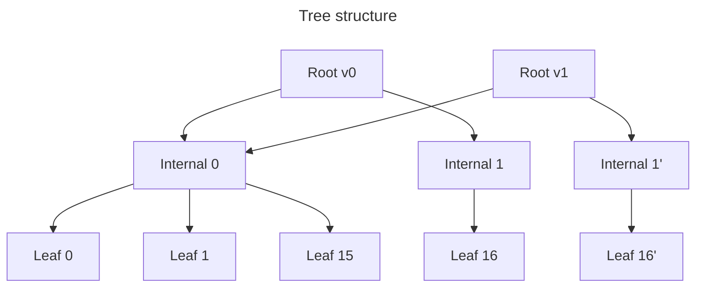

# Persistent ZK OS Merkle tree

Dense, doubly linked Merkle tree implementation with parameterized depth and amortization factor.

## Construction

- The tree is a dense binary Merkle tree with parametric depth (the default depth is currently set to 64; i.e., up to
  `2 ** 64` leaves).
- Hash function is parametric as well; the default one is Blake2s with 256-bit output. The tree is always considered to
  have fixed depth (i.e., no reduced hashing for lightly populated trees).
- The order of leaves is the insertion order; leaves are never removed from the tree.
- Leaves emulate a linked list. I.e., each leaf holds beside a 32-byte key and 32-byte value, 0-based indices in the
  tree to leaves with lexicographically previous and next keys.
- There are 2 pre-inserted guard leaves with min / max keys (i.e., `[0_u8; 32]` and `[u8::MAX; 32]`). As such, all
  “real” leaves always have previous / next pointers well-defined.

Hashing specification:

```text
hash(leaf) = blake2s(
  leaf.key ++ leaf.value ++ leaf.prev.to_le_bytes() ++ leaf.next.to_le_bytes()
);
hash(node) = blake2s(hash(node.left) ++ hash(node.right));
```

where `++` is byte concatenation.

## Storage layout

RocksDB is used for tree persistence. The implementation uses versioning and parametric amortization strategy similar to
[Jellyfish Merkle tree] to reduce the amount of I/O at the cost of increased hashing. Here, parametric means that the
radix of internal nodes is configurable (obviously, it's fixed for a specific tree instance). More details on what
amortization means follow.

A tree is _versioned_; a new version is created for each batch update, and all past versions are available. (This is
necessary to be able to provide Merkle proofs for past versions.) Internally, the forest of all tree versions is built
like an immutable data structure, with tree nodes reused where possible (i.e., if not changed in an update).

As expected, the Merkle tree consists of leaves and internal nodes; the tree root is a special case of internal node
with additional data (for now, it's just the number of leaves).

- A **leaf** consists of a key, value and prev / next indices as expected.
- **Internal nodes** consist of refs to children; each ref is a version + hash. To reduce the amount of I/O ops (at the
  cost of read / write volume overhead), an internal node contains >2 child refs; that's what the radix mentioned above
  means (e.g., in a radix-16 tree each internal node _usually_ contains 16 child refs, with the only possible exception
  being the rightmost node on each tree level).

E.g., here's a radix-16 amortized tree with 2 versions and toy depth 8 (i.e., 1 internal node level excluding the root,
and 1 leaf level). The first version inserts 17 leaves, and the second version updates the last leaf.



Tree nodes are mapped to the RocksDB column family (CF) using _node keys_ consisting of a version, the number of
_nibbles_ (root has 0, its children 1 etc.), and the 0-based index on the level. Without pruning, it's easy to see that
storage is append-only.

Besides the tree, RocksDB also persists the key to leaf index lookup in a separate CF. This lookup is used during
updates and to get historic Merkle proofs. To accommodate for historic proofs, CF values contain the version at which
the leaf was inserted besides its index; leaves with future versions are skipped during lookup. The lookup CF is
insert-only even with pruning; the only exception is tree truncation. Unlike the tree CF, inserted entries are not
ordered though.

## Benchmarking

The `loadtest` example is a CLI app allowing to measure tree performance. It allows using the in-memory or RocksDB
storage backend, and Blake2s or no-op hashing functions. For example, the following command launches a benchmark with
1,000 batches each containing 4,000 insertions and 16,000 updates (= 20,000 writes / batch; 4M inserts in total),
generating an insertion proof for each batch.

```shell
RUST_LOG=debug cargo run --release \
  -p zk_os_merkle_tree --example loadtest_zk_os_merkle_tree -- \
  --updates=16000 --chunk-size=500 --proofs 1000 4000
```

The order of timings should be as follows (measured on MacBook Pro with 12-core Apple M2 Max CPU and 32 GB DDR5 RAM
using the command line above):

```text
2025-02-19T11:06:24.736870Z  INFO loadtest: Processing block #999
2025-02-19T11:06:24.813829Z DEBUG zk_os_merkle_tree::storage::patch: loaded lookup info, elapsed: 76.89375ms
2025-02-19T11:06:24.908340Z DEBUG zk_os_merkle_tree::storage::patch: loaded nodes, elapsed: 93.501125ms, distinct_indices.len: 23967
2025-02-19T11:06:24.908994Z DEBUG zk_os_merkle_tree: loaded tree data, elapsed: 172.085ms, inserts: 4000, updates: 16000, loaded_internal_nodes: 36294
2025-02-19T11:06:24.936667Z DEBUG zk_os_merkle_tree::storage::patch: collected hashes for batch proof, hash_latency: 15.131706ms, traverse_latency: 10.213624ms
2025-02-19T11:06:24.936756Z DEBUG zk_os_merkle_tree: created batch proof, elapsed: 27.751333ms, proof.leaves.len: 23967, proof.hashes.len: 156210
2025-02-19T11:06:24.944054Z DEBUG zk_os_merkle_tree: updated tree structure, elapsed: 7.285209ms
2025-02-19T11:06:24.954820Z DEBUG zk_os_merkle_tree: hashed tree, elapsed: 10.747417ms
2025-02-19T11:06:25.017817Z DEBUG zk_os_merkle_tree: persisted tree, elapsed: 62.967083ms
2025-02-19T11:06:25.018655Z  INFO loadtest: Processed block #999 in 281.765541ms, root hash = 0x12fa11d7742d67509c9a980e0fb62a1b64a478c9ff4d7596555e1f0d5cb2043f
2025-02-19T11:06:25.018669Z  INFO loadtest: Verifying tree consistency...
2025-02-19T11:07:06.144174Z  INFO loadtest: Verified tree consistency in 41.126574667s
```

I.e., latency is dominated by I/O (~30% for key–index lookup, ~30% for loading tree nodes, and ~20% for tree
persistence).

[jellyfish merkle tree]: https://developers.diem.com/papers/jellyfish-merkle-tree/2021-01-14.pdf
