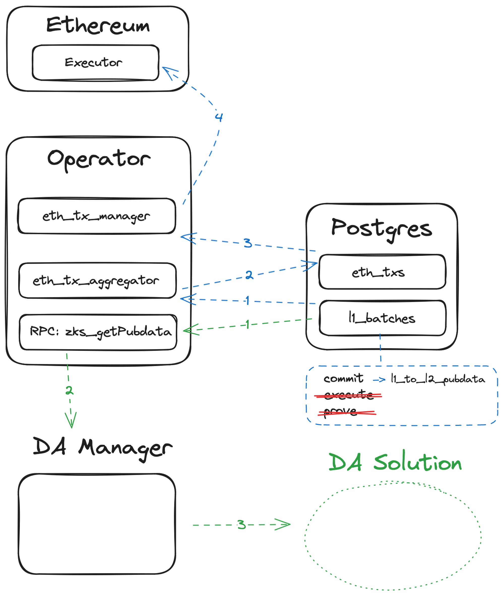

# DA Manager

A `DA Manager` is introduced, a component that periodically queries for new batches and uploads their `pubdata` to some
data availability solution, as a separate binary. The way this works is the following:

- A new RPC endpoint is added to the `zk server`, called `zks_getBatchPubdata`, that takes a batch number or hash as a
  parameter and returns the `pubdata` for that batch appropriately encoded as an array of bytes.
- To construct the `pubdata`, the operator will query Postgres for the four components of pubdata from the `l1_batches`
  table (meaning that there’s no need to modify or add any schemas), then convert it into its byte representation using
  the logic in the `pub fn construct_pubdata(&self) -> Vec<u8>` method of the `L1BatchWithMetadata` struct.
- A user wanting to incorporate a new DA solution simply writes their own DA manager in the programming language they
  prefer, as an application that uses the endpoint introduced above to periodically query for new `pubdata` and post it
  to the DA server. For this scenario, we should provide some examples showing what you should implement for your own DA
  solution.
- This `DA Manager` runs independently from the operator, i.e. as an entirely separate `OS` process or even on a
  different machine (in particular, it’s independent from both the `eth_tx_aggregator` and the `eth_tx_manager`)

## How to run

1. Run the ZK Stack
2. Run `python3 da_manager_example/main.py`
