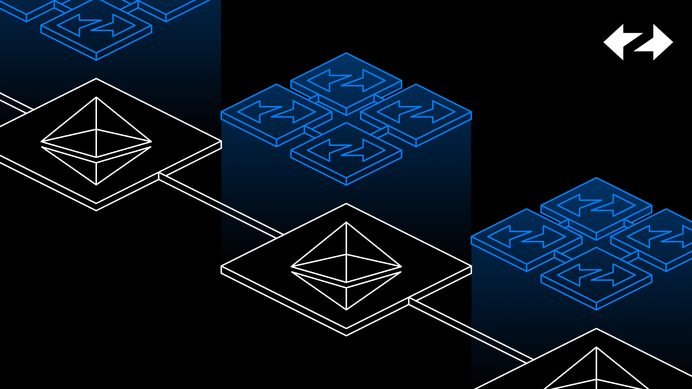

# ZK Stack protocol specification

## Table of contents

- README.md
- zkVM High level overview
    1. [L1 Contracts](./zkVM/high_level/1_l1_smart_contracts.md)
    1. [VM internals](./zkVM/high_level/2_vm_internals.md)
    1. [Bootloader](./zkVM/high_level/3_bootloader.md)
    1. [L2 System Contracts](./zkVM/high_level/4_system_contracts.md)
    1. [Account Abstraction](./zkVM/high_level/5_account_abstraction.md)
    1. [Precompiles](./zkVM/high_level/6_elliptic_curve_precompiles.md)
    1. [Batches and L2 blocks](./zkVM/high_level/7_batches_L2_blocks.md)
    1. [L1-> L2 messages, Deposits and Withdrawals](./zkVM/high_level/8_handling_L1→L2_ops.md)
    1. [DA, Pubdata, Compression, Rollup, Validium and Porter](./zkVM/high_level/9_handling_pubdata_in_boojum/bytecode_compression.md)
    1. [Fee model](./zkVM/high_level/10_fee_model/fee_model.md)
    1. [Prover](./zkVM/high_level/11_prover/zk_intuition.md)
- zkVM and Prover full specification
    - [VM](./zkVM/VM_and_prover/VM_section/zkSync_era_virtual_machine_primer.md)
    - [Circuits](./zkVM/VM_and_prover/circuits_section/intro_to_zkSync’s_ZK.md)
- [Decentralisation](./zkVM/Decentralisation/network_design_for_zkSync_BFT.md)
- The Hyperchain
  - [Shared Bridge](./the_hyperchain/1_shared_bridge.md)
  - [Hyperbridging](./the_hyperchain/2_hyperbridges.md)

## Introduction

This document is a specification of the ZK Stack protocol. The main part focuses on the zkVM, which serves to prove the state transition function of all hyperchains. This provides a high level overview of the zkVM, and a full specification of its more technical components such as the prover, compiler, and a full specification of the VM itself. We also specify the decentralised consensus mechanism, and the hyperchain ecosystem including hyperbridging.  