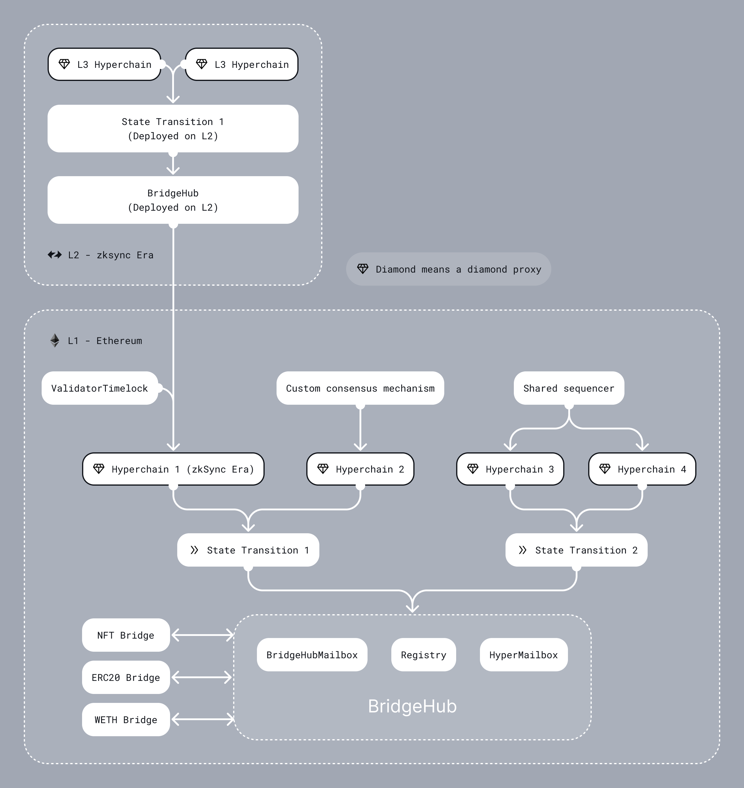
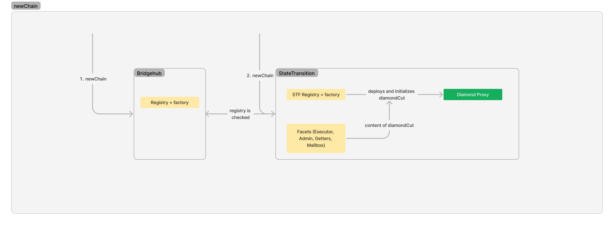

# Table of Contents

---

# Introduction

Ethereum's future is rollup-centric. This means breaking with the current paradigm of isolated EVM chains to
infrastructure that is focused on an ecosystem of interconnected zkEVMs, (which we name Hyperchains). This ecosystem
will be grounded on Ethereum, requiring the appropriate L1 smart contracts. Here we outline our ZK Stack approach for
these contracts, their interfaces, the needed changes to the existing architecture, as well as future features to be
implemented.

If you want to know more about Hyperchains, check this
[blog post](https://blog.matter-labs.io/introduction-to-hyperchains-fdb33414ead7), or go through
[our docs](https://era.zksync.io/docs/reference/concepts/hyperscaling.html).

## High-level design

We want to create a system where:

- Hyperchains should be launched permissionlessly within the ecosystem.
- Hyperbridges should enable unified liquidity for assets across the ecosystem.
- Multi-chain smart contracts need to be easy to develop, which means easy access to traditional bridges, and other
  supporting architecture.

Hyperchains have specific trust requirements - they need to satisfy certain common standards so that they can trust each
other. This means a single set of L1 smart contracts has to manage the proof verification for all hyperchains, and if
the proof system is upgraded, all chains have to be upgraded together. New chains will be able to be launched
permissionlessly in the ecosystem according to this shared standard.

To allow unified liquidity each L1 asset (ETH, ERC20, NFTs) will have a single bridge contract on L1 for the whole
ecosystem. These shared bridges will allow users to deposit, withdraw and transfer from any hyperchain in the ecosystem.
These shared bridges are also responsible for deploying and maintaining their counterparts on the hyperchains. The
counterparts will be asset contracts extended with bridging functionality.

To enable the bridging functionality:

- On the L1 we will add a Bridgehub contract which connects asset bridges to all the hyperchains. This will also be the
  contract that holds the ETH for the ecosystem.
- On the Hyperchain side we will add special system contracts that enable these features.

We want to make the ecosystem as modular as possible, giving developers the ability to modify the architecture as
needed; consensus mechanism, staking, and DA requirements.

We also want the system to be forward-compatible, with future updates like L3s, proof aggregation, alternative State
Transition (ST) contracts, and ZK IP (which would allow unified liquidity between all STs). Those future features have
to be considered in this initial design, so it can evolve to support them (meaning, chains being launched now will still
be able to leverage them when available).

---

# Architecture

## General Architecture



## Components

### Bridgehub

- Acts as a hub for bridges, so that they have a single point of communication with all hyperchain contracts. This
  allows L1 assets to be locked in the same contract for all hyperchains, including L3s and validiums. The `Bridgehub`
  also implements the following:
- `Registry` This is where hyperchains can register, starting in a permissioned manner, but with the goal to be
  permissionless in the future. This is where their `chainID` is determined. L3s will also register here. This
  `Registry` is also where State Transition contracts should register. Each chain has to specify its desired ST when
  registering (Initially, only one will be available).

  ```
  function newChain(
          uint256 _chainId,
          address _stateTransition
      ) external returns (uint256 chainId);

  function newStateTransition(address _stateTransition) external;
  ```

- `BridgehubMailbox` routes messages to the Diamond proxy’s Mailbox facet based on chainID

  - Same as the current zkEVM
    [Mailbox](https://github.com/matter-labs/era-contracts/blob/main/ethereum/contracts/zksync/facets/Mailbox.sol), just
    with chainId,
  - Ether needs to be deposited and withdrawn from here.
  - This is where L2 transactions can be requested.

  ```
  function requestL2Transaction(
          uint256 _chainId,
          address _contractL2,
          uint256 _l2Value,
          bytes calldata _calldata,
          uint256 _l2GasLimit,
          uint256 _l2GasPerPubdataByteLimit,
          bytes[] calldata _factoryDeps,
          address _refundRecipient
      ) public payable override returns (bytes32 canonicalTxHash) {
          address proofChain = bridgeheadStorage.proofChain[_chainId];
          canonicalTxHash = IProofChain(proofChain).requestL2TransactionBridgehead(
              _chainId,
              msg.value,
              msg.sender,
              _contractL2,
              _l2Value,
              _calldata,
              _l2GasLimit,
              _l2GasPerPubdataByteLimit,
              _factoryDeps,
              _refundRecipient
          );
      }
  ```

- `Hypermailbox`
  - This will allow general message passing (L2<>L2, L2<>L3, etc). This is where the `Mailbox` sends the `Hyperlogs`.
    `Hyperlogs` are commitments to these messages sent from a single hyperchain. `Hyperlogs` are aggregated into a
    `HyperRoot` in the `HyperMailbox`.
  - This component has not been implemented yet

### Main asset shared bridges

- Some assets have to be natively supported (ETH, WETH) and it also makes sense to support some generally accepted token
  standards (ERC20 tokens), as this makes it easy to bridge those tokens (and ensures a single version of them exists on
  the hyperchain). These cannonical asset contracts are deployed from L1 by a bridge shared by all hyperchains. This is
  where assets are locked on L1. These bridges use the Bridgehub to communicate with all hyperchains. Currently, these
  bridges are the `WETH` and `ERC20` bridges.

  - The pair on L2 is deployed from L1. The hash of the factory dependencies is stored on L1, and when a hyperchain
    wants to register, it can passes it in for deployment, it is verified, and the contract is deployed on L2. The
    actual token contracts on L2 are deployed by the L2 bridge.

  ```
  function initializeChain(
          uint256 _chainId,
          bytes[] calldata _factoryDeps,
          uint256 _deployBridgeImplementationFee,
          uint256 _deployBridgeProxyFee
      ) external payable {
      ....
      // Deploy L2 bridge proxy contract
          l2Bridge[_chainId] = BridgeInitializationHelper.requestDeployTransaction(
              _chainId,
              bridgehead,
              _deployBridgeProxyFee,
              l2WethBridgeProxyBytecodeHash,
              l2WethBridgeProxyConstructorData,
              // No factory deps are needed for L2 bridge proxy, because it is already passed in the previous step
              new bytes[](0)
          );
  ```

This topic is now covered more thoroughly by the Custom native token discussion.

[Custom native token compatible with Hyperbridging](https://www.notion.so/Custom-native-token-compatible-with-Hyperbridging-54e190a1a76f44248cf84a38304a0641?pvs=21)

### State Transition

- `StateTransition` A state transition manages proof verification and DA for multiple chains. It also implements the
  following functionalities:
  - `StateTransitionRegistry` The ST is shared for multiple chains, so initialization and upgrades have to be the same
    for all chains. Registration is not permissionless but happens based on the registrations in the bridgehub’s
    `Registry`. At registration a `DiamondProxy` is deployed and initialized with the appropriate `Facets` for each
    Hyperchain.
  - `Facets` and `Verifier` are shared across chains that relies on the same ST: `Base`, `Executor` , `Getters`, `Admin`
    , `Mailbox.`The `Verifier` is the contract that actually verifies the proof, and is called by the `Executor`.
  - Upgrade Mechanism The system requires all chains to be up-to-date with the latest implementation, so whenever an
    update is needed, we have to “force” each chain to update, but due to decentralization, we have to give each chain a
    time frame (more information in the
    [Upgrade Mechanism](https://www.notion.so/ZK-Stack-shared-bridge-alpha-version-a37c4746f8b54fb899d67e474bfac3bb?pvs=21)
    section). This is done in the update mechanism contract, this is where the bootloader and system contracts are
    published, and the `ProposedUpgrade` is stored. Then each chain can call this upgrade for themselves as needed.
    After the deadline is over, the not-updated chains are frozen, that is, cannot post new proofs. Frozen chains can
    unfreeze by updating their proof system.
- Each chain has a `DiamondProxy`.
  - The [Diamond Proxy](https://eips.ethereum.org/EIPS/eip-2535) is the proxy pattern that is used for the chain
    contracts. A diamond proxy points to multiple implementation contracts called facets. Each selector is saved in the
    proxy, and the correct facet is selected and called.
  - In the future the DiamondProxy can be configured by picking alternative facets e.g. Validiums will have their own
    `Executor`

### Chain specific contracts

- A chain might implement its own specific consensus mechanism. This needs its own contracts. Only this contract will be
  able to submit proofs to the State Transition contract.
- Currently, the `ValidatorTimelock` is an example of such a contract.

## Components interactions

In this section, we will present some diagrams showing the interaction of different components.

### New Chain

A chain registers in the Bridgehub, this is where the chain ID is determined. The chain’s governor specifies the State
Transition that they plan to use. In the first version only a single State Transition contract will be available for
use, our with Boojum proof verification.

At initialization we prepare the `StateTransitionChain` contract. We store the genesis batch hash in the ST contract,
all chains start out with the same state. A diamond proxy is deployed and initialised with this initial value, along
with predefined facets which are made available by the ST contract. These facets contain the proof verification and
other features required to process proofs. The chain ID is set in the VM in a special system transaction sent from L1.

<!-- Image outdated-->

### WETH Contract

Ether, the native gas token is part of the core system contracts, so deploying it is not necessary. But WETH is just a
smart contract, it needs to be deployed and initialised. This happens from the L1 WETH bridge. This deploys on L2 the
corresponding bridge and ERC20 contract. This is deployed from L1, but the L2 address is known at deployment time.


### Deposit WETH

The user can deposit WETH into the ecosystem using the WETH bridge on L1. The destination chain ID has to be specified.
The Bridgehub unwraps the WETH, and keeps the ETH, and send a message to the destination L2 to mint WETH to the
specified address.


---

## Common Standards and Upgrades

In this initial phase, Hyperchains have to follow some common standards, so that they can trust each other. This means
all chains start out with the same empty state, they have the same VM implementations and proof systems, asset contracts
can trust each on different chains, and the chains are upgraded together. We elaborate on the shared upgrade mechanism
here.

### Upgrade mechanism

Currently, there are three types of upgrades for zkEVM. Normal upgrades (used for new features) are initiated by the
Governor (a multisig) and are public for a certain timeframe before they can be applied. Shadow upgrades are similar to
normal upgrades, but the data is not known at the moment the upgrade is proposed, but only when executed (they can be
executed with the delay, or instantly if approved by the security council). Instant upgrades (used for security issues),
on the other hand happen quickly and need to be approved by the Security Council in addition to the Governor. For
hyperchains the difference is that upgrades now happen on multiple chains. This is only a problem for shadow upgrades -
in this case, the chains have to tightly coordinate to make all the upgrades happen in a short time frame, as the
content of the upgrade becomes public once the first chain is upgraded. The actual upgrade process is as follows:

1. Prepare Upgrade for all chains:
   - The new facets and upgrade contracts have to be deployed,
   - The upgrade’ calldata (diamondCut, initCalldata with ProposedUpgrade) is hashed on L1 and the hash is saved.
2. Upgrade specific chain
   - The upgrade has to be called on the specific chain. The upgrade calldata is passed in as calldata and verified. The
     protocol version is updated.
   - Ideally, the upgrade will be very similar for all chains. If it is not, a smart contract can calculate the
     differences. If this is also not possible, we have to set the `diamondCut` for each chain by hand.
3. Freeze not upgraded chains
   - After a certain time the chains that are not upgraded are frozen.
