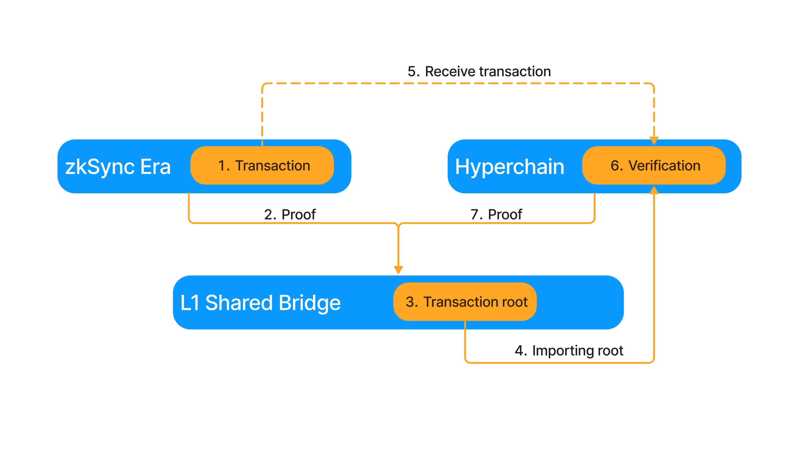

# Interop

## Introduction

In the Shared bridge document we described how the L1 smart contracts work to support multiple chains, and we emphasized
that the core feature is hyperbridging, but we did not outline the hyperbridges themselves. This is because hyperbridges
are mostly L2 contracts. In this document we describe what hyperbridges are, and specify the necessary infrastructure.

### Hyperbridge description

Hyperbridges are trustless and cheap general native bridges between ZK Chains, allowing cross-chain function calls.
Trustlessness is achieved by relying on the main ZK Chain bridge to send a compressed message to L1, which is then sent
to and expanded on the destination ZK Chain.

Technically they are a system of smart contracts that build on top of the enshrined L1<>L2 validating bridges, and can
interpret messages sent from L2 to L2 by verifying Merkle proofs. They are built alongside the protocol, they can
transfer the native asset of the ecosystem, and they can be used for asynchronous function calls between ZK Chains.


The trustless nature of hyperbridges allows the ecosystem to resemble a single VM. To illustrate imagine a new ZK Chain
joining the ecosystem. We will want ether/Dai/etc. to be accessible on this ZK Chain. This can be done automatically.
There will be a central erc20 deployer contract in the ecosystem, which will deploy the new ERC20 contract via the
hyperbridge. After the contract is deployed it will be able to interact other Dai contracts in the ecosystem.

### High Level design



### L1

For the larger context see the [Shared Bridge](./shared_bridge.md) document, here we will focus on

- HyperMailbox (part of Bridgehub). Contains the Hyperroot, root of Merkle tree of Hyperlogs. Hyperlogs are the L2->L1
  SysLogs that record the sent hyperbridge messages from the L2s.

### L2 Contracts

- Outbox system contract. It collects the hyperbridge txs into the hyperlog of the ZK Chain.
- Inbox system contract. This is where the hyperroot is imported and sent to L1 for settlement. Merkle proofs are
  verified here, tx calls are started from here, nullifiers are stored here (add epochs later)

#### Bridgehub

- Acts as a hub for bridges, so that they have a single point of communication with all ZK Chain contracts. This allows
  L1 assets to be locked in the same contract for all ZK Chains, including L3s and validiums. The `Bridgehub` also
  implements the following:
- `Registry` This is where ZK Chains can register, starting in a permissioned manner, but with the goal to be
  permissionless in the future. This is where their `chainID` is determined. L3s will also register here. This
  `Registry` is also where State Transition contracts should register. Each chain has to specify its desired ST when
  registering (Initially, only one will be available).

  ```
  function newChain(
          uint256 _chainId,
          address _stateTransition
      ) external returns (uint256 chainId);

  function newStateTransition(address _stateTransition) external;
  ```
