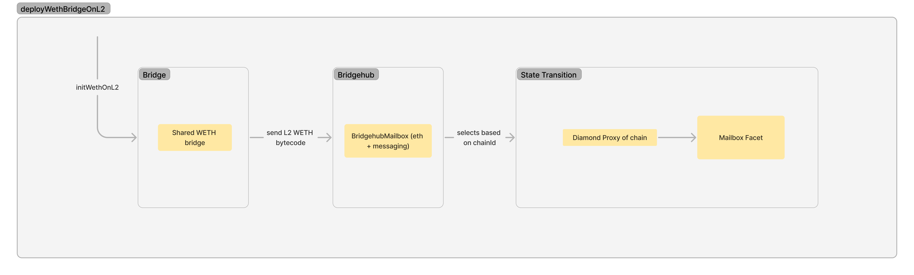
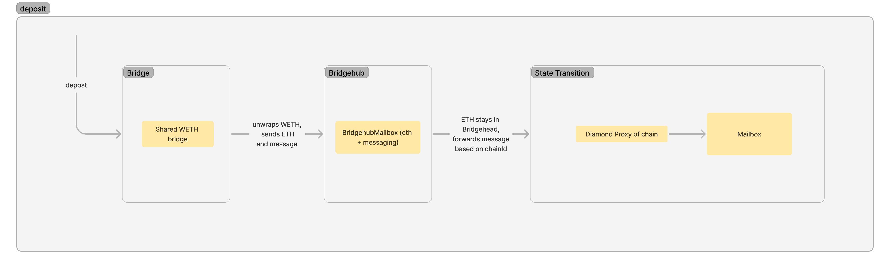

# ZK Router

#### Asset Router

- Some assets have to be natively supported (ETH, WETH) and it also makes sense to support some generally accepted token
  standards (ERC20 tokens), as this makes it easy to bridge those tokens (and ensures a single version of them exists on
  the ZK Chain ecosystem). These canonical asset contracts are deployed from L1 by a bridge shared by all ZK Chains.
  This is where assets are locked on L1. These bridges use the BridgeHub to communicate with all ZK Chains. Currently,
  these bridges are the `WETH` and `ERC20` bridges.

  - The pair on L2 is deployed from L1. The hash of the factory dependencies is stored on L1, and when a ZK Chain wants
    to register, it can passes it in for deployment, it is verified, and the contract is deployed on L2. The actual
    token contracts on L2 are deployed by the L2 bridge.

This topic is now covered more thoroughly by the Custom native token discussion.

#### WETH Contract

Ether, the native gas token is part of the core system contracts, so deploying it is not necessary. But WETH is just a
smart contract, it needs to be deployed and initialised. This happens from the L1 WETH bridge. This deploys on L2 the
corresponding bridge and ERC20 contract. This is deployed from L1, but the L2 address is known at deployment time.

#### Deposit WETH

The user can deposit WETH into the ecosystem using the WETH bridge on L1. The destination chain ID has to be specified.
The Bridgehub unwraps the WETH, and keeps the ETH, and send a message to the destination L2 to mint WETH to the
specified address.

---
