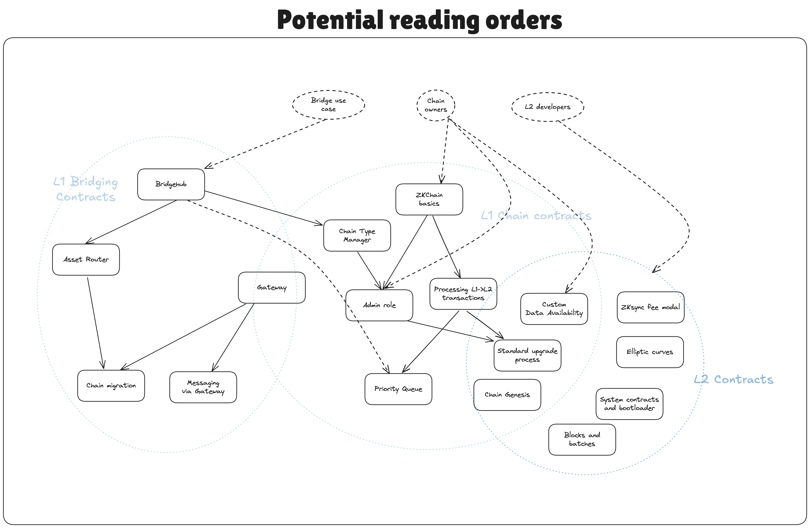

<!--- WIP --->

# ZK Stack contracts specs

The order of the files here only roughly represents the order of reading. A lot of topics are intertwined, so it is recommended to read everything first to have a complete picture and then refer to specific documents for more details.

- [Overview](../contracts/overview.md)
- [Glossary](../contracts/glossary.md)
- [Chain Management](../contracts/chain_management/overview.md)
  - [Bridgehub](../contracts/chain_management/bridgehub.md)
  - [Chain type manager](../contracts/chain_management/chain_type_manager.md)
  - [Admin role](../contracts/chain_management/admin_role.md)
  - [Chain genesis](../contracts/chain_management/chain_genesis.md)
  - [Standard Upgrade process](../contracts/chain_management/upgrade_process.md)
- [Bridging](../contracts/bridging/overview.md)
  - [Asset Router](../contracts/bridging/asset_router_and_ntv/asset_router.md)
  - [Native token vault](../contracts/bridging/asset_router_and_ntv/native_token_vault.md)
- [Settlement Contracts](../contracts/settlement_contracts/zkchain_basics.md)
  - [L1 <> L2 communication](../contracts/settlement_contracts/priority_queue/README.md)
    - [Handling L1→L2 operations](../contracts/settlement_contracts/priority_queue/l1_l2_communication/l1_to_l2.md)
    - [L2→L1 communication](../contracts/settlement_contracts/priority_queue/l1_l2_communication/l2_to_l1.md)
    - [Overview - Deposits and Withdrawals](../contracts/settlement_contracts/priority_queue/l1_l2_communication/overview_deposits_withdrawals.md)
    - [Priority queue](../contracts/settlement_contracts/priority_queue/priority-queue.md)
  - [Data availability](../contracts/settlement_contracts/data_availability/README.md)
    - [Pubdata](../contracts/settlement_contracts/data_availability/pubdata.md)
    - [Compression](../contracts/settlement_contracts/data_availability/compression.md)
    - [Reconstruction](../contracts/settlement_contracts/data_availability/reconstruction.md)
    - [Validium and zkPorter](../contracts/settlement_contracts/data_availability/validium_zk_porter.md)
    - [Custom DA support](../contracts/settlement_contracts/data_availability/custom_da.md)
    - [Rollup DA support](../contracts/settlement_contracts/data_availability/rollup_da.md)
    - [Standard pubdata format](../contracts/settlement_contracts/data_availability/standard_pubdata_format.md)
    - [State diff compression v1 spec](../contracts/settlement_contracts/data_availability/state_diff_compression_v1_spec.md)
- [Consensus](../contracts/consensus/README.md)
  - [Consensus Registry](../contracts/consensus/consensus-registry.md)

## Contracts repo structure

The repository contains the following sections:

- [gas-bound-caller](https://github.com/matter-labs/era-contracts/tree/main/gas-bound-caller) that contains `GasBoundCaller` utility contract implementation. You can read more about it in its README.
- [da-contracts](https://github.com/matter-labs/era-contracts/tree/main/da-contracts) contracts that should be deployed on L1 only.
- [l1-contracts](https://github.com/matter-labs/era-contracts/tree/main/l1-contracts). Despite the legacy name, it contains contracts that are deployed both on L1 and on L2. This folder encompasses bridging, ZK chain contracts, the contracts for chain admin, etc. The name is historical due to the fact that these contracts were usually deployed on L1 only. However with Gateway, settlement and bridging-related contracts will be deployed on both EVM and eraVM environment. Also, bridging has been unified between L1 and L2 in many places and so keeping everything in one project allows to avoid code duplication.
- [l2-contracts](https://github.com/matter-labs/era-contracts/tree/main/l2-contracts). Contains contracts that are deployed only on L2.
- [system-contracts](https://github.com/matter-labs/era-contracts/tree/main/system-contracts). Contains system contracts or predeployed L2 contracts.

## For auditors: Invariants/tricky places to look out for

This section is for auditors of the codebase. It includes some of the important invariants that the system relies on and which if broken could have bad consequences.

- Assuming that the accepting CTM is correct & efficient, the L1→GW part of the L1→GW→L3 transaction never fails. It is assumed that the provided max amount for gas is always enough for any transaction that can realistically come from L1.
- GW → L1 migration never fails. If it is possible to get into a state where the migration is not possible to finish, then the chain is basically lost. There are some exceptions where for now it is the expected behavior. (check out the “Migration invariants & protocol upgradability” section)
- The general consistency of chains when migration between different settlement layers is done. Including the feasibility of emergency upgrades, etc. I.e. whether the whole system is thought-through.
- Preimage attacks in the L3→L1 tree, we apply special prefixes to ensure that the tree structure is fixed, i.e. all logs are 88 bytes long (this is for backwards compatibility reasons). For batch leaves and chain id leaves we use special prefixes.
- Data availability guarantees. Whether rollup users can always restore all their storage slots, etc. An example of a potential tricky issue can be found in “Security notes for Gateway-based rollups” [in this document](./gateway/gateway_da.md).

The desired properties of the system are that funds can not be stolen from the L1 contracts, and that L2 constracts are executed securely.