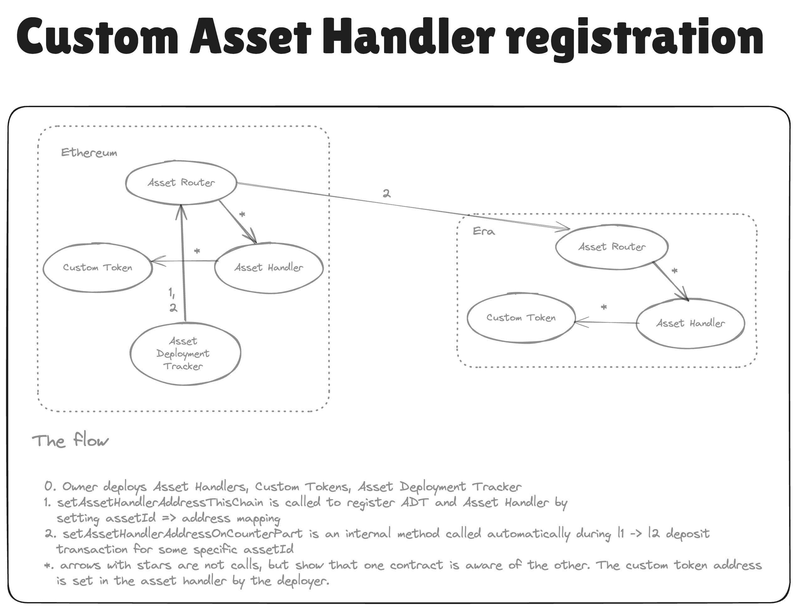

# Overview of Custom Asset Bridging with the Asset Router

[back to readme](../../README.md)

Bridges are completely separate contracts from the ZKChains and system contracts. They are a wrapper for L1 <-> L2 communication on both L1 and L2. Upon locking assets on one layer, a request is sent to mint these bridged assets on the other layer.
Upon burning assets on one layer, a request is sent to unlock them on the other.

Custom asset bridging is a new bridging model that allows to:

1. Minimize the effort needed by custom tokens to be able to become part of the elastic chain ecosystem. Before, each custom token would have to build its own bridge, but now just custom asset deployment trackers / asset handler is needed. This is achieved by building a modular bridge which separates the logic of L1<>L2 messaging from the holding of the asset.
2. Unify the interfaces between L1 and L2 bridge contracts, paving the way for easy cross chain bridging. It will especially become valuable once interop is enabled.

#### New concepts

- assetId => identifier to track bridged assets across chains. This is used to link messages to specific asset handlers in the AssetRouters.
- AssetHandler => contract that manages liquidity (burns/mints, locks/unlocks, etc.) for specific token (or a set of them) on a chain. Every asset
- AssetDeploymentTracker => contract that manages the deployment of asset handlers across chains. This is the contract that registers these asset handlers in the AssetRouters.

### Normal flow

Assets Handlers are registered in the Routers based on their assetId. The assetId is used to identify the asset when bridging, it is sent with the cross-chain transaction data and Router routes the data to the appropriate Handler. If the asset handler is not registered in the L2 Router, then the L1->L2 bridging transaction will fail on the L2 (expect for NTV assets, see below).

`assetId = keccak256(chainId, asset deployment tracker = msg.sender, additionalData)`

Asset registration is handled by the AssetDeploymentTracker. It is expected that this contract is deployed on the L1. Registration of the assetHandler on a ZKChain can be permissionless depending on the Asset (e.g. the AssetHandler can be deployed on the chain at a predefined address, this can message the L1 ADT, which can then register the asset in the Router). Registering the L1 Handler in the L1 Router can be done via a direct function call from the L1 Deployment Tracker. Registration in the L2 Router is done indirectly via the L1 Router.

The Native Token Vault is a special case of the Asset Handler, as we want it to support automatic bridging. This means it should be possible to bridge a L1 token to an L2 without deploying the Token contract beforehand and without registering it in the L2 Router. For NTV assets, L1->L2 transactions where the AssetHandler is not registered will not fail, but the message will be automatically be forwarded to the L2NTV. Here the contract checks that the asset is indeed deployed by the L1NTV, by checking that the assetId contains the correct ADT address (note, for NTV assets the ADT is the NTV and the used address is the L2NTV address). If the assetId is correct, the token contract is deployed.

### Read more

You can read more in the more in-depth about L1 and L2 asset routers and the default asset handler that is Native Token Vault [here](./asset_router.md).
