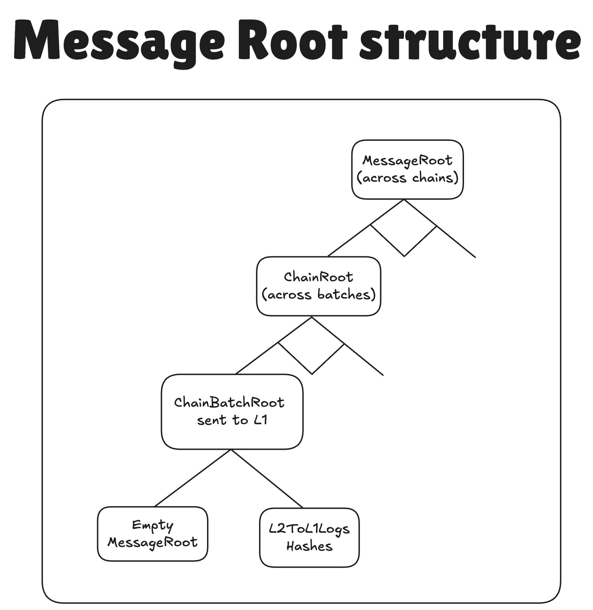

# Forms of finality

Interop requires the importing of a [MessageRoot](./message_root.md) from some other chain. The MessageRoot commits to the interop tx. This can be done in different ways, depending on the security trust between the chains.

1. Proof based interop
2. Commit based interop
3. Pre-commit based interop. 

## Proof based interop

The batch where the interop tx is emitted is [sealed](../../../blocks_batches.md#L1-batches) and committed to the chain's settlement layer (Gateway or L1). Proof is posted on the SL, and the batch is fully finalized and cannot be reverted. When this happens the SL's `MessageRoot` is updated. The receiving chain imports this `MessageRoot`. When the receiving chain settles using the [Executor facet](https://github.com/matter-labs/era-contracts/blob/b43cf6b3b069c85aec3cd61d33dd3ae2c462c896/l1-contracts/contracts/state-transition/chain-deps/facets/Executor.sol#L298), its imported `MessageRoot` is checked against the MessageRoot.sol contract.

This solution is the most trustless, but it is the slowest, since proofs have to be generated. To use this kind of interop, we specify the `gw_message_root` log proof target when interacting with the SDK: this will serve a Merkle proof of inclusion of the log of interest inside Gateway's `MessageRoot`.

## Commit/Batch based interop

The batch has to be sealed and committed to the SL. We do not wait for the `MessageRoot` to be updated. We get the `ChainBatchRoot` of the source chain from the DiamondProxy of the chain itself. When the receiving chain commits the batch, the imported `ChainBatchRoot` is stored as a dependency. When the batch is executed, it is checked that all the dependencies have been executed.

This is faster than proof based interop, but not as fast as pre-commit based interop. It is also the middle ground in security. To use this kind of interop, we specify the `chain` log proof target when interacting with the SDK: this will serve a Merkle proof of inclusion of the log of interest inside the chain's `ChainBatchRoot`.

## Pre-commit/parallel building interop

Batches are not sealed, but built in parallel. `L2ToL1LogsRoot` is updated mid batch after each block. The receiving chain can read the current `L2ToL1LogsRoot` from the L1Messenger contract of the source chain. This can be two way, i.e. both chains can read from each other. It can happen multiple times inside a batch as well. If multiple roots were imported from the same batch, when settling they are aggregated and only the last node is sent. When settling, the imported `L2ToL1LogsRoot` might not be the final one that is settled by the source chain. An additional merkle proof will have to complete the root. This final root can be checked against the pending root of the other chain. If the roots match, then the batches of the chains have to be executed in parallel.

- Note: this solution can also be used for Shared Sequencing.
- Note: the L2ToL1 messages are aggregated in a Dynamic Incramental Merkle tree, see [here](https://github.com/matter-labs/era-contracts/blob/b43cf6b3b069c85aec3cd61d33dd3ae2c462c896/l1-contracts/contracts/common/libraries/DynamicIncrementalMerkle.sol). 

This solution is the fastest. 

# Security considerations for Precommit based interop

When doing interop between chains, the receiving chain needs to ensure that it can safely receive interop txs. For this it needs two things, it needs to know that the execution of the block is correct, and that the block will be finalized. 

To make sure that the block was executed correctly, the chains can run ENs for each other. In the future, this might be replaced with TEEs. 

To make sure that the blocks are finalized, there will be an onchain way to commit to the execution of the blocks. If the block is not executed in a timely fashion, an emergency mode will be activated, during which anybody can execute batches corresponding to the corresponding blocks. 