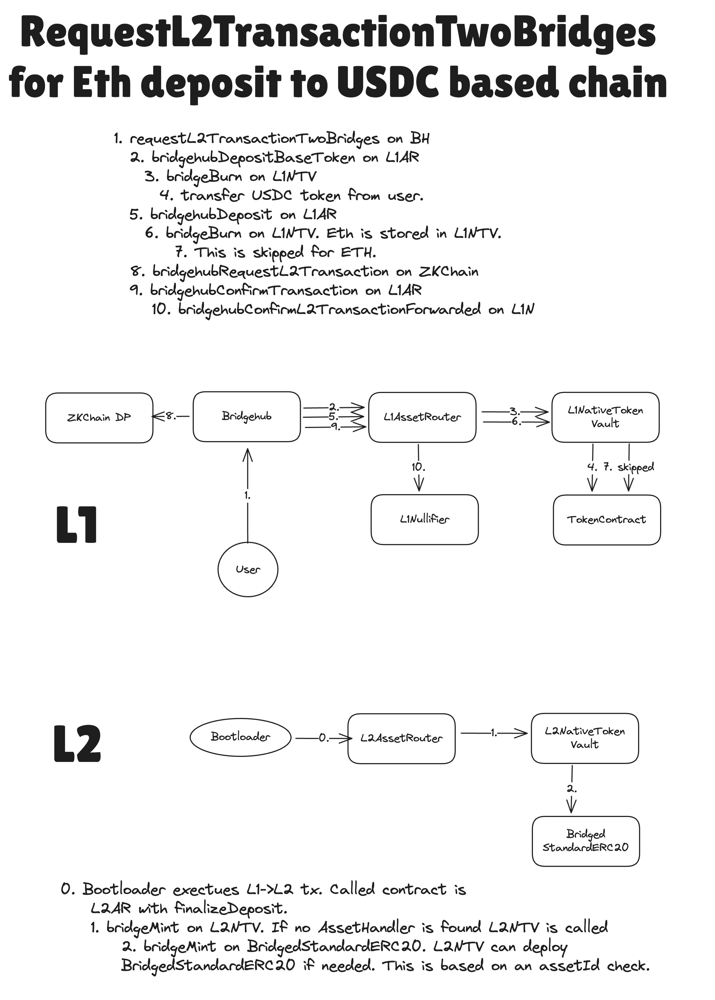

# Bridging overview

[back to readme](../../README.md)

## Introduction

InteropCenter is used to start transactions between chains. 

## `requestL2TransactionTwoBridges`

`L1AssetRouter` is used as the main "glue" for value bridging across chains. Whenever a token that is not native needs to be bridged between two chains an L1<>L2 transaction out of the name of an AssetRouter needs to be performed. For more details, check out the [asset router documentation](../asset_router_and_ntv/overview.md). But for this section it is enough to understand that we need to somehow make a transaction out of the name of `L1AssetRouter` to its L2 counterpart to deliver the message about certain amount of asset being bridged.

> In the next paragraphs we will often refer to `L1AssetRouter` as performing something. It is good enough for understanding of how bridgehub functionality works. Under the hood though, it mainly serves as common entry that calls various asset handlers that are chosen based on asset id. You can read more about it in the [asset router documentation](../asset_router_and_ntv/asset_router.md).

Let’s say that a ZKChain has ETH as its base token. Let’s say that the depositor wants to bridge USDC to that chain. We can not use `BridgeHub.requestL2TransactionDirect`, because it only takes base token `mintValue` and then starts an L1→L2 transaction rightaway out of the name of the user and not the `L1AssetRouter`.

We need some way to atomically deposit both ETH and USDC to the shared bridge + start a transaction from `L1AssetRouter`. For that we have a separate function on `Bridgehub`: `BridgeHub.requestL2TransactionTwoBridges`. The reason behind the name “two bridges” is a bit historical: the transaction supposed compose to do actions with two bridges: the bridge responsible for base tokens and the second bridge responsible for any other token.

Note, however, that only `L1AssetRouter` can be used to bridge base tokens. And the role of the second bridge can be played by any contract that supports the protocol desrcibed below.

When calling `BridgeHub.requestL2TransactionTwoBridges` the following struct needs to be provided:

```solidity
struct L2TransactionRequestTwoBridgesOuter {
  uint256 chainId;
  uint256 mintValue;
  uint256 l2Value;
  uint256 l2GasLimit;
  uint256 l2GasPerPubdataByteLimit;
  address refundRecipient;
  address secondBridgeAddress;
  uint256 secondBridgeValue;
  bytes secondBridgeCalldata;
}
```

The first few fields are the same as for the simple L1→L2 transaction case. However there are three new fields:

- `secondBridgeAddress` is the address of the bridge (or contract in general) which will need to perform the L1->L2 transaction. In this case it should be the same `L1AssetRouter`
- `secondBridgeValue` is the `msg.value` to be sent to the bridge which is responsible for the asset being deposited (in this case it is `L1AssetRouter` ). This can be used to deposit ETH to ZKChains that have base token that is not ETH.
- `secondBridgeCalldata` is the data to pass to the second contract. `L1AssetRouter` supports multiple formats of calldata, the list can be seen in the `bridgehubDeposit` function of the `L1AssetRouter`.

The function will do the following:

#### L1

1. It will deposit the `request.mintValue` of the ZKChain’s base token the same way as during a simple L1→L2 transaction. These funds will be used for funding the `l2Value` and the fee to the operator.
2. It will call the `secondBridgeAddress` (`L1AssetRouter`) once again and this time it will deposit the funds to the `L1AssetRouter`, but this time it will be deposit not to pay the fees, but rather for the sake of bridging the desired token.

This call will return the parameters to call the l2 contract with (the address of the L2 bridge counterpart, the calldata and factory deps to call it with). 3. After the BridgeHub will call the ZKChain to add the corresponding L1→L2 transaction to the priority queue. 4. The BridgeHub will call the `SharedBridge` once again so that it can remember the hash of the corresponding deposit transaction. [This is needed in case the deposit fails](#claiming-failed-deposits).

#### L2

1. After some time, the corresponding L1→L2 is created.
2. The L2AssetRouter will receive the message and re-route it to the asset handler of the bridged token. To read more about how it works, check out the [asset router documentation](../asset_router_and_ntv/overview.md).

**_Diagram of a depositing ETH onto a chain with USDC as the baseToken. Note that some contract calls (like `USDC.transferFrom` are omitted for the sake of consiceness):_**



## Generic usage of `BridgeHub.requestL2TransactionTwoBridges`

`L1AssetRouter` is the only bridge that can handle base tokens. However, the `BridgeHub.requestL2TransactionTwoBridges` could be used by `secondBridgeAddress` on L1. A notable example of how it is done is how our [CTMDeploymentTracker](../../../l1-contracts/contracts/bridgehub/CTMDeploymentTracker.sol) uses it to register the correct CTM address on Gateway. You can read more about how Gateway works in [its documentation](../../gateway/overview.md).

Let’s do a quick recap on how it works:

When calling `BridgeHub.requestL2TransactionTwoBridges` the following struct needs to be provided:

```solidity
struct L2TransactionRequestTwoBridgesOuter {
  uint256 chainId;
  uint256 mintValue;
  uint256 l2Value;
  uint256 l2GasLimit;
  uint256 l2GasPerPubdataByteLimit;
  address refundRecipient;
  address secondBridgeAddress;
  uint256 secondBridgeValue;
  bytes secondBridgeCalldata;
}
```

- `secondBridgeAddress` is the address of the L1 contract that needs to perform the L1->L2 transaction.
- `secondBridgeValue` is the `msg.value` to be sent to the `secondBridgeAddress`.
- `secondBridgeCalldata` is the data to pass to the `secondBridgeAddress`. This can be interpreted any way it wants.

1. Firstly, the Bridgehub will deposit the `request.mintValue` the same way as during a simple L1→L2 transaction. These funds will be used for funding the `l2Value` and the fee to the operator.
2. After that, the `secondBridgeAddress.bridgehubDeposit` with the following signature is called

```solidity
struct L2TransactionRequestTwoBridgesInner {
  // Should be equal to a constant `keccak256("TWO_BRIDGES_MAGIC_VALUE")) - 1`
  bytes32 magicValue;
  // The L2 contract to call
  address l2Contract;
  // The calldata to call it with
  bytes l2Calldata;
  // The factory deps to call it with
  bytes[] factoryDeps;
  // Just some 32-byte value that can be used for later processing
  // It is called `txDataHash` as it *should* be used as a way to facilitate
  // reclaiming failed deposits.
  bytes32 txDataHash;
}

function bridgehubDeposit(
  uint256 _chainId,
  // The actual user that does the deposit
  address _prevMsgSender,
  // The msg.value of the L1->L2 transaction to be created
  uint256 _l2Value,
  // Custom bridge-specific data
  bytes calldata _data
) external payable returns (L2TransactionRequestTwoBridgesInner memory request);
```

Now the job of the contract will be to “validate” whether they are okay with the transaction to come. For instance, the `CTMDeploymentTracker` checks that the `_prevMsgSender` is the owner of `CTMDeploymentTracker` and has the necessary rights to perform the transaction out of the name of it.

Ultimately, the correctly processed `bridgehubDeposit` function basically grants `BridgeHub` the right to create an L1→L2 transaction out of the name of the `secondBridgeAddress`. Since it is so powerful, the first returned value must be a magical constant that is equal to `keccak256("TWO_BRIDGES_MAGIC_VALUE")) - 1`. The fact that it was a somewhat non standard signature and a struct with the magical value is the major defense against “accidental” approvals to start a transaction out of the name of an account.

Aside from the magical constant, the method should also return the information an L1→L2 transaction will start its call with: the `l2Contract` , `l2Calldata`, `factoryDeps`. It also should return the `txDataHash` field. The meaning `txDataHash` will be needed in the next paragraphs. But generally it can be any 32-byte value the bridge wants.

1. After that, an L1→L2 transaction is invoked. Note, that the “trusted” `L1AssetRouter` has enforced that the baseToken was deposited correctly (again, the step (1) can _only_ be handled by the `L1AssetRouter`), while the second bridge can provide any data to call its L2 counterpart with.
2. As a final step, following function is called:

```solidity
function bridgehubConfirmL2Transaction(
  // `chainId` of the ZKChain
  uint256 _chainId,
  // the same value that was returned by `bridgehubDeposit`
  bytes32 _txDataHash,
  // the hash of the L1->L2 transaction
  bytes32 _txHash
) external;
```

This function is needed for whatever actions are needed to be done after the L1→L2 transaction has been invoked.

On `L1AssetRouter` it is used to remember the hash of each deposit transaction, so that later on, the funds could be returned to user if the `L1->L2` transaction fails. The `_txDataHash` is stored so that the whenever the users will want to reclaim funds from a failed deposit, they would provide the token and the amount as well as the sender to send the money to.

## Claiming failed deposits

In case a deposit fails, the `L1AssetRouter` allows users to recover the deposited funds by providing a proof that the corresponding transaction indeed failed. The logic is the same as in the current Era implementation.

## Withdrawing funds from L2

Funds withdrawal is a similar way to how it is done currently on Era.

The user needs to call the `L2AssetRouter.withdraw` function on L2, while providing the token they want to withdraw. This function would then calls the corresponding L2 asset handler and ask him to burn the funds. We expand a bit more about it in the [asset router documentation](../asset_router_and_ntv/overview.md).

Note, however, that it is not the way to withdraw base token. To withdraw base token, `L2BaseToken.withdraw` needs to be called.

After the batch with the withdrawal request has been executed, the user can finalize the withdrawal on L1 by calling `L1AssetRouter.finalizeWithdrawal`, where the user provides the proof of the corresponding withdrawal message.
