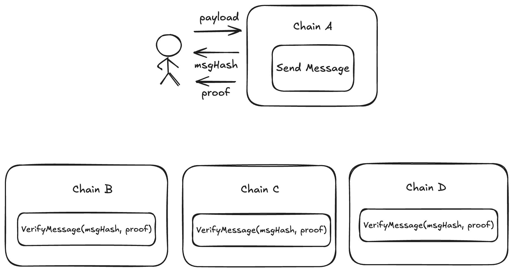

# Interop Messages

In this section, we’re going to cover the lowest level of the interop stack: **Interop Messages** — the interface that
forms the foundation for everything else.

This is an advanced document. While most users and app developers typically interact with higher levels of interop, it’s
still valuable to understand how the internals work.

## Basics


Interop Messages are the lowest level of our stack.

An **InteropMessage** contains data and offers two methods:

- Send a message
- Verify that a given message was sent on some chain

Notice that the message itself doesn’t have any ‘destination chain’ or address—it is simply a payload that a user (or
contract) is creating. Think of it as a broadcast.

The `InteropCenter` is a contract that is pre-deployed on all chains at a fixed address `0x00..10008`.

```solidity
contract InteropCenter {
  // Sends interop message. Can be called by anyone.
  // Returns the unique interopHash.
 function sendInteropMessage(bytes data) returns interopHash;

  // Interop message - uniquely identified by the hash of the payload.
 struct InteropMessage {
   bytes data;
   address sender; // filled by InteropCenter
   uint256 sourceChainId; // filled by InteropCenter
   uint256 messageNum; // a 'nonce' to guarantee different hashes.
 }

 // Verifies if such interop message was ever producted.
 function verifyInteropMessage(bytes32 interopHash, Proof merkleProof) return bool;
}
```

When you call `sendInteropMessage`, the `InteropCenter` adds additional fields, such as your sender address, source
chain ID, and messageNum (a nonce ensuring the hash of this structure is globally unique). It then returns the
`interopHash`.

This `interopHash` serves as a globally unique identifier that can be used on any chain in the network to call
`verifyInteropMessage`.



#### How do I get the proof

You’ll notice that **verifyInteropMessage** has a second argument — a proof that you need to provide. This proof is a
Merkle tree proof (more details [here](../message_root.md)). You can obtain it by querying the chain using the 
[api](https://docs.zksync.io/build/api-reference/zks-rpc#zks_getl2tol1msgproof), or generate it off-chain - by
looking at the chain's state on L1.

#### How does the interop message differ from other layers (InteropTransactions, InteropCalls)

As the most basic layer, an interop message doesn’t include any advanced features — it lacks support for selecting
destination chains, nullifiers/replay, cancellation, and more.

If you need these capabilities, consider integrating with a higher layer of interop, such as Call or Bundle, which
provide these additional functionalities.


<!-- ## Deeper Technical Dive

Let’s break down what happens inside the InteropCenter when a new interop message is created:

```solidity
function sendInteropMessage(bytes data) {
  messageNum += 1;
  msg = InteropMessage({data, msg.sender, block.chain_id, messageNum});
  // Does L2->L1 Messaging.
  sendToL1(abi.encode(msg));
  return keccak(msg);
}
```

As you can see, it populates the necessary data and then calls the `sendToL1` method.


#### Timestamps and Expiration

- In ElasticChain, older messages become increasingly difficult to validate as it becomes harder to gather the data
  required to construct a Merkle proof. Expiration is also being considered for this reason, but the specifics are yet
  to be determined. -->
