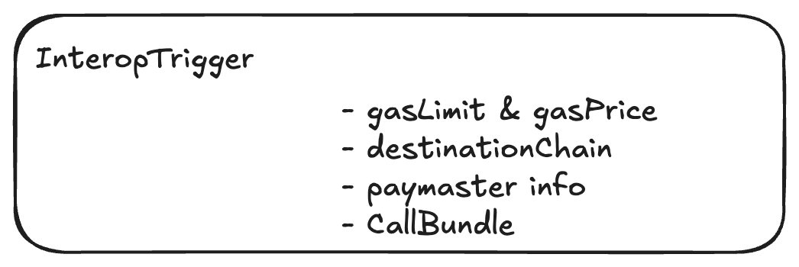
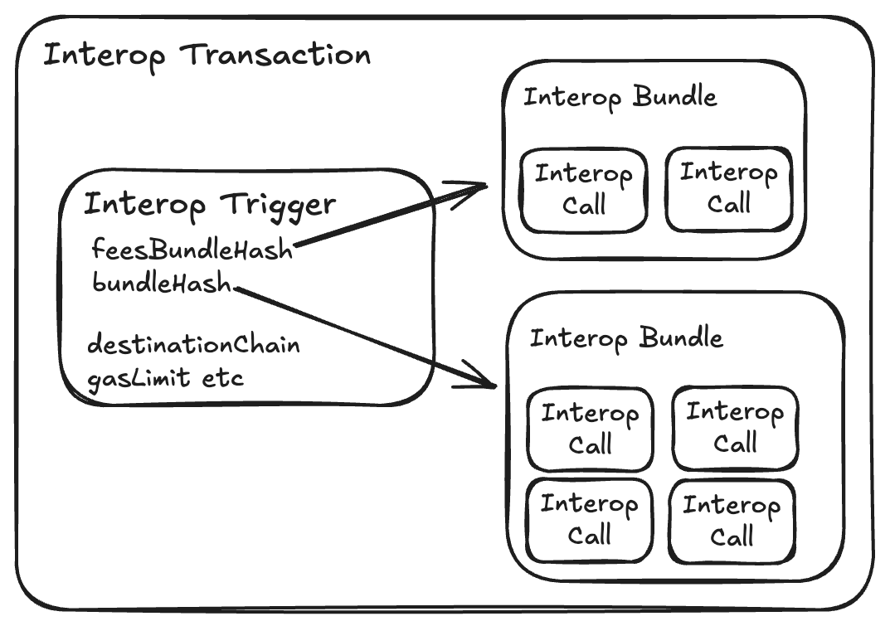
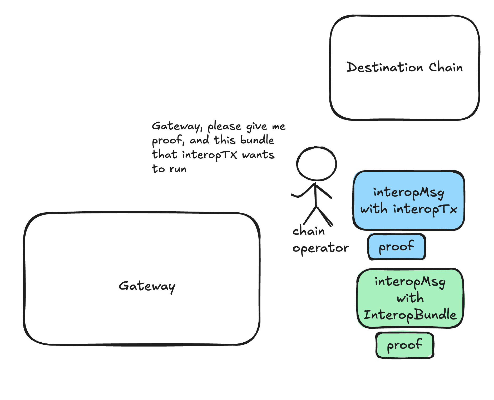

# Interop Trigger and Interop Transactions

## Basics

The **InteropTrigger** sits at the top of our interop stack, acting as the “delivery” mechanism for **Interop
Bundles**. The **InteropTrigger** together with its bundles is called an **InteropTransaction**.

Think of it like a car that picks up our "hitchhiker" bundles and carries them to their destination.



**Note:** Interop Transactions aren’t the only way to execute a bundle. Once an interop bundle is created on the source
chain, users can simply send a regular transaction on the destination chain to execute it.

However, this approach can be inconvenient as it requires users to have funds on the destination chain to cover gas fees
and to configure the necessary network settings (like the RPC address).

**InteropTriggers** simplify this process by handling everything from the source chain. They allow you to select
which **interopBundle** to execute, specify gas details (such as gas amount and gas price), and determine who will cover
the gas costs. This can be achieved using tokens on the source chain or through a paymaster.

The inteorp transaction will "automatically" execute. It will be picked up by the InteropSwitch component and sent to the destination chain.

An **InteropTrigger** contains two hashes pointing to the bundles:

- **feesBundleHash**: Holds interop calls to cover fees.
- **executionBundleHash**: Contains the main execution bundle.



## Interface

The function `sendInteropTrigger` provides all the options. For simpler use cases, refer to the helper methods
defined later in the article.

```solidity
contract InteropCenter {
  /// Creates a trigger that will attempt to execute a given feePayment and execution bundles on the destination chain.

  function sendInteropTrigger(
        InteropTrigger memory _interopTrigger
  )

  struct InteropTrigger {
    uint256 destinationChainId;
    address sender;
    // the address used to trigger the interop transaction
    address recipient;
    // this is the bundle that contains the calls to pay for gas
    bytes32 feeBundleHash;
    // the main bundle that you want to execute on destination chain
    bytes32 executionBundleHash;
    // gasLimit & price for execution
    GasFields gasFields;
    // optionally - you can use a paymaster on destination chain
    // with specific params
    address paymaster;
    bytes paymasterInput;
  }

  struct GasFields {
      uint256 gasLimit;
      uint256 gasPerPubdataByteLimit;
      address refundRecipient;
  }

}
```

After creating the **InteropBundle**s, you can simply call `sendInteropTrigger` to create the complete transaction
that will execute the bundle.

## Retries

If your transaction fails to execute the bundle (e.g., due to a low gas limit) or isn’t included at all (e.g., due to
too low gasPrice), you can send another transaction to **attempt to execute the same bundle again**.

Simply call `sendInteropTrigger` again with updated gas settings.

### Example of Retrying

Here’s a concrete example: Suppose you created a bundle to perform a swap that includes transferring 100 ETH, executing
the swap, and transferring some tokens back.

You attempted to send the interop transaction with a low gas limit (e.g., 100). Since you didn’t have any base tokens on
the destination chain, you created a separate bundle to transfer a small fee (e.g., 0.0001) to cover the gas.

You sent your first interop transaction to the destination chain, but it failed due to insufficient gas. However, your
“fee bundle” was successfully executed, as it covered the gas cost for the failed attempt.

Now, you have two options: either cancel the execution bundle (the one with 100 ETH) or retry.

To retry, you decide to set a higher gas limit (e.g., 10,000) and create another fee bundle (e.g., 0.01) but use **the
same execution bundle** as before. You also create a new **InteropTrigger** with the updated gas settings.

This time, the transaction succeeds — the swap completes on the destination chain, and the resulting tokens are
successfully transferred back to the source chain.


## Fees & Restrictions

Using an **InteropBundle** for fee payments offers flexibility, allowing users to transfer a small amount to cover the
fees while keeping the main assets in the execution bundle itself.

### Restrictions

This flexibility comes with trade-offs, similar to the validation phases in **Account Abstraction** or **ERC4337**,
primarily designed to prevent DoS attacks. Key restrictions include:

- **Lower gas limits**
- **Limited access to specific slots**

<!-- Additionally, when the `INTEROP_CENTER` constructs an **InteropTrigger**, it enforces extra restrictions on
**feePaymentBundles**:

- **Restricted Executors**:  
  Only your **AliasedAccount** on the receiving side can execute the `feePaymentBundle`.

This restriction is crucial for security, preventing others from executing your **fee bundle**, which could cause your
transaction to fail and prevent the **execution bundle** from processing. -->

### **Types of Fees**

#### Using the Destination Chain’s Base Token

The simplest scenario is when you (as the sender) already have the destination chain’s base token available on the
source chain.

For example:

- If you are sending a transaction from **Era** (base token: ETH) to **Sophon** (base token: SOPH) and already have SOPH
  on ERA, you can use it for the fee.

To make this easier, we’ll provide a helper function:

```solidity
contract InteropCenter {
  // Creates InteropTransaction to the destination chain with payment with base token.
  // Before calling, you have to 'approve' InteropCenter to the ERC20/Bridge that holds the destination chain's base tokens.
  // or if the destination chain's tokens are the same as yours, just attach value to this call.
  function sendInteropTxMinimal(
   destinationChain,
   bundleHash,        // the main bundle that you want to execute on destination chain
   gasLimit,          // gasLimit & price for execution
   gasPrice,
  );
 }
```

#### Using paymaster on the destination chain

If you don’t have the base token from the destination chain (e.g., SOPH in our example) on your source chain, you’ll
need to use a paymaster on the destination chain instead.

In this case, you’ll send the token you do have (e.g., USDC) to the destination chain as part of the **feeBundleHash**.
Once there, you’ll use it to pay the paymaster on the destination chain to cover your gas fees.

Your **InteropTransaction** would look like this:


## **Automatic Execution**

One of the main advantages of **InteropTransactions** is that they execute automatically. As the sender on the source
chain, you don’t need to worry about technical details like RPC addresses or obtaining proofs — it’s all handled for
you.

After creating an **InteropTrigger**, it can be relayed to the destination chain by anyone. The transaction already
includes a signature (also known as an interop message proof), making it fully self-contained and ready to send without
requiring additional permissions. KL todo add more details. 

Typically, the sender chain’s operator will handle and include incoming **InteropTransactions**. However, if they
don’t, other participants can step in to prepare and send them.

You can also use the available tools to create and send the destination transaction yourself. Since the transaction is
self-contained, it doesn’t require additional funds or signatures to execute.

<!-- 

Once they see the message, they can request the proof from the **ChainOperator** and also fetch the **InteropBundles**
contained within the message (along with their respective proofs). -->

<!-- 

As the final step, the operator can use the received data to create a regular transaction, which can then be sent to
their chain.


The steps above don’t require any special permissions and can be executed by anyone.

While the **Gateway** was used above for tasks like providing proofs, if the Gateway becomes malicious, all this
information can still be constructed off-chain using data available on L1.

### How it Works Under the hood

We’ll modify the default account to accept interop proofs as signatures, seamlessly integrating with the existing ZKSync
native **Account Abstraction** model. See [Interop handler](../interop_handler.md) for more details. -->
