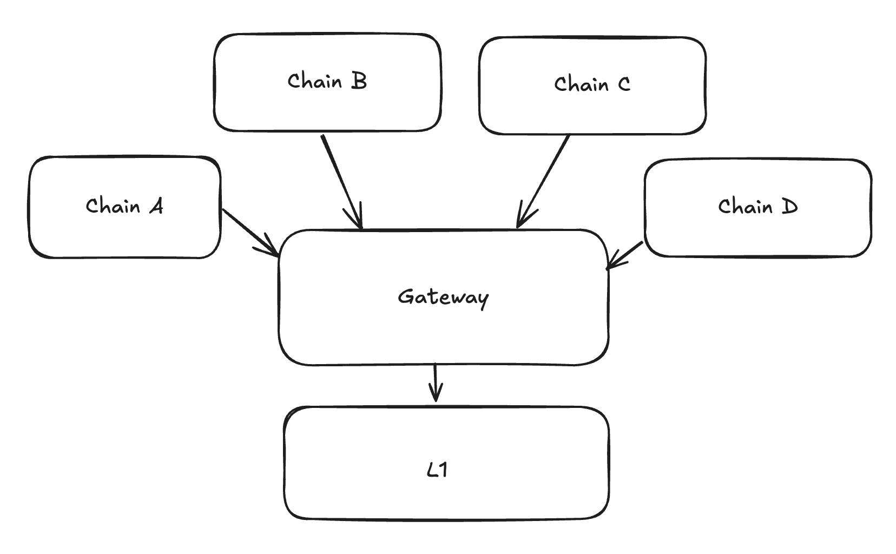

# MessageRoot
[back to readme](../README.md)

## Introduction

The message root is the contract on L1 that collects messages from different chains and aggregates them into a single merkle tree. This makes interop more efficient, since instead of having to import each individual message, chains can import the MessageRoot, which is an aggregate of messages in a single batch, then across batches of a single chain, and then across chains. 

The MessageRoot contract is deployed both on L1 and ZK chains, but on ZK chains it is only used on GW. On GW it is used to aggregate messages for chains that are settling on GW, in the same way that it is done on L1. Read about it [here](../../gateway/nested_l3_l1_messaging.md).


> Note:

The lines between `MessageRoot` and `chainRoot` and between each `chainRoot` and `ChainBatchRoot` show different  binary merkle trees. The `MessageRoot` will be the root of a FullMerkleTree of `chainRoot`, while `chainRoot` is the merkle root of a DynamicIncrementalMerkleTree of `ChainBatchRoot`.

>

For each chain that settles on L1, the root will have the following format:

`ChainBatchRoot = keccak256(LocalLogsRoot, MessageRoot)`

where `LocalLogsRoot` is the root of the tree of messages that come from the chain itself, while the `MessageRoot` is the root of aggregated messages from all of the chains that settle on top of the chain. For most chains the `MessageRoot` is empty (except for Gateway and L1). The `ChainBatchRoot` will be settled on the layer below, and be used to update the `ChainRoot` in the `MessageRoot` contract on that layer.

The structure has the following recursive format:

- `ChainBatchRoot = keccak256(LocalLogsRoot, MessageRoot)`
- `BatchRootLeaf = keccak256(BATCH_LEAF_HASH_PADDING, batch_number, ChainBatchRoot).`
- `ChainRoot` = the root of the binary dynamic incremental merkle tree `BatchRootLeaf[]`.
- `ChainIdLeaf = keccak256(CHAIN_ID_LEAF_PADDING, chain_id, ChainRoot)`
    - `chain_id` — the chain id of the chain the batches of which are aggregated.
    - `CHAIN_ID_LEAF_PADDING` — it is a constant padding, needed to ensure that the preimage of the ChainIdLeaf is larger than 64 bytes and so it can not be an internal node.
- `MessageRoot` — the root of the binary full merkle tree over `ChainIdLeaf[]`.

Note that the `MessageRoot` appears twice in the structure. So the structure is recursive, chains can aggregate other chains, this is used for the [`Gateway`](../../gateway/nested_l3_l1_messaging.md)

## Appending new batch root leaves

At the end of each batch, the L1Messenger system contract would query the MessageRoot contract for the total aggregated root, i.e. the root of all `ChainIdLeaf`s. Calculate the settled chain batch root `ChainBatchRoot = keccak256(LocalLogsRoot, MessageRoot)` and propagate it to L1. Only the chain's final `ChainBatchRoot` is stored on L1.

At the execution stage of every batch, the ZK Chain would call the `MessageRoot.addChainBatchRoot` function, while providing the `ChainBatchRoot` for the chain. Then, the `BatchRootLeaf` will be calculated and appended to the incremental merkle tree with which the `ChainRoot` & `ChainIdLeaf` is calculated, which will be updated in the merkle tree of `ChainIdLeaf`s.

## Proving that a message belongs to a MessageRoot

We need to construct merkle proofs and concatenate them to prove that a message belongs to a MessageRoot. The process will consist of two steps:

1. Construct the proof to the chain's `ChainBatchRoot`. This is the same proof that is used to verify [L2->L1 logs](../../settlement_contracts/priority_queue/l1_l2_communication/l2_to_l1.md).
2. Prove that it belonged to the MessageRoot. We will explain this in the following.

The concatenated proof is passed into the `proveL2LogInclusion` method. This will split the proof into the two parts listed above, and then verify the two merkle proofs. The first verification is done via the normal process of log inclusion, while the second uses `proveL2LeafInclusion`. The final root is checked to be stored in storage.

We want to avoid breaking changes to SDKs, so we will modify the `zks_getL2ToL1LogProof` to return the data in the following format (the results of it are directly passed into the `proveL2LogInclusion` method, so returned value must be supported by the contract):

First `bytes32` corresponds to the metadata of the proof. The zero-th byte should tell the version of the metadata and must be equal to the `SUPPORTED_PROOF_METADATA_VERSION` (a constant of `0x01`).

Then, it should contain the number of 32-byte words that are needed to restore the current `BatchRootLeaf` , i.e. `logLeafProofLen` (it is called this way as it proves that a leaf belongs to the `ChainBatchRoot`). The second byte contains the `batchLeafProofLen` . It is the length of the merkle path to prove that the `BatchRootLeaf` belonged to the `ChainRoot` .

Then, the following happens:

- We consume the `logLeafProofLen` items to produce the `ChainBatchRoot`. The last word is typically the aggregated root for the chain.

If we were verifying `ChainBatchRoot` inclusion we would end here. To continue to `MessageRoot` inclusion we calculate:

- `BatchRootLeaf = keccak256(BATCH_LEAF_HASH_PADDING, ChainBatchRoot, batch_number).`
- Consume one element from the `_proofs` array to get the mask for the merkle path of the batch leaf in the chain id tree.
- Consume `batchLeafProofLen` elements to construct the `ChainRoot`
- After that, we calculate the `chainIdLeaf = keccak256(CHAIN_ID_LEAF_PADDING, chainIdRoot, chainId)`

Now, we have the _supposed_ `chainIdRoot` for the chain inside its settlement layer. The only thing left to prove is that this root belonged to some batch of the settlement layer.

Then, the following happens:

- One element from `_proof` array is consumed and expected to maintain the batchNumber of the settlement layer when this chainid root was present as well as mask for the reconstruction of the merkle tree.
- The other element from the `_proof` contains the address of the settlement layer, where the address will be checked.

The `proveL2LeafInclusion` function will be internally used by the existing `_proveL2LogInclusion` function to prove that a certain node  existed in the tree. 
Now, we can call the function to verify that the batch belonged to the settlement layer's MessageRoot:

```solidity
    proveL2LeafInclusion(
        settlementLayerChainId,
        settlementLayerBatchNumber,
        settlementLayerBatchRootMask,
        chainIdLeaf,
        // Basically pass the rest of the `_proof` array
        extractSliceUntilEnd(_proof, ptr)
    );
```

The other slice of the `_proof` array is expected to have the same structure as before:

- Metadata
- Merkle path to construct the `ChainBatchRoot`
- In case there are any more aggregation layers, additional info to prove that the batch belonged to it.

## Additional notes on security

### Redundance of data

Currently, we never clear the `MessageRoot` in other words, the aggregated root contains more and more batches’ settlement roots, leading to the following two facts:

- The aggregated proofs’ length starts to logarithmically depend on the number of total batches ever finalized on top of this settlement layer (it also depends logarithmically on the number of chains in the settlement layer). I.e. it is `O(log(total_chains) + log(total_batches) + log(total_logs_in_the_batch))` in case of a single aggregation layer.
- The same data may be referenced from multiple final aggregated roots.

It is the responsibility of the chain to ensure that each message has a unique id and can not be replayed. Currently a tuple of `chain_batch_number, chain_message_id` is used. While there are multiple message roots from which such a tuple could be proven from, it is still okay as it will be nullified only once.

Another notable example of the redundancy of data, is that we also have total `MessageRoot` on L1, which contains the aggregated root of all chains, while for chains that settle on L1, we still store the `ChainBatchRoot` for the efficiency.

<!-- The `sendToL1` method is part of a system contract that gathers all messages during a batch, constructs a Merkle tree
from them at the end of the batch, and sends this tree to the SettlementLayer (Gateway) when the batch is committed.


The settlement layer receives the messages and once the proof for the batch is submitted (or more accurately, during the
"execute" step), it will add the root of the Merkle tree to its `messageRoot` (sometimes called `globalRoot`).


The `messageRoot` is the root of the Merkle tree that includes all messages from all chains. Each chain regularly reads
the messageRoot value from the Gateway to stay synchronized.


If a user wants to call `verifyInteropMessage` on a chain, they first need to query the Gateway for the Merkle path from
the batch they are interested in up to the `messageRoot`. Once they have this path, they can provide it as an argument
when calling a method on the destination chain (such as the `openSignup` method in our example).



#### What if Chain doesn’t provide the proof

If the chain doesn’t respond, users can manually re-create the Merkle proof using data available on L1. Every
interopMessage is also sent to L1.

#### Message roots change frequently

Yes, message roots update continuously as new chains prove their blocks. However, chains retain historical message roots
for a reasonable period (around 24 hours) to ensure that recently generated Merkle paths remain valid.

#### Is this secure? Could a chain operator, like Chain D, use a different message root

Yes, it’s secure. If a malicious operator on Chain D attempted to use a different message root, they wouldn’t be able to
submit the proof for their new batch to the Gateway. This is because the proof’s public inputs must include the valid
message root.

### Other Features

#### Dependency Set

- In ElasticChain, this is implicitly handled by the Gateway. Any chain that is part of the message root can exchange
  messages with any other chain, effectively forming an undirected graph. -->