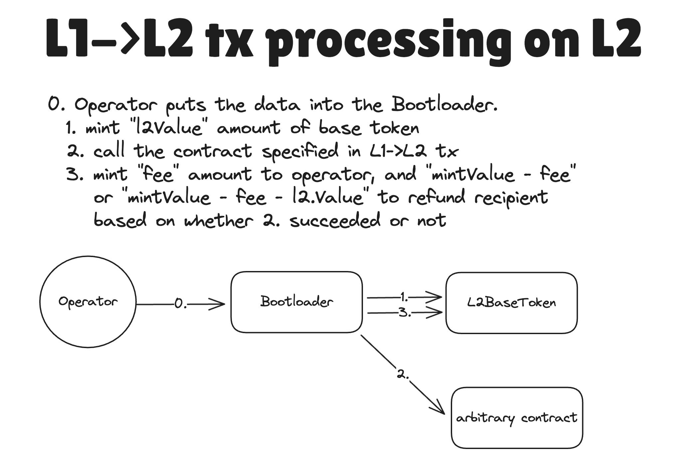
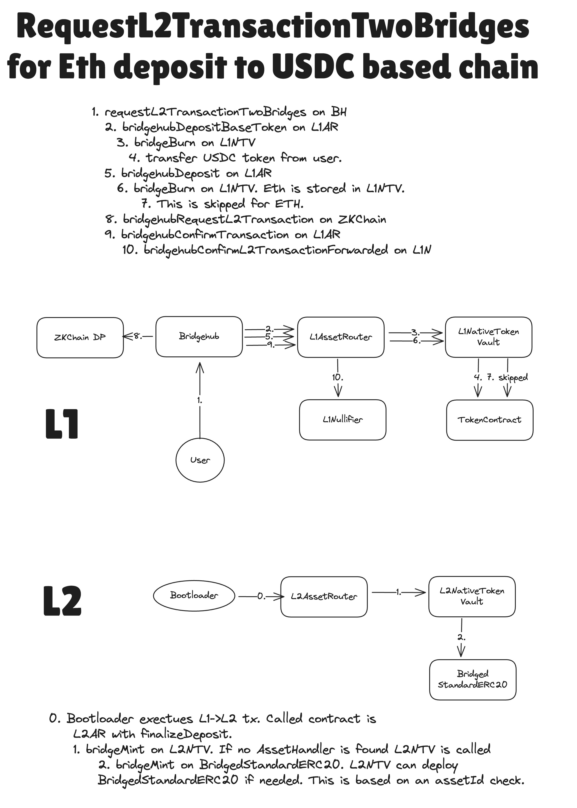

# BridgeHub & Asset Routers

[back to readme](../README.md)

## Bridgehub as the main chain registry

Bridgehub is the most important contract in the system, that stores:

- A mapping from chainId to chains address
- A mapping from chainId to the CTM it belongs to.
- A mapping from chainId to its base token (i.e. the token that is used for paying fees)
- etc

> Not sure what CTM is? Check out the [overview](../settlement_contracts/zkchain_basics.md) for contracts for settlement layer.

Overall, it is the main registry for all the contracts. Note, that a clone of Bridgehub is also deployed on each L2 chain, but this clone is only used on settlement layers. All the in all, the architecture of the entire ecosystem can be seen below:


> This document will not cover how ZK Gateway works, you can check it out in [a separate doc](../gateway/overview.md).

## Asset router as the main asset bridging entrypoint

The main entry for passing value between chains is the AssetRouter, it is responsible for facilitating bridging between multiple asset types. To read more in detail on how it works, please refer to custom [asset bridging documentation](./asset_router_and_ntv/overview.md).

For the purpose of this document, it is enough to treat the Asset Router as a blackbox that is responsible for processing escrowing funds on the source chain and minting them on the destination chain.

> For those that are aware of the [previous ZKsync architecture](https://github.com/code-423n4/2024-03-zksync/blob/main/docs/Smart%20contract%20Section/L1%20ecosystem%20contracts.md), its role is similar to L1SharedBridge that we had before. Note, however, that it is a different contract with much enhanced functionality. Also, note that the L1SharedBridge will NOT be upgraded to the L1AssetRouter. For more details about migration, please check out [the migration doc](../../upgrade_history/gateway_upgrade/gateway_diff_review.md).

### Handling base tokens

On L2, _a base token_ (not to be consfused with a _native token_, i.e. an ERC20 token with a main contract on the chain) is the one that is used for `msg.value` and it is managed at `L2BaseToken` system contract. We need its logic to be strictly defined in `L2BaseToken`, since the base asset is expected to behave the exactly the same as ether on EVM. For now this token contract does not support base minting and burning of the asset, nor further customization.

In other words, in the current release base assets can only be transferred through `msg.value`. They can also only be minted when they are backed 1-1 on L1.

## L1→L2 communication via `Bridgehub.requestL2TransactionDirect`

L1→L2 communication allows users on L1 to create a request for a transaction to happen on L2. This is the primary censorship resistance mechanism. If you are interested, you can read more on L1→L2 communications [here](../settlement_contracts/priority_queue/l1_l2_communication/l1_to_l2.md), but for now just understanding that L1→L2 communication allows to request transactions to happen on L2 is enough.

The L1→L2 communication is also the only way to mint a base asset at the moment. Fees to the operator as well as `msg.value` will be minted on `L2BaseToken` after the corresponding L1→L2 tx has been processed.

To request an L1→L2 transaction, the `BridgeHub.requestL2TransactionDirect` function needs to be invoked. The user should pass the struct with the following parameters:

```solidity
struct L2TransactionRequestDirect {
  uint256 chainId;
  uint256 mintValue;
  address l2Contract;
  uint256 l2Value;
  bytes l2Calldata;
  uint256 l2GasLimit;
  uint256 l2GasPerPubdataByteLimit;
  bytes[] factoryDeps;
  address refundRecipient;
}
```

Most of the params are self-explanatory & replicate the logic of ZKsync Era. The only non-trivial fields are:

- `mintValue` is the total amount of the base tokens that should be minted on L2 as the result of this transaction. The requirement is that `request.mintValue >= request.l2Value + request.l2GasLimit * derivedL2GasPrice(...)`, where `derivedL2GasPrice(...)` is the gas price to be used by this L1→L2 transaction. The exact price is defined by the ZKChain.

Here is a quick guide on how this transaction is routed through the bridgehub.

1. The bridgehub retrieves the `baseTokenAssetId` of the chain with the corresponding `chainId` and calls `L1AssetRouter.bridgehubDepositBaseToken` method. The `L1AssetRouter` will then use standard token depositing mechanism to burn/escrow the respective amount of the `baseTokenAssetId`. You can read more about it in [the asset router doc](./asset_router_and_ntv/overview.md). This step ensures that the baseToken will be backed 1-1 on L1.

2. After that, it just routes the corresponding call to the ZKChain with the corresponding `chainId` . It is now the responsibility of the ZKChain to validate that the transaction is correct and can be accepted by it. This validation includes, but not limited to:

   - The fact that the user paid enough funds for the transaction (basically `request.l2GasLimit * derivedL2GasPrice(...) + request.l2Value >= request.mintValue`.
   - The fact the transaction is always executable (the `request.l2GasLimit` is not high enough).
   - etc.

3. After the ZKChain validates the tx, it includes it into its priority queue. Once the operator executes this transaction on L2, the `mintValue` of the baseToken will be minted on L2. The `derivedL2GasPrice(...) * gasUsed` will be given to the operator’s balance. The other funds can be routed either of the following way:

If the transaction is successful, the `request.l2Value` will be minted on the `request.l2Contract` address (it can potentially transfer these funds within the transaction). The rest are minted to the `request.refundRecipient` address. In case the transaction is not successful, all of the base token will be minted to the `request.refundRecipient` address. These are the same rules as for the ZKsync Era.

**_Diagram of the L1→L2 transaction flow on L1 for direct user calls, the baseToken can be ETH or an ERC20:_**


**_Diagram of the L1→L2 transaction flow on L2 (it is the same regardless of the baseToken):_**




### Limitations of custom base tokens in the current release

ZKsync Era uses ETH as a base token. Upon creation of an ZKChain other chains may want to use their own custom base tokens. Note, that for the current release all the possible base tokens are whitelisted. The other limitation is that all the base tokens must be backed 1-1 on L1 as well as they are solely implemented with `L2BaseToken` contract. In other words:

- No custom logic is allowed on L2 for base tokens
- Base tokens can not be minted on L2 without being backed by the corresponding L1 amount.

If someone wants to build a protocol that mints base tokens on L2, the option for now is to “mint” an infinite amount of those on L1, deposit on L2 and then give those out as a way to “mint”. We will update this in the future.

## General architecture and initialization of SharedBridge for a new ZKChain

Once the chain is created, its L2AssetRouter will be automatically deployed upon genesis. You can read more about it in the [Chain creation flow](../chain_management/chain_genesis.md).

## `requestL2TransactionTwoBridges`

`L1AssetRouter` is used as the main "glue" for value bridging across chains. Whenever a token that is not native needs to be bridged between two chains an L1<>L2 transaction out of the name of an AssetRouter needs to be performed. For more details, check out the [asset router documentation](./asset_router_and_ntv/overview.md). But for this section it is enough to understand that we need to somehow make a transaction out of the name of `L1AssetRouter` to its L2 counterpart to deliver the message about certain amount of asset being bridged.

> In the next paragraphs we will often refer to `L1AssetRouter` as performing something. It is good enough for understanding of how bridgehub functionality works. Under the hood though, it mainly serves as common entry that calls various asset handlers that are chosen based on asset id. You can read more about it in the [asset router documentation](./asset_router_and_ntv/asset_router.md).

Let’s say that a ZKChain has ETH as its base token. Let’s say that the depositor wants to bridge USDC to that chain. We can not use `BridgeHub.requestL2TransactionDirect`, because it only takes base token `mintValue` and then starts an L1→L2 transaction rightaway out of the name of the user and not the `L1AssetRouter`.

We need some way to atomically deposit both ETH and USDC to the shared bridge + start a transaction from `L1AssetRouter`. For that we have a separate function on `Bridgehub`: `BridgeHub.requestL2TransactionTwoBridges`. The reason behind the name “two bridges” is a bit historical: the transaction supposed compose to do actions with two bridges: the bridge responsible for base tokens and the second bridge responsible for any other token.

Note, however, that only `L1AssetRouter` can be used to bridge base tokens. And the role of the second bridge can be played by any contract that supports the protocol desrcibed below.

When calling `BridgeHub.requestL2TransactionTwoBridges` the following struct needs to be provided:

```solidity
struct L2TransactionRequestTwoBridgesOuter {
  uint256 chainId;
  uint256 mintValue;
  uint256 l2Value;
  uint256 l2GasLimit;
  uint256 l2GasPerPubdataByteLimit;
  address refundRecipient;
  address secondBridgeAddress;
  uint256 secondBridgeValue;
  bytes secondBridgeCalldata;
}
```

The first few fields are the same as for the simple L1→L2 transaction case. However there are three new fields:

- `secondBridgeAddress` is the address of the bridge (or contract in general) which will need to perform the L1->L2 transaction. In this case it should be the same `L1AssetRouter`
- `secondBridgeValue` is the `msg.value` to be sent to the bridge which is responsible for the asset being deposited (in this case it is `L1AssetRouter` ). This can be used to deposit ETH to ZKChains that have base token that is not ETH.
- `secondBridgeCalldata` is the data to pass to the second contract. `L1AssetRouter` supports multiple formats of calldata, the list can be seen in the `bridgehubDeposit` function of the `L1AssetRouter`.

The function will do the following:

#### L1

1. It will deposit the `request.mintValue` of the ZKChain’s base token the same way as during a simple L1→L2 transaction. These funds will be used for funding the `l2Value` and the fee to the operator.
2. It will call the `secondBridgeAddress` (`L1AssetRouter`) once again and this time it will deposit the funds to the `L1AssetRouter`, but this time it will be deposit not to pay the fees, but rather for the sake of bridging the desired token.

This call will return the parameters to call the l2 contract with (the address of the L2 bridge counterpart, the calldata and factory deps to call it with). 3. After the BridgeHub will call the ZKChain to add the corresponding L1→L2 transaction to the priority queue. 4. The BridgeHub will call the `SharedBridge` once again so that it can remember the hash of the corresponding deposit transaction. [This is needed in case the deposit fails](#claiming-failed-deposits).

#### L2

1. After some time, the corresponding L1→L2 is created.
2. The L2AssetRouter will receive the message and re-route it to the asset handler of the bridged token. To read more about how it works, check out the [asset router documentation](./asset_router_and_ntv/overview.md).

**_Diagram of a depositing ETH onto a chain with USDC as the baseToken. Note that some contract calls (like `USDC.transferFrom` are omitted for the sake of consiceness):_**



## Generic usage of `BridgeHub.requestL2TransactionTwoBridges`

`L1AssetRouter` is the only bridge that can handle base tokens. However, the `BridgeHub.requestL2TransactionTwoBridges` could be used by `secondBridgeAddress` on L1. A notable example of how it is done is how our CTMDeploymentTracker uses it to register the correct CTM address on Gateway. You can read more about how Gateway works in [its documentation](../gateway/overview.md).

Let’s do a quick recap on how it works:

When calling `BridgeHub.requestL2TransactionTwoBridges` the following struct needs to be provided:

```solidity
struct L2TransactionRequestTwoBridgesOuter {
  uint256 chainId;
  uint256 mintValue;
  uint256 l2Value;
  uint256 l2GasLimit;
  uint256 l2GasPerPubdataByteLimit;
  address refundRecipient;
  address secondBridgeAddress;
  uint256 secondBridgeValue;
  bytes secondBridgeCalldata;
}
```

- `secondBridgeAddress` is the address of the L1 contract that needs to perform the L1->L2 transaction.
- `secondBridgeValue` is the `msg.value` to be sent to the `secondBridgeAddress`.
- `secondBridgeCalldata` is the data to pass to the `secondBridgeAddress`. This can be interpreted any way it wants.

1. Firstly, the Bridgehub will deposit the `request.mintValue` the same way as during a simple L1→L2 transaction. These funds will be used for funding the `l2Value` and the fee to the operator.
2. After that, the `secondBridgeAddress.bridgehubDeposit` with the following signature is called

```solidity
struct L2TransactionRequestTwoBridgesInner {
  // Should be equal to a constant `keccak256("TWO_BRIDGES_MAGIC_VALUE")) - 1`
  bytes32 magicValue;
  // The L2 contract to call
  address l2Contract;
  // The calldata to call it with
  bytes l2Calldata;
  // The factory deps to call it with
  bytes[] factoryDeps;
  // Just some 32-byte value that can be used for later processing
  // It is called `txDataHash` as it *should* be used as a way to facilitate
  // reclaiming failed deposits.
  bytes32 txDataHash;
}

function bridgehubDeposit(
  uint256 _chainId,
  // The actual user that does the deposit
  address _prevMsgSender,
  // The msg.value of the L1->L2 transaction to be created
  uint256 _l2Value,
  // Custom bridge-specific data
  bytes calldata _data
) external payable returns (L2TransactionRequestTwoBridgesInner memory request);
```

Now the job of the contract will be to “validate” whether they are okay with the transaction to come. For instance, the `CTMDeploymentTracker` checks that the `_prevMsgSender` is the owner of `CTMDeploymentTracker` and has the necessary rights to perform the transaction out of the name of it.

Ultimately, the correctly processed `bridgehubDeposit` function basically grants `BridgeHub` the right to create an L1→L2 transaction out of the name of the `secondBridgeAddress`. Since it is so powerful, the first returned value must be a magical constant that is equal to `keccak256("TWO_BRIDGES_MAGIC_VALUE")) - 1`. The fact that it was a somewhat non standard signature and a struct with the magical value is the major defense against “accidental” approvals to start a transaction out of the name of an account.

Aside from the magical constant, the method should also return the information an L1→L2 transaction will start its call with: the `l2Contract` , `l2Calldata`, `factoryDeps`. It also should return the `txDataHash` field. The meaning `txDataHash` will be needed in the next paragraphs. But generally it can be any 32-byte value the bridge wants.

1. After that, an L1→L2 transaction is invoked. Note, that the “trusted” `L1AssetRouter` has enforced that the baseToken was deposited correctly (again, the step (1) can _only_ be handled by the `L1AssetRouter`), while the second bridge can provide any data to call its L2 counterpart with.
2. As a final step, following function is called:

```solidity
function bridgehubConfirmL2Transaction(
  // `chainId` of the ZKChain
  uint256 _chainId,
  // the same value that was returned by `bridgehubDeposit`
  bytes32 _txDataHash,
  // the hash of the L1->L2 transaction
  bytes32 _txHash
) external;
```

This function is needed for whatever actions are needed to be done after the L1→L2 transaction has been invoked.

On `L1AssetRouter` it is used to remember the hash of each deposit transaction, so that later on, the funds could be returned to user if the `L1->L2` transaction fails. The `_txDataHash` is stored so that the whenever the users will want to reclaim funds from a failed deposit, they would provide the token and the amount as well as the sender to send the money to.

## Claiming failed deposits

In case a deposit fails, the `L1AssetRouter` allows users to recover the deposited funds by providing a proof that the corresponding transaction indeed failed. The logic is the same as in the current Era implementation.

## Withdrawing funds from L2

Funds withdrawal is a similar way to how it is done currently on Era.

The user needs to call the `L2AssetRouter.withdraw` function on L2, while providing the token they want to withdraw. This function would then calls the corresponding L2 asset handler and ask him to burn the funds. We expand a bit more about it in the [asset router documentation](./asset_router_and_ntv/overview.md).

Note, however, that it is not the way to withdraw base token. To withdraw base token, `L2BaseToken.withdraw` needs to be called.

After the batch with the withdrawal request has been executed, the user can finalize the withdrawal on L1 by calling `L1AssetRouter.finalizeWithdrawal`, where the user provides the proof of the corresponding withdrawal message.
