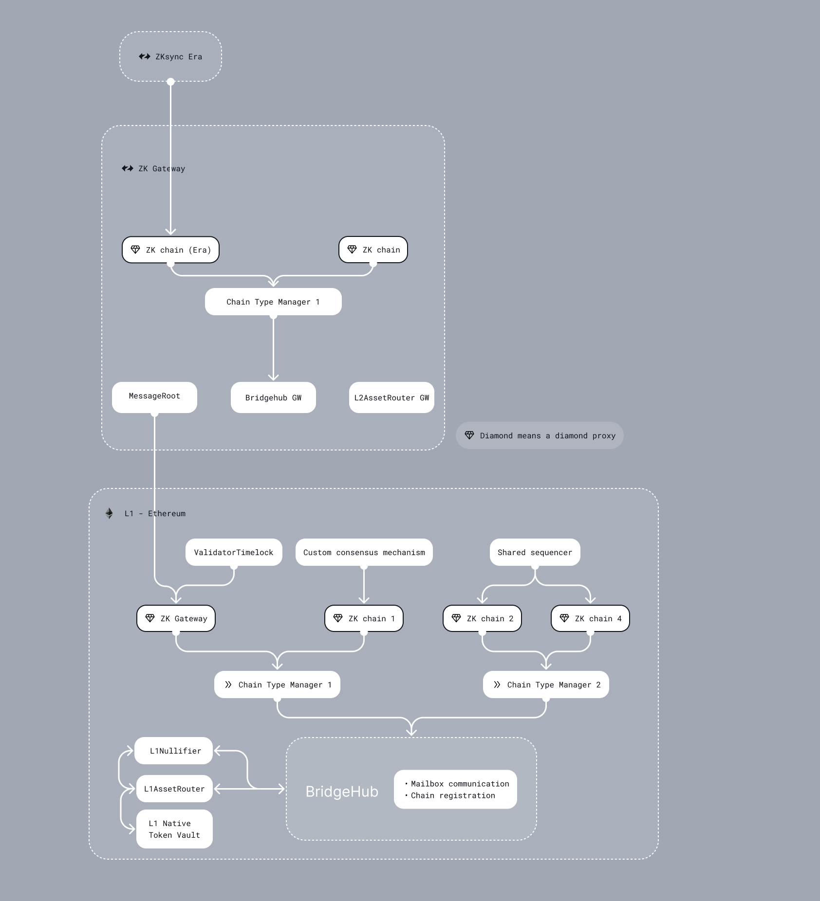

<!--- WIP --->

# Bridgehub

## Introduction

Bridgehub is the main chain registry contract for the ecosystem, that stores:

- A mapping from chainId to chains address
- A mapping from chainId to the CTM it belongs to.
- A mapping from chainId to its base token (i.e. the token that is used for paying fees)
- Whitelisted settlement layers (i.e. Gateway)

Note sure what CTM is? Check our the [overview](./chain_type_manager.md).

> This document will not cover how ZK Gateway works, you can check it out in [a separate doc](../gateway/overview.md). 

The Bridgehub is the contract where new chains can [register](./chain_genesis.md). The Bridgehub also serves as an AssetHandler for chains when migrating chains between settlement layers, read more about it [here](../gateway/chain_migration.md).

Overall, it is the main registry for all the contracts. Note, that a clone of Bridgehub is also deployed on each L2 chain, it is used to start interop txs by checking that the chain is active. It is also used on settlement layers such as Gateway. All the in all, the architecture of the entire ecosystem can be seen below:

