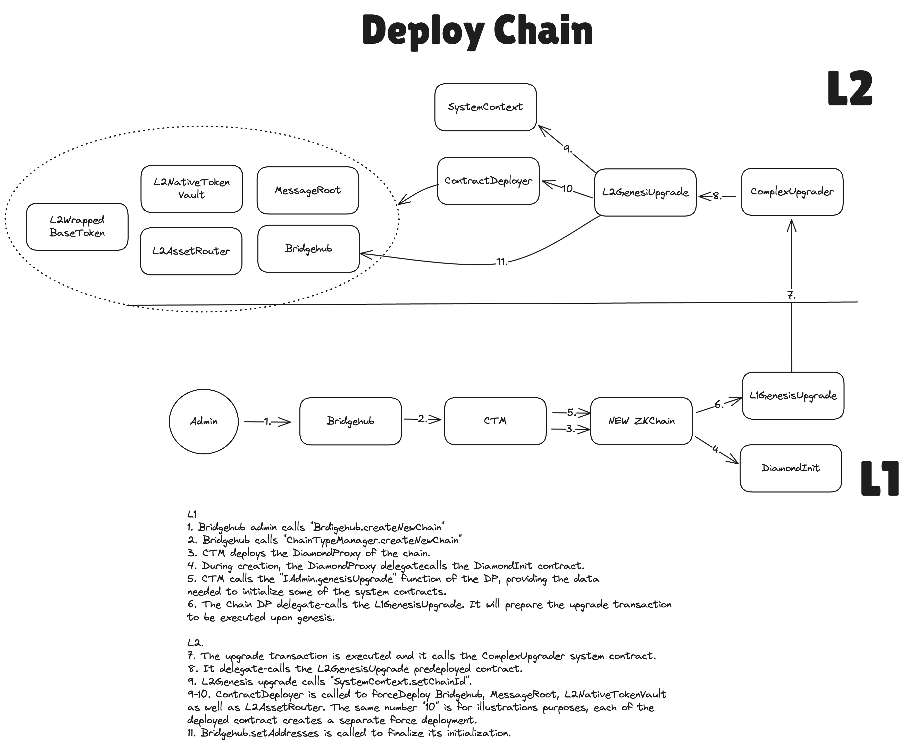

# Creating new chains with BridgeHub

[back to readme](../README.md)

The main contract of the whole hyperchain ecosystem is called _`BridgeHub`_. It contains:

- the registry from chainId to CTMs that is responsible for that chainId
- the base token for each chainId.
- the whitelist of CTMs
- the whitelist of tokens allowed to be `baseTokens` of chains.
- the whitelist of settlement layers
- etc

BridgeHub is responsible for creating new STs. It is also the main point of entry for L1→L2 transactions for all the STs. Users won't be able to interact with STs directly, all the actions must be done through the BridgeHub, which will ensure that the fees have been paid and will route the call to the corresponding ST. One of the reasons it was done this way was to have the unified interface for all STs that will ever be included in the hyperchain ecosystem.

To create a chain, the `BridgeHub.createNewChain` function needs to be called:

```solidity
/// @notice register new chain. New chains can be only registered on Bridgehub deployed on L1. Later they can be moved to any other layer.
/// @notice for Eth the baseToken address is 1
/// @param _chainId the chainId of the chain
/// @param _chainTypeManager the state transition manager address
/// @param _baseTokenAssetId the base token asset id of the chain
/// @param _salt the salt for the chainId, currently not used
/// @param _admin the admin of the chain
/// @param _initData the fixed initialization data for the chain
/// @param _factoryDeps the factory dependencies for the chain's deployment
function createNewChain(
    uint256 _chainId,
    address _chainTypeManager,
    bytes32 _baseTokenAssetId,
    // solhint-disable-next-line no-unused-vars
    uint256 _salt,
    address _admin,
    bytes calldata _initData,
    bytes[] calldata _factoryDeps
) external
```

BridgeHub will check that the CTM as well as the base token are whitelisted and route the call to the State



### Creation of a chain in the current release

In the future, ST creation will be permissionless. A securely random `chainId` will be generated for each chain to be registered. However, generating 32-byte chainId is not feasible with the current SDK expectations on EVM and so for now chainId is of type `uint48`. And so it has to be chosen by the admin of `BridgeHub`. Also, for the current release we would want to avoid chains being able to choose their own initialization parameter to prevent possible malicious input.

For this reason, there will be an entity called `admin` which is basically a hot key managed by us and it will be used to deploy new STs.

So the flow for deploying their own ST for users will be the following:

1. Users tell us that they want to deploy a ST with certain governance, CTM (we’ll likely allow only one for now), and baseToken.
2. Our server will generate a chainId not reserved by any other major chain and the `admin` will call the `BridgeHub.createNewChain` . This will call the `CTM.createNewChain` that will deploy the instance of the rollup as well as initialize the first transaction there — the system upgrade transaction needed to set the chainId on L2.

After that, the ST is ready to be used. Note, that the admin of the newly created chain (this will be the organization that will manage this chain from now on) will have to conduct certain configurations before the chain [can be used securely](../chain_management/admin_role.md).

## Built-in contracts and their initialization

Each single ZK Chain has a set of the following contracts that, while not belong to kernel space, are built-in and provide important functionality:

- Bridgehub (the source code is identical to the L1 one). The role of bridgehub is to facilitate cross chain transactions. It contains a mapping from chainId to the address of the diamond proxy of the chain. It is really used only on the L1 and Gateway, i.e. layers that can serve as a settlement layer.
- L2AssetRouter. The new iteration of the SharedBridge.
- L2NativeTokenVault. The Native token vault on L2.
- MessageRoot (the source code is identical to the L1 one). Similar to bridgehub, it facilitates cross-chain communication, but is practically unused on all chains except for L1/GW.

To reuse as much code as possible from L1 and also to allow easier initialization, most of these contracts are not initialized as just part of the genesis storage root. Instead, the data for their initialization is part of the original diamondcut for the chain. In the same initial upgrade transaction when the chainId is initialized, these contracts are force-deployed and initialized also. An important part in it plays the new `L2GenesisUpgrade` contract, which is pre-deployed in a user-space contract, but it is delegate-called by the `ComplexUpgrader` system contract (already exists as part of genesis and existed before this upgrade).

## Additional limitations for the current version

In the current version creating new chains will not be permissionless. That is needed to ensure that no malicious input can be provided there.

Also, since in the current release, there will be little benefits from shared liquidity, i.e. the there will be no direct ZKChain<>ZKChain transfers supported, as a measure of additional security we’ll also keep track of balances for each individual ZKChain and will not allow it to withdraw more than it has deposited into the system.
