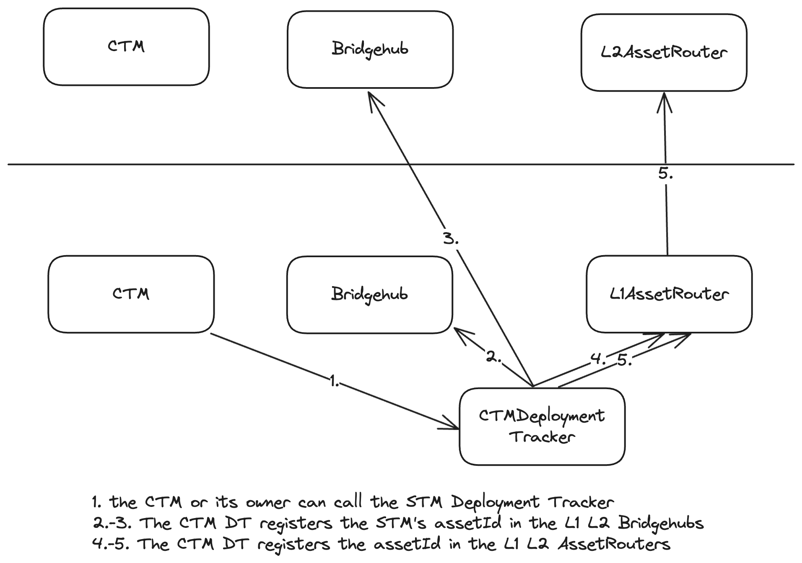
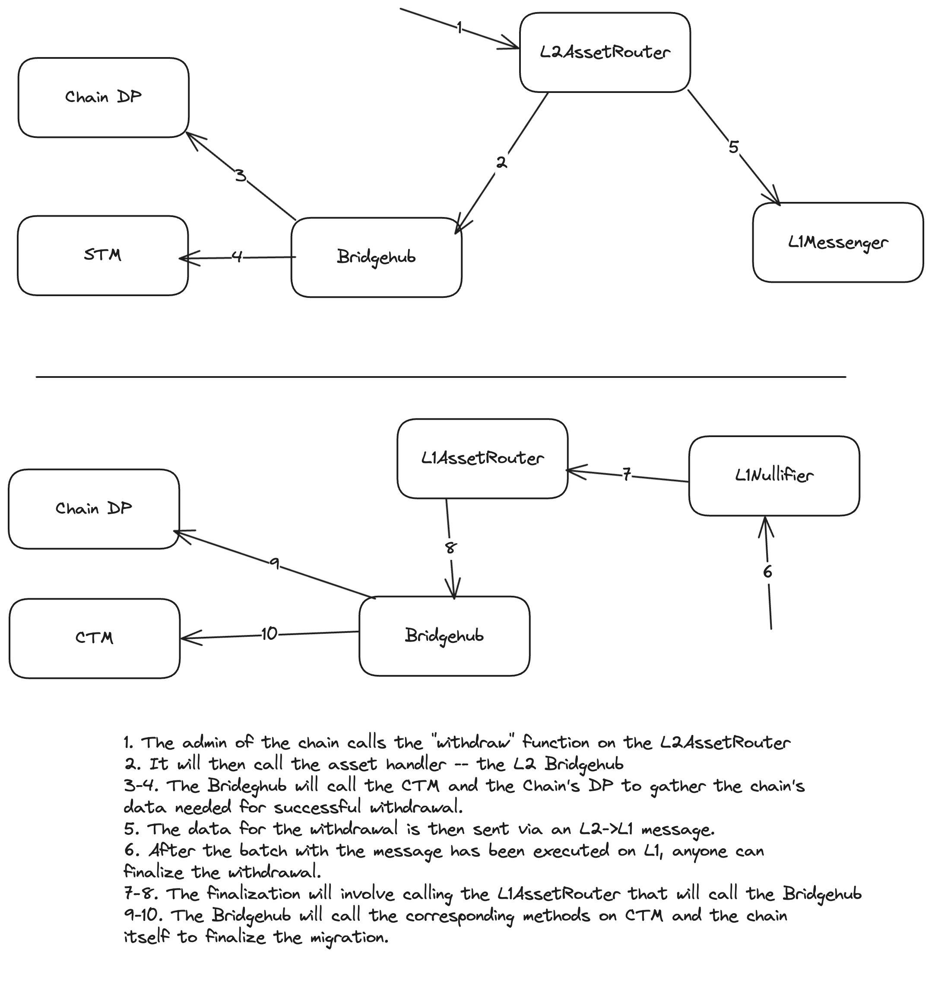

# Chain migration

## Ecosystem Setup

Chain migration reuses lots of logic from standard custom asset bridging which is enabled by the AssetRouter. The easiest way to imagine is that ZKChains are NFTs that are being migrated from one chain to another. Just like in case of the NFT contract, an CTM is assumed to have an `assetId := keccak256(abi.encode(L1_CHAIN_ID, address(ctmDeployer), bytes32(uint256(uint160(_ctmAddress)))))`. I.e. these are all assets with ADT = ctmDeployer contract on L1.

CTMDeployer is a very lightweight contract used to facilitate chain migration. Its main purpose is to server as formal asset deployment tracker for CTMs. It serves two purposes:

- Assign bridgehub as the asset handler for the “asset” of the CTM on the supported settlement layer.

Currently, it can only be done by the owner of the CTMDeployer, but in the future, this method can become either permissionless or callable by the CTM owner.

- Tell bridgehub which address on the L2 should serve as the L2 representation of the CTM on L1. Currently, it can only be done by the owner of the CTMDeployer, but in the future, this method can become callable by the CTM owner.

## The process of migration L1→GW

## Chain migration GW → L1

Chain migration from from L1 to GW works similar to how NFT bridging from L1 to another chain would work. Migrating back will use the same mechanism as for withdrawals.

Note, that for L2→L1 withdrawals via bridges we never provide a recovery mechanism. The same is the case with GW → L1 messaging, i.e. it is assumed that such migrations are always executable on L1.

You can read more about how the safety is ensured in the “Migration invariants & protocol upgradability” section.

## Chain migration GW_1 → GW_2

In this release we plan to only support a single whitelisted settlement layer, but if in the future more will be supported, as of now the plan is to migrate the chain firstly to L1 and then to GW.

## Chain migration invariants & protocol upgradability

Note, that once a chain migrates to a new settlement layer, there are two deployments of contracts for the same ZKChain. What’s more, the L1 part will always be used.

There is a need to ensure that the chains work smoothly during migration and there are not many issues during the protocol upgrade.

You can read more about it [here](./gateway_protocol_upgrades.md).
