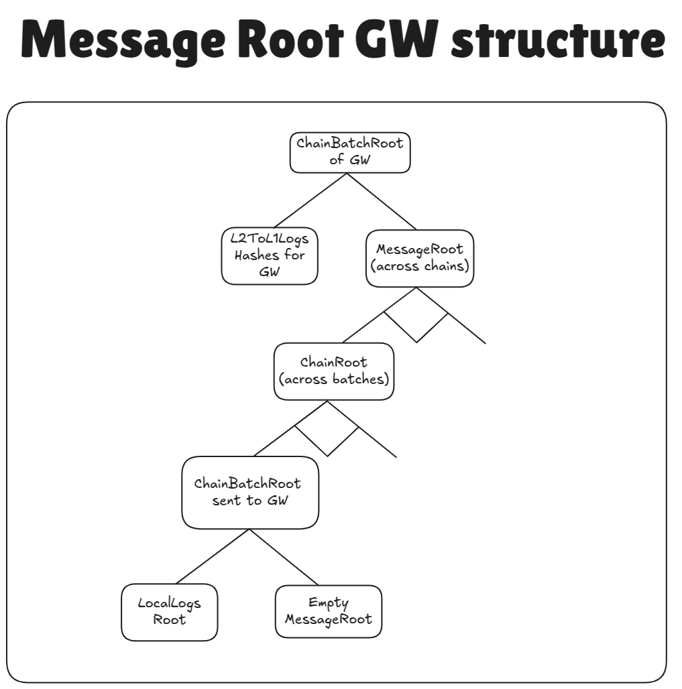

# Nested L2→GW→L1 messages tree design for Gateway

## Introduction

This document assumes that the reader is already aware of how [L2→L1 logs](../settlement_contracts/priority_queue/l1_l2_communication/l2_to_l1.md) are aggregated into the [MessageRoot][TODO] and what the [Gateway](../gateway/overview.md) is. To reduce interactions with L1, the Gateway gathers all the `ChainBatchRoot`s from all the chains into the tree with following structure:

>
## Proving logs for chains settling on Gateway

Proving these logs is almost the same as proving [interop][TODO] logs. For chain settling on Gateway the `MessageRoot` of Gateway is aggregated with the `LocalLogsRoot` of GW, and the `ChainBatchRoot` is sent to L1 to the GW's diamond proxy. The only difference is that the `ChainBatchRoot` is not stored in the `MessageRoot` but in the `LocalLogsRoot`.

## Trust assumptions

Note, that the `_proof` field is provided by potentially malicious users. The only part that really checks anything with L1 state is the final step of the aggregated proof verification, i.e. that the settled `ChainBatchRoot` of batch of the final top layer was present on L1.

It puts a lot of trust in the settlement layers as it can steal funds from chains and “verify” incorrect L2→GW→L1 logs if it wants to. It is the job of the chain itself to ensure that it trusts the aggregation layer. For this reason, all settlement layers have to be whitelisted by governance.

Also, note that that `address` of the settlement layer is provided by the user. Assuming that the settlement layer is trusted, this scheme works fine, since the `chainIdLeaf` belongs to it only if the chain really ever settled there. I.e. so the protection from maliciously chosen settlement layers is the fact that the settlement layers are trusted to never include batches that they did not have.

### Data availability guarantees

We want to maintain the security invariant that users can always withdraw their funds from rollup chains. In other words, all L2→GW→L1 logs that come from rollups should be eventually propagated to L1, and also regardless of how other chains behave an honest chain should always provide the ability for their users to withdraw.

Firstly, unless the chain settles on L1, this requires a trusted settlement layer. That is, not trusted operator of the gateway, but it works properly, i.e. appends messages correctly, publishes the data that it promises to publish, etc. This is already the case for the Gateway as it is a ZK rollup fork of Era, and while the operator may censor transactions, it can not lie and is always forced to publish all state diffs.

Secondly, we guarantee that all the stored `ChainIdLeaf`s are published on L1, even for Validiums. Publishing a single 32 byte value per relatively big Gateway batch has little price for Validiums, but it ensures that the settlement root of the gateway can always be constructed. And, assuming that the preimage for the chain root could be constructed, this gives an ability to ability to recover the proof for any L2→GW→L1 coming from a rollup.

But how can one reconstruct the total chain tree for a particular rollup chain? A rollup would relay all of its pubdata to L1, meaning that by observing L1, the observer would know all the L2→GW→L1 logs that happened in a particular batch. It means that for each batch it can restore the `LocalLogsRoot` (in case the `MessageRoot` is non-zero, it could be read from e.g. the storage which is available via the standard state diffs). This allows to calculate the `BatchRootLeaf` for the chain. The only thing missing is understanding which batches were finalized on gateway in order to construct the merkle path to the `ChainRootLeaf`.

To understand which SL was used by a batch for finalization, one could simply brute force over all settlement layers ever used to find out where the chainBatchRoot is stored. This number is expected to be rather small.

<!-- 
## Legacy support

In order to ease the server migration, we support legacy format of L2→L1 logs proving, i.e. just provide a proof that assumes that stored `chainBatchRoot` is identical to `LocalLogsRoot`, i.e. the hash of logs in the batch.

To differentiate between legacy format and the one, the following approach is used;

- Except for the first 3 bytes the first word in the new format contains 0s, which is unlikely in the old format, where leaves are hashed.
- I.e. if the last 29 bytes are zeroes, then it is assumed to be the new format and vice versa.

In the next release the old format will be removed.
 -->
