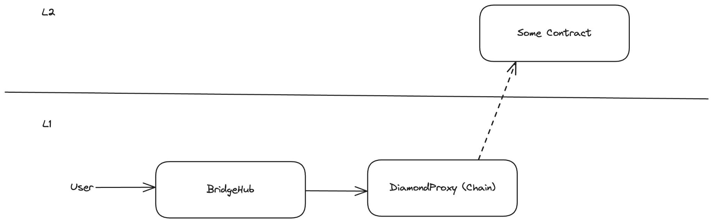
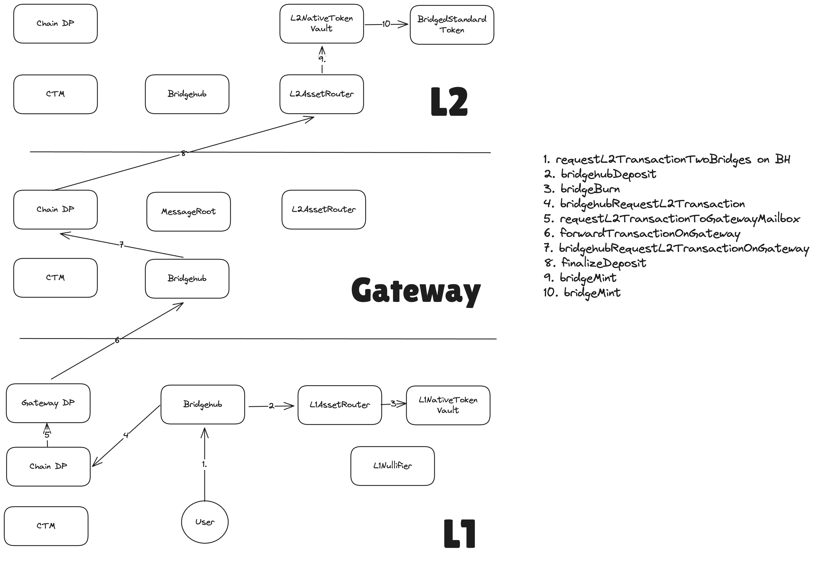

# Messaging via Gateway

## Deeper dive into MessageRoot contract and how L2→GW→L1 communication works

Before, when were just settling on L1, a chain’s message root was just the merkle tree of L2→L1 logs that were sent within this batch. However, this new model will have to be amended to be able to perform messages to L1 coming from an L2 that settles on top of Gateway.

The description of how L2→GW→L1 messages are aggregated in the MessageRoots and proved on L1 can be read in the [nested l2 gw l1 messaging](./l2_gw_l1_messaging.md) section.

## L1→GW→L2 messaging

As a recap, here is how messaging works for chains that settle on L1:

- The user calls the bridgehub, which routes the message to the chain.
- The operator eventually sees the transaction via an event on L1 and it will process it on L2.

With gateway, the situation will be a bit more complex:

Since now, the contracts responsible for batch processing were moved to Gateway, now all the priority transactions have to be relayed to that chain so that the validation could work.

- (Steps 1-3) The user calls Bridgehub. The base token needs to be deposited via L1AssetRouter (usually the NTV will be used).
- (Step 4-5). The Bridgehub calls the chain where the transaction is targeted to. The chain sees that its settlement layer is another chain and so it calls it and asks to relay this transaction to gateway
- (Steps 6-7). priority transaction from `SETTLEMENT_LAYER_RELAY_SENDER` to the Bridgehub is added to the Gateway chain’s priority queue. Once the Gateway operator sees the transaction from L1, it processed it. The transaction itself will eventually call the DiamondProxy of the initial called chain.
- (Step 8) At some point, the operator of the chain will see that the priority transaction has been included to the gateway and it will process it on the L2.
- Step 9 from the picture above is optional and in case the callee of the L1→GW→L2 transaction is the L2AssetRouter (i.e. the purpose of the transaction was bridging funds), then the L2AssetRouter will call asset handler of the asset (in case of standard bridged tokens, it will be the NativeTokenVault). It will be responsible for minting the corresponding number of tokens to the user.

So under the hood there are 2 cross chain transactions happening:

1. One from L1 to GW
2. The second one from GW to the L2.

From another point with bridging we have methods that allow users to recover funds in case of a failed L1→L2 transaction. E.g. if the user tried to bridge USDC to a Zk Chain, but did not provide enough L2 gas, it can still recover the funds.

This functionality works by letting user prove that the bridging transaction failed and then the funds are released back to the original sender on L1. With the approach above where there are multiple cross chain transactions involved, it could become 2x hard to maintain: now both of these could fail.

To simplify things, for now, we provide the L1→GW with a large amount of gas (72kk, i.e. the maximal amount allowed to be passed on L2). We believe that it is not possible to create a relayed transaction that would fail, assuming that a non malicious recipient CTM is used on L2.

> Note, that the above means that we currently rely on the following two facts:

- The recipient CTM is honest and efficient.
- Creating a large transaction on L1 that would cause the L1→GW part to fail is not possible due to high L1 gas costs that would be required to create such a tx.

Both of the assumptions above will be removed in subsequent releases, but for now this is how things are.

>
