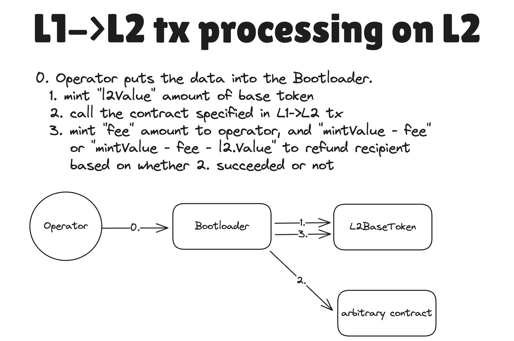

# Interop Center example scenarios

### Handling base tokens

On L2, _a base token_ (not to be consfused with a _native token_, i.e. an ERC20 token with a main contract on the chain) is the one that is used for `msg.value` and it is managed at `L2BaseToken` system contract. We need its logic to be strictly defined in `L2BaseToken`, since the base asset is expected to behave the exactly the same as ether on EVM. For now this token contract does not support base minting and burning of the asset, nor further customization.

In other words, in the current release base assets can only be transferred through `msg.value`. They can also only be minted when they are backed 1-1 on L1.

## L1→L2 communication via `Bridgehub.requestL2TransactionDirect`

L1→L2 communication allows users on L1 to create a request for a transaction to happen on L2. This is the primary censorship resistance mechanism. If you are interested, you can read more on L1→L2 communications [here](../../settlement_contracts/priority_queue/l1_l2_communication/l1_to_l2.md), but for now just understanding that L1→L2 communication allows to request transactions to happen on L2 is enough.

The L1→L2 communication is also the only way to mint a base asset at the moment. Fees to the operator as well as `msg.value` will be minted on `L2BaseToken` after the corresponding L1→L2 tx has been processed.

To request an L1→L2 transaction, the `BridgeHub.requestL2TransactionDirect` function needs to be invoked. The user should pass the struct with the following parameters:

```solidity
struct L2TransactionRequestDirect {
  uint256 chainId;
  uint256 mintValue;
  address l2Contract;
  uint256 l2Value;
  bytes l2Calldata;
  uint256 l2GasLimit;
  uint256 l2GasPerPubdataByteLimit;
  bytes[] factoryDeps;
  address refundRecipient;
}
```

///
<!-- - `BridgehubMailbox` routes messages to the Diamond proxy’s Mailbox facet based on chainID

  - Same as the current zkEVM
    [Mailbox](https://github.com/matter-labs/era-contracts/blob/main/l1-contracts/contracts/zksync/facets/Mailbox.sol),
    just with chainId,
  - This is where L2 transactions can be requested.

  ```
    function requestL2TransactionTwoBridges(
        L2TransactionRequestTwoBridgesOuter calldata _request
    )
  ```

  ```
  struct L2TransactionRequestTwoBridgesOuter {
    uint256 chainId;
    uint256 mintValue;
    uint256 l2Value;
    uint256 l2GasLimit;
    uint256 l2GasPerPubdataByteLimit;
    address refundRecipient;
    address secondBridgeAddress;
    uint256 secondBridgeValue;
    bytes secondBridgeCalldata;
  }
  ```

```
  struct L2TransactionRequestTwoBridgesInner {
    bytes32 magicValue;
    address l2Contract;
    bytes l2Calldata;
    bytes[] factoryDeps;
    bytes32 txDataHash;
}
```

- The `requestL2TransactionTwoBridges` function should be used most of the time when bridging to a chain ( the exeption
  is when the user bridges directly to a contract on the L2, without using a bridge contract on L1). The logic of it is
  the following:

  - The user wants to bridge to chain with the provided `L2TransactionRequestTwoBridgesOuter.chainId`.
  - Two bridges are called, the baseTokenBridge (i.e. the L1SharedBridge or L1AssetRouter after the Gateway upgrade) and
    an arbitrary second bridge. The Bridgehub will provide the original caller address to both bridges, which can
    request that the appropriate amount of tokens are transferred from the caller to the bridge. The caller has to set
    the appropriate allowance for both bridges. (Often the bridges coincide, but they don't have to).
  - The `L2TransactionRequestTwoBridgesOuter.mintValue` is the amount of baseTokens that will be minted on L2. This is
    the amount of tokens that the baseTokenBridge will request from the user. If the baseToken is Eth, it will be
    forwarded to the baseTokenBridge.
  - The `L2TransactionRequestTwoBridgesOuter.l2Value` is the amount of tokens that will be deposited on L2. The second
    bridge and the Mailbox receives this as an input (although our second bridge does not use the value).
  - The `L2TransactionRequestTwoBridgesOuter.l2GasLimit` is the maximum amount of gas that will be spent on L2 to
    complete the transaction. The Mailbox receives this as an input.
  - The `L2TransactionRequestTwoBridgesOuter.l2GasPerPubdataByteLimit` is the maximum amount of gas per pubdata byte
    that will be spent on L2 to complete the transaction. The Mailbox receives this as an input.
  - The `L2TransactionRequestTwoBridgesOuter.refundRecipient` is the address that will be refunded for the gas spent on
    L2. The Mailbox receives this as an input.
  - The `L2TransactionRequestTwoBridgesOuter.secondBridgeAddress` is the address of the second bridge that will be
    called. This is the arbitrary address that is called from the Bridgehub.
  - The `L2TransactionRequestTwoBridgesOuter.secondBridgeValue` is the amount of tokens that will be deposited on L2.
    The second bridge receives this value as the baseToken (i.e. Eth on L1).
  - The `L2TransactionRequestTwoBridgesOuter.secondBridgeCalldata` is the calldata that will be passed to the second
    bridge. This is the arbitrary calldata that is passed from the Bridgehub to the second bridge.
  - The secondBridge returns the `L2TransactionRequestTwoBridgesInner` struct to the Bridgehub. This is also passed to
    the Mailbox as input. This is where the destination contract, calldata, factoryDeps are determined on the L2.

  This setup allows the user to bridge the baseToken of the origin chain A to a chain B with some other baseToken, by
  specifying the A's token in the secondBridgeValue, which will be minted on the destination chain as an ERC20 token,
  and specifying the amount of B's token in the mintValue, which will be minted as the baseToken and used to cover the
  gas costs.

#### Main asset shared bridges L2TransactionRequestTwoBridgesInner

- Some assets have to be natively supported (ETH, WETH) and it also makes sense to support some generally accepted token
  standards (ERC20 tokens), as this makes it easy to bridge those tokens (and ensures a single version of them exists on
  the ZK Chain ecosystem). These canonical asset contracts are deployed from L1 by a bridge shared by all ZK Chains.
  This is where assets are locked on L1. These bridges use the BridgeHub to communicate with all ZK Chains. Currently,
  these bridges are the `WETH` and `ERC20` bridges. -->
////


Most of the params are self-explanatory & replicate the logic of ZKsync Era. The only non-trivial fields are:

- `mintValue` is the total amount of the base tokens that should be minted on L2 as the result of this transaction. The requirement is that `request.mintValue >= request.l2Value + request.l2GasLimit * derivedL2GasPrice(...)`, where `derivedL2GasPrice(...)` is the gas price to be used by this L1→L2 transaction. The exact price is defined by the ZKChain.

Here is a quick guide on how this transaction is routed through the bridgehub.

1. The bridgehub retrieves the `baseTokenAssetId` of the chain with the corresponding `chainId` and calls `L1AssetRouter.bridgehubDepositBaseToken` method. The `L1AssetRouter` will then use standard token depositing mechanism to burn/escrow the respective amount of the `baseTokenAssetId`. You can read more about it in [the asset router doc](../../bridging/asset_router_and_ntv/asset_router.md). This step ensures that the baseToken will be backed 1-1 on L1.

2. After that, it just routes the corresponding call to the ZKChain with the corresponding `chainId` . It is now the responsibility of the ZKChain to validate that the transaction is correct and can be accepted by it. This validation includes, but not limited to:

   - The fact that the user paid enough funds for the transaction (basically `request.l2GasLimit * derivedL2GasPrice(...) + request.l2Value >= request.mintValue`.
   - The fact the transaction is always executable (the `request.l2GasLimit` is not high enough).
   - etc.

3. After the ZKChain validates the tx, it includes it into its priority queue. Once the operator executes this transaction on L2, the `mintValue` of the baseToken will be minted on L2. The `derivedL2GasPrice(...) * gasUsed` will be given to the operator’s balance. The other funds can be routed either of the following way:

If the transaction is successful, the `request.l2Value` will be minted on the `request.l2Contract` address (it can potentially transfer these funds within the transaction). The rest are minted to the `request.refundRecipient` address. In case the transaction is not successful, all of the base token will be minted to the `request.refundRecipient` address. These are the same rules as for the ZKsync Era.

**_Diagram of the L1→L2 transaction flow on L1 for direct user calls, the baseToken can be ETH or an ERC20:_**


**_Diagram of the L1→L2 transaction flow on L2 (it is the same regardless of the baseToken):_**


