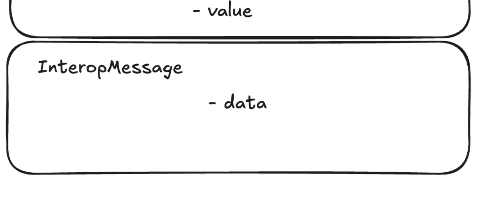

## Interop Messages

In this section, we cover the lowest level of the interop stack: **Interop Messages**—the interface that forms the foundation for everything else.

This is an advanced document. While most users and app developers typically interact with higher layers of interop, understanding the internals remains valuable.

## Basics



**InteropMessages** are the base layer of our interop stack.

An **InteropMessage** consists of arbitrary data (bytes) and has two simple properties:

* Anyone can send a message.
* Anyone can verify that a given message was successfully sent on some chain.

The message itself has no destination chain or address—it’s simply a payload created by a user (or contract). Think of it as a broadcast.

To send a message, a user calls the `sendToL1` function on the `L1Messenger` contract, which is pre-deployed on every ZKsync chain at address `0x00..008008`:

```solidity
function sendToL1(bytes calldata _message)
```

When you call `sendToL1`, the `L1Messenger` returns a `hash`, which is the `keccak256` of the message. This hash serves as a globally unique identifier and is required to verify the message’s inclusion on other chains via `verifyInteropMessage`.


### What happens under the hood?


Note, that currently only message flow between chains settling on Gateway is possible, so we'll have this in mind while going over step-by-step process.

A high-level overview of the send-and-verify flow:

1. **Send**.
   The user calls `sendToL1` on chain **L2_A** via the `L1Messenger` contract.
2. **Batch Execution**.
   When the batch containing the message executes on the Gateway, the Executor facet appends **L2_A**’s chain-batch root (which includes the log for the message) to the Gateway’s global message root.
3. **Event Emission**.
   The Gateway’s `MessageRoot` contract emits an event indicating that a new interop root (the updated `sharedTree` root) was generated.
4. **Event Capture**.
   The server for the listening chain (**L2B**) uses EthWatch to detect this event, stores it in its database, and includes it in the next batch’s bootloader state.
5. **Root Storage**.
   On **L2_B**, the Bootloader component calls `L2InteropRootStorage` to update its stored interop roots with the latest root from step 4.
6. **Dependency Verification**.
   During settlement on **L2_B**, the batch’s dependency roots are verified against the Gateway’s `MessageRoot`.
7. **Verification Complete**.
   At this point, the interop root for the batch is confirmed.
8. **User Proof Submission**.
   The user calls `proveL2MessageInclusionShared` on **L2_B**’s `L2_MESSAGE_VERIFICATION_ADDRESS` (`0x..10009`), supplying the message data and a proof of inclusion (see below). Note, that this step could be done in the same batch as steps 6-7, not necessarily strictly later.
9. **Final Verification**.
   This triggers `L2InteropRootStorage` to verify the corresponding interop-root inclusion on **L2_B**.

#### How do I get the proof?

The `proveL2MessageInclusionShared` function requires a Merkle-tree proof (see [message root](./message_root.md)). You can obtain it by:

* Querying the chain via the [zksync RPC API](https://docs.zksync.io/build/api-reference/zks-rpc#zks_getl2tol1msgproof)
* Generating it off-chain from the SL state

#### How does this differ from other layers (InteropTransactions, InteropCalls)?

As the most basic layer, Interop Messages:

* Do **not** support selecting destination chains
* Lack nullifiers or replay protection
* Offer no cancellation mechanism

They represent a simple, broadcast-style communication primitive.

#### Timestamps and Expiration

* On ElasticChain, older messages can become harder to validate as gathering the required Merkle-proof data grows more challenging over time.
* Nevertheless, if you can obtain the proof for the corresponding leaf, there is **no expiration**—messages remain technically verifiable indefinitely.


#### Example

Please see the [Advanced Guide](../../../guides/advanced/19_interop_basics.md) for example with exact commands.