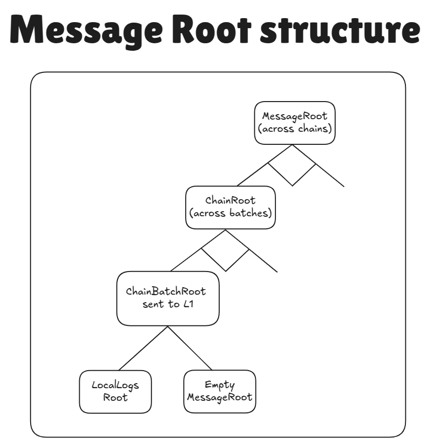
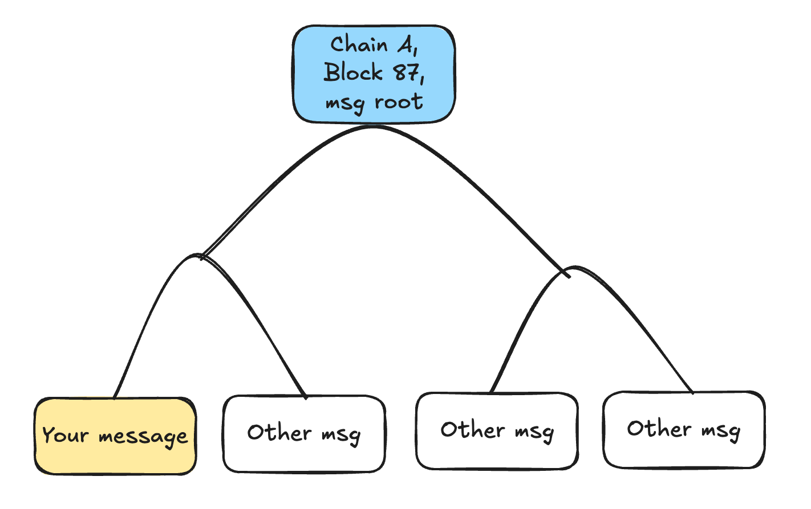
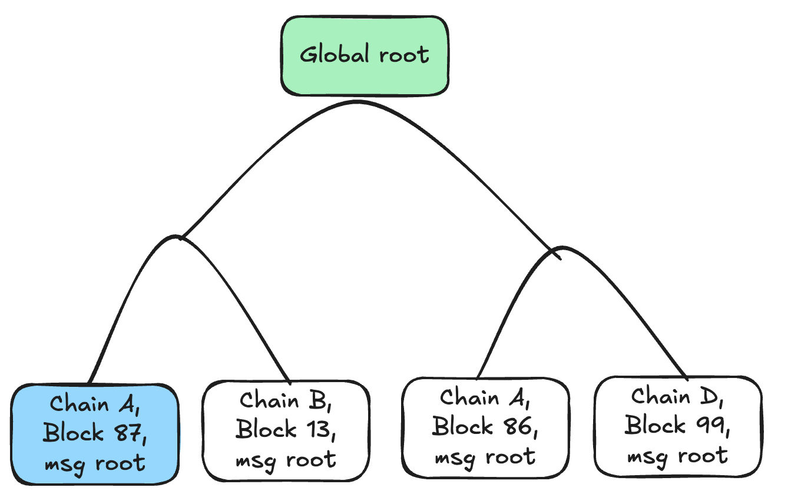
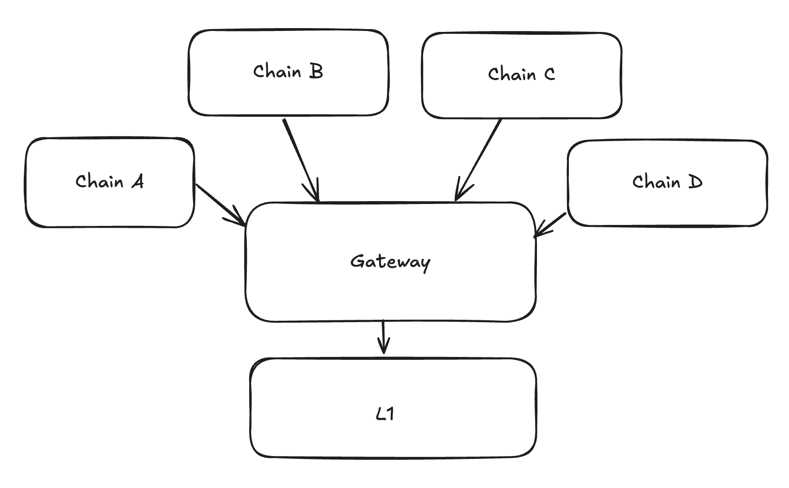

# MessageRoot

## Introduction

The message root is the contract on ZKsync chains that collects messages from different chains and aggregates them into a single Merkle tree. This makes interop more efficient, since instead of having to import each individual message, chains can import the `MessageRoot`, which is an aggregate of messages in a single batch, then across batches of a single chain, and then across chains. 

The `MessageRoot` contract is deployed both on L1 and all ZKsync chains, but on ZKsync chains it is only used on GW (since it's the only ZKsync chain which is whitelisted as settlement layer, as of now). On GW it is used to aggregate messages for chains that are settling on GW, in the same way that it is done on L1. Read about it [here](../gateway/messaging_via_gateway.md).



The tree forming the whole `MessageRoot` at one given chain is called `sharedTree` on implementation level. It's the tree formed by taking `MessageRoot` node, and all of it's children in the picture above.

> The lines between `MessageRoot` and `chainRoot` and between each `chainRoot` and `ChainBatchRoot` show different binary merkle trees. The `MessageRoot` will be the root of a `FullMerkleTree` of `chainRoot`, while `chainRoot` is the merkle root of a `DynamicIncrementalMerkleTree` of `ChainBatchRoot`.

The root has the following format:

`ChainBatchRoot = keccak256(LocalLogsRoot, MessageRoot)`

where `LocalLogsRoot` is the root of the tree of messages that come from the chain itself in the given batch, while the `MessageRoot` is the root of aggregated messages from all of the chains that settle on top of the chain. For most chains the `MessageRoot` is empty. The `ChainBatchRoot` will be settled on the layer below, and be used to update the `ChainRoot` in the `MessageRoot` contract on that layer.

The structure has the following recursive format:

- `ChainBatchRoot = keccak256(LocalLogsRoot, MessageRoot)`
- `BatchRootLeaf = keccak256(BATCH_LEAF_PADDING, chainBatchRoot, batchNumber)`, where:
    - `BATCH_LEAF_PADDING`: a constant padding, needed to ensure that the preimage of the BatchRootLeaf is larger than 64 bytes and so it can not be an internal node.
- `ChainRoot` = the root of the binary dynamic incremental merkle tree `BatchRootLeaf[]`.
- `ChainIdLeaf = keccak256(CHAIN_ID_LEAF_PADDING, chainRoot, chainId)`, where:
    - `CHAIN_ID_LEAF_PADDING` — it is a constant padding, needed to ensure that the preimage of the ChainIdLeaf is larger than 64 bytes and so it can not be an internal node.
    - `chain_id` — the chain id of the chain the batches of which are aggregated.
- `MessageRoot` — the root of the binary full merkle tree over `ChainIdLeaf[]`.

Note that the `MessageRoot` appears twice in the structure. So the structure is recursive, chains can aggregate other chains, this is used for the [`Gateway`](../gateway/l2_gw_l1_messaging.md)

## Appending new batch root leaves

At the end of each batch, the `L1Messenger` system contract would query the `MessageRoot` contract for the total aggregated root (i.e., the root of all `ChainIdLeaf`s, which is the `sharedTree` root, the upmost node of the `MessageRoot` on the chain), calculate the `LocalLogsRoot` itself, and finally calculate the settled chain batch root `ChainBatchRoot = keccak256(LocalLogsRoot, AggregatedRootHash)` and propagate it to the settlement layer. We store `ChainBatchRoot` for each executed batch on settlement layer.

When a ZKsync chain's batch gets executed on the settlement layer, the chain calls the `L2AssetRouter.processLogsAndMessages` function, processing all the messages within the batch (see the flow [here](../bridging/asset_tracker/asset_tracker.md#settlement-of-chains-and-interop)). After all the checks are done, the `BatchRootLeaf` will be calculated and appended to the incremental Merkle tree with which the `ChainRoot` & `ChainIdLeaf` is calculated, which will be updated in the Merkle tree of `ChainIdLeaf`s.

## Proving that a message belongs to a MessageRoot

### Concepts

To prove that a message belongs to a `MessageRoot`, we need to understand the verification process conceptually. The proof system works through a hierarchical structure where messages are aggregated at multiple levels:

1. Message to Batch: First, we prove that a specific message was included in a particular batch on its origin chain. This uses the same verification mechanism as standard L2->L1 log proofs.
2. Batch to Chain: Next, we prove that the batch containing our message was included in the origin chain's aggregated root (`ChainRoot`). This involves proving the `BatchRootLeaf`'s inclusion in the chain's `DynamicIncrementalMerkle` tree.
3. Chain to MessageRoot: Finally, we prove that the origin chain's root was included in the `MessageRoo`t's shared tree. This involves proving the `ChainIdLeaf`'s inclusion in the `MessageRoot`'s FullMerkle tree.

The verification process follows the hierarchical structure described earlier in this document, working up through the tree levels from individual messages to the final `MessageRoot`. Each level uses Merkle proofs to cryptographically verify inclusion, ensuring that the message authentically belongs to the claimed `MessageRoot`.

### Technical Implementation

We construct concatenated Merkle proofs to prove that a message belongs to a `MessageRoot`. The process consists of two main steps:

1. Construct the proof to the chain's `ChainBatchRoot`. This is the same proof that is used to verify [L2->L1 logs](../settlement_contracts/priority_queue/l1_l2_communication/l2_to_l1.md).
2. Prove that it belonged to the `MessageRoot`.

The concatenated proof is passed into the `proveL2LogInclusion` method. This will split the proof into the two parts listed above, and then verify the two merkle proofs. The first verification is done via the normal process of log inclusion, while the second uses `proveL2LeafInclusion`. The final root is checked to be stored in storage.

#### RPC Method and Proof Format

To avoid breaking changes to SDKs, the `zks_getL2ToL1LogProof` RPC method returns the proof data in a format directly supported by the `proveL2LogInclusion` contract method:

First `bytes32` corresponds to the metadata of the proof. The zero-th byte should tell the version of the metadata and must be equal to the `SUPPORTED_PROOF_METADATA_VERSION` (a constant of `0x01`).

Then, it should contain the number of 32-byte words that are needed to restore the current `BatchRootLeaf` , i.e. `logLeafProofLen` (it is called this way as it proves that a leaf belongs to the `ChainBatchRoot`). The second byte contains the `batchLeafProofLen`. It is the length of the merkle path to prove that the `BatchRootLeaf` belonged to the `ChainRoot`. The third byte, `isFinalNode`, is a boolean value representing if the proof is for the top level in the aggregation.

#### Proof Verification Process

Then, the following happens:

- We consume the `logLeafProofLen` items to produce the `ChainBatchRoot`. The last word is typically the aggregated root for the chain.

If we were verifying `ChainBatchRoot` inclusion we would end here: `isFinalNode` would be set to true, and `batchLeafProofLen` to zero. To continue to `MessageRoot` inclusion we would set `isFinalNode` to be false, define `batchLeafProofLen` accordingly, and:

- Compute `BatchRootLeaf = keccak256(BATCH_LEAF_PADDING, chainBatchRoot, batchNumber)`.
- Consume one element from the `_proofs` array to get the mask for the Merkle path of the batch leaf in the chain ID tree.
- Consume `batchLeafProofLen` elements to construct the `ChainRoot`
- Compute the `chainIdLeaf = keccak256(CHAIN_ID_LEAF_PADDING, chainRoot, chainId)`

Now, we have the _supposed_ `chainIdRoot` for the chain inside its settlement layer. The only thing left to prove is that this root belonged to some batch of the settlement layer.

Then, the following happens:

- One element from `_proof` array is consumed and expected to maintain the block number of the settlement layer when this chain ID `ChainBatchRoot` was present concatenated with the mask for the reconstruction of the Merkle tree.
- The second element read from `_proof` contains the settlement layer Chain ID.

The `proveL2LeafInclusion` function will be internally used by the existing `_proveL2LogInclusion` function to prove that a certain node existed in the tree. 
Now, we can call the function to verify that the batch belonged to the settlement layer's `MessageRoot`:

```solidity
    proveL2LeafInclusion(
        settlementLayerChainId,
        settlementLayerBlockNumber,
        settlementLayerBlockRootMask,
        chainIdLeaf,
        // Basically pass the rest of the `_proof` array
        extractSliceUntilEnd(_proof, ptr)
    );
```

The other slice of the `_proof` array is expected to have the same structure as before:

- Metadata
- Merkle path to construct the `ChainBatchRoot`
- In case there are any more aggregation layers, additional info to prove that the batch belonged to it.

## Additional notes on security

### Redundance of data

Currently, we never clear the `MessageRoot` in other words, the aggregated root contains more and more batches’ settlement roots, leading to the following two facts:

- The aggregated proofs’ length starts to logarithmically depend on the number of total batches ever finalized on top of this settlement layer (it also depends logarithmically on the number of chains in the settlement layer). I.e. it is `O(log(total_chains) + log(total_batches) + log(total_logs_in_the_batch))` in case of a single aggregation layer.
- The same data may be referenced from multiple final aggregated roots.

It is the responsibility of the chain to ensure that each message has a unique id and can not be replayed. Currently a tuple of `chain_batch_number, chain_message_id` is used. While there are multiple message roots from which such a tuple could be proven from, it is still okay as it will be nullified only once.

Another notable example of the redundancy of data, is that we also have total `MessageRoot` on L1, which contains the aggregated root of all chains, while for chains that settle on L1, we still store the `ChainBatchRoot` for the efficiency.

## MessageRoot as global source of batches

Before v30, we used to simply store the chain batch roots for chains inside their DiamondProxy and then, whenever someone needed to check whether a message was present, we queried its Mailbox (see the [`Mailbox.sol` facet](https://github.com/matter-labs/era-contracts/blob/a6a51b69e5456841993c05d1f7f254406b6da637/l1-contracts/contracts/state-transition/chain-deps/facets/Mailbox.sol#L70)).

However, the logic above relies on the fact that this getter will never be malicious. This is no longer acceptable taking into account that potentially malicious chains could be present. Starting from v30 each chain (whether it settles on L1 or GW) is expected to store its batch roots inside `MessageRoot` (`chainBatchRoots` mapping). To ensure that the chain does append only blocks in the sequential order, we also maintain `currentChainBatchNumber`.

The `currentChainBatchNumber` mapping is expected to always have the up-to-date value on the chain's settlement layer and these are cloned to the new settlement layer whenever a chain migrates.

Maintaining `chainBatchRoots` inside a global contract allows to verify messages within the MessageRoot, which provides an easy interface for verification that always works the standard way and now it is guaranteed that once a batch hash is stored there, it will remain the same in perpetuity.

## `v30UpgradeChainBatchNumber`

For all chains we also store `v30UpgradeChainBatchNumber`, the batch number when the chain has upgraded to v30. You can read more about its usage [here](../bridging/asset_tracker/asset_tracker.md).

This means that it is important that a settlement layer knows what is the canonical `v30UpgradeChainBatchNumber` is and ensure that any chain's batch that it appends to its shared tree is at least of this number. The original number is stored on `L1MessageRoot`, and copied to all the settlement layers whenever a chain migrates there. Note, that for Era chains it is possible that the value is stored on GW if chains settled there at the time they upgraded to v30. It will then be copied on L1 when a chain migrates to L1.

You can also read more on the v30 upgrade process [here](../../upgrade_history/v30-bundles/upgrade_process_v30.md#ecosystem-upgrade-process).

<!-- The `sendToL1` method is part of a system contract that gathers all messages during a batch, constructs a Merkle tree
from them at the end of the batch, and sends this tree to the SettlementLayer (Gateway) when the batch is committed.



The settlement layer receives the messages and once the proof for the batch is submitted (or more accurately, during the
"execute" step), it will add the root of the Merkle tree to its `messageRoot` (sometimes called `globalRoot`).



The `messageRoot` is the root of the Merkle tree that includes all messages from all chains. Each chain regularly reads
the messageRoot value from the Gateway to stay synchronized.


If a user wants to call `verifyInteropMessage` on a chain, they first need to query the Gateway for the Merkle path from
the batch they are interested in up to the `messageRoot`. Once they have this path, they can provide it as an argument
when calling a method on the destination chain (such as the `openSignup` method in our example).



#### What if Chain doesn’t provide the proof

If the chain doesn’t respond, users can manually re-create the Merkle proof using data available on L1. Every
interopMessage is also sent to L1.

#### Message roots change frequently

Yes, message roots update continuously as new chains prove their blocks. However, chains retain historical message roots
for a reasonable period (around 24 hours) to ensure that recently generated Merkle paths remain valid.

#### Is this secure? Could a chain operator, like Chain D, use a different message root

Yes, it’s secure. If a malicious operator on Chain D attempted to use a different message root, they wouldn’t be able to
submit the proof for their new batch to the Gateway. This is because the proof’s public inputs must include the valid
message root.

### Other Features

#### Dependency Set

- In ElasticChain, this is implicitly handled by the Gateway. Any chain that is part of the message root can exchange messages with any other chain, effectively forming an undirected graph.
