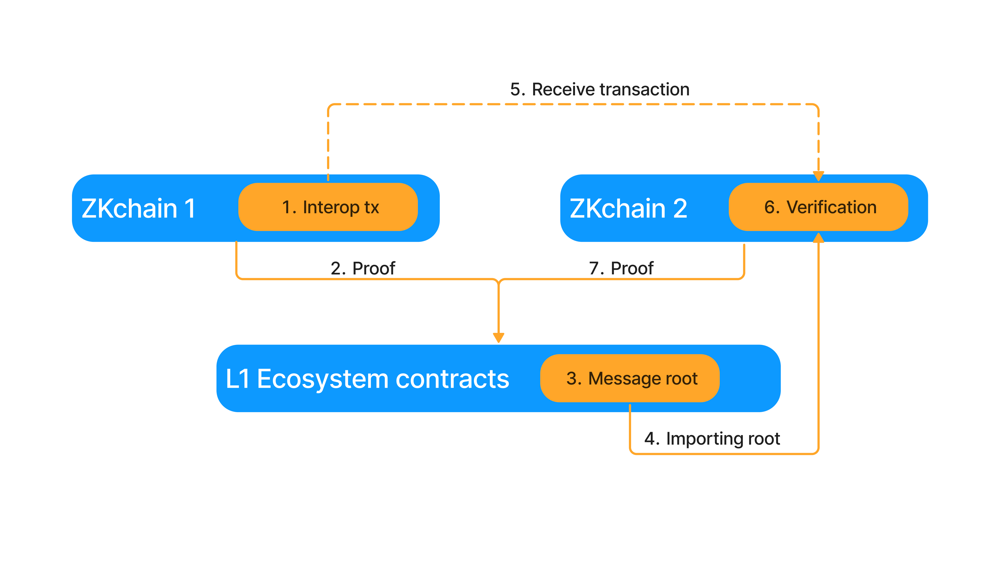
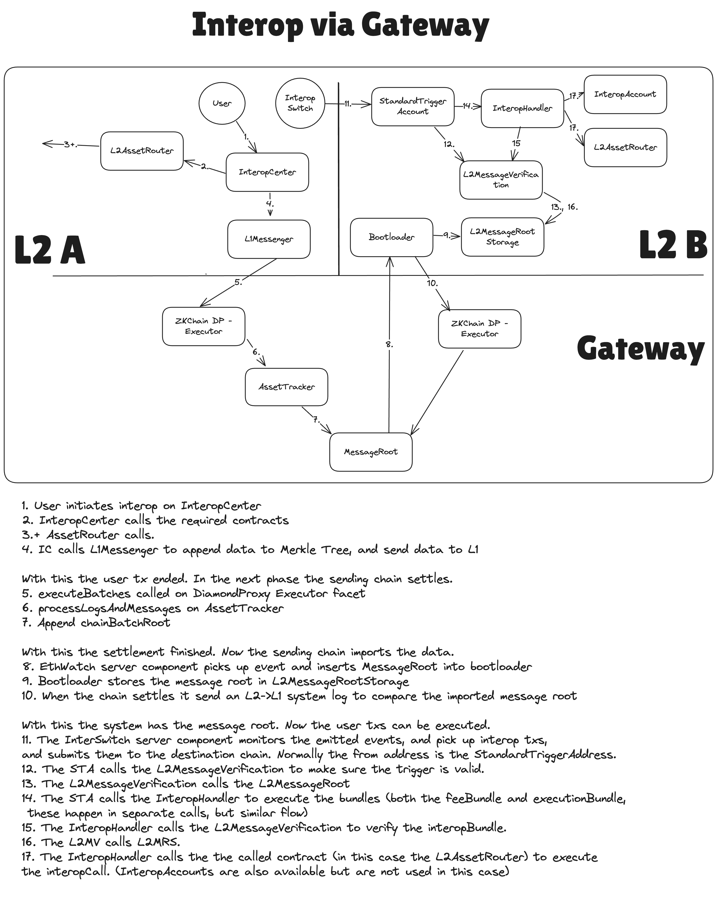

# Interop Overview

### Interop Process

This document describes a standard asset bridging scenario using proof-based interop. Other [finality](./forms_of_finality.md) options and interop [interface](./interop_center/overview.md) options are available. The interop process consists of seven main steps:

1. **Initiating the Transaction on the Sending Chain**

   - The user's EOA calls the InteropCenter contract. In the standard asset bridging scenario, they will call `requestL2TransactionSingleCall`. See the [InteropCenter](./interop_center/overview.md) documentation for additional options.
   - The InteropCenter emits two `InteropBundleSent` events and a single `InteropTriggerSent` event. Together, these events specify the interop transaction. One bundle is used to pay for gas fees, while the other is the main execution bundle used to bridge the asset. The trigger specifies the interop transaction parameters so that the transaction can be executed automatically on the destination chain.
   - For each event, an L2→L1 message is created that contains the event data. Each L2→L1 message is included in the chain's Merkle tree of emitted transactions in the `L2toL1Logs` Merkle tree (see [here](../settlement_contracts/priority_queue/l1_l2_communication/l2_to_l1.md)). This inclusion makes the messages verifiable using Merkle proofs.

2. **Settlement of the Sending Chain on the Settlement Layer (SL)**
   - The sending chain submits its proof to its settlement layer (L1 or Gateway). See [here](../settlement_contracts/zkchain_basics.md) for more details.

3. **Updating the MessageRoot on the Settlement Layer**
   - As the sending chain settles, the Executor facet of settling chain calls the MessageRoot contract, which is then updated with the new L2→L1 logs (see [here](./message_root.md#appending-new-batch-root-leaves)).
   - The updated MessageRoot now [commits](https://en.wikipedia.org/wiki/Commitment_scheme) to all L2→L1 logs emitted from the settling chain.
   - An [event](https://github.com/matter-labs/era-contracts/blob/b43cf6b3b069c85aec3cd61d33dd3ae2c462c896/l1-contracts/contracts/bridgehub/MessageRoot.sol#L38) is emitted to indicate that the MessageRoot has been updated.

4. **The Receiving Chain Fetches the Updated MessageRoot**
   - The receiving chain monitors the Settlement Layer using its EthWatch component.
   - It detects the event emitted by the MessageRoot contract on the Settlement Layer and saves the updated MessageRoot in its database, corresponding to that block of the Settlement Layer.
   - **Note:** In some scenarios, alternative hashes might be imported; see [here](./forms_of_finality.md) for additional details.
   - When creating the next batch, the MessageRoot is imported into the [bootloader](https://github.com/matter-labs/era-contracts/blob/b43cf6b3b069c85aec3cd61d33dd3ae2c462c896/system-contracts/bootloader/bootloader.yul#L4129). This process saves the MessageRoot in the chain's [L2MessageRootStorage](https://github.com/matter-labs/era-contracts/blob/b43cf6b3b069c85aec3cd61d33dd3ae2c462c896/system-contracts/contracts/L2MessageRootStorage.sol) contract, against which the Merkle proofs of interop messages will be verified in step 6.

5. **Submitting Cross-L2 Transactions on the Destination Chain**
   - The interop transactions (xL2 txs) can now be submitted to the destination chain. The `InteropSwitch/Slingshot` (name to be finalized) component on the sending chain monitors its own InteropCenter contract and detects the emitted `InteropBundleSent` and `InteropTriggerSent` events and corresponding L2→L1 messages.
   - The InteropSwitch requests the Merkle proofs for the L2→L1 messages. These proofs are the same ones as are used to finalize the L2→L1 messages (see [here](../settlement_contracts/priority_queue/l1_l2_communication/l2_to_l1.md)).
   - The event data, combined with the Merkle proofs, is used to construct the interop transactions. This step applies to the standard interop scenario with two bundles and a trigger; in other cases, additional gas payment may be required on the destination chain.
   - The interop transaction is then submitted to the destination chain.

6. **Verifying and Executing the Interop Transaction**
   - The interop transaction is verified and executed on the destination chain using account abstraction and the `InteropHandler` contract.
   - The sender of the interop transaction is the address specified in the trigger; that contract must support account abstraction.
   - **Reminder:** In ZKsync, EOAs use the [DefaultAccount](https://github.com/matter-labs/era-contracts/blob/b43cf6b3b069c85aec3cd61d33dd3ae2c462c896/system-contracts/contracts/DefaultAccount.sol) contract, which will support interop. To have EVM-equivalence, a standard account contract can be used.
   - During the `validateTransaction` step of the account abstraction flow, the triggered account contract:
     - Verifies the Merkle proof of the trigger using the `MessageVerification` contract and confirms that the origin chain sender has the appropriate permissions. It also verifies the other fields in the trigger (e.g. that the `gasPrice` is the same as in the trigger).
     - Calls the InteropHandler contract to execute the PaymasterBundle.
   - During the `executeTransaction` step of the account abstraction flow, the InteropHandler contract is called again to execute the execution bundle.
   - When the InteropHandler executes a bundle, it:
     - Verifies the Merkle proof of the bundle using the `MessageVerification` contract, which in turn queries the `L2MessageRootStorage` contract. The bundle hash is stored to prevent replay.
     - Iterates over all calls in the bundle; for each call, it deploys the AliasedAccount contract and specifies the call to be executed. The AliasedAccount then executes the call.

7. **Settling of the Destination Chain**
   - The destination chain settles on the Settlement Layer (SL). When sealing the batch, the saved `MessageRoot` are sent to the Settlement Layer using an L2→L1 system log, which can be processed during batch execution in the Executor contract.
   - The Executor contract verifies that the saved `MessageRoot` are correct, it does this by comparing them against the MessageRoot.sol contract.
