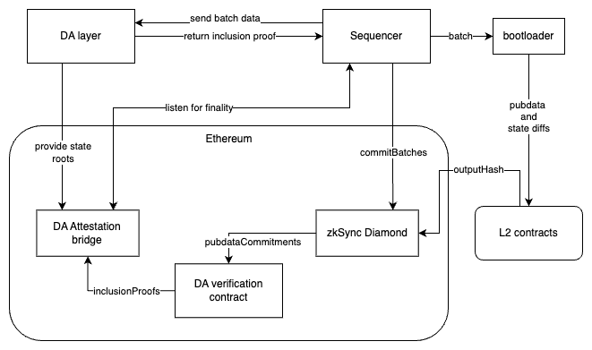

# Custom DA support

[back to readme](../../README.md)

## Intro

We introduced modularity into our contracts to support multiple DA layers, easier support for Validium and Rollup mode, and to settlement via the Gateway.




### Background

**Pubdata** - information published by the ZK Chain that can be used to reconstruct its state, it consists of l2→l1 logs, l2→l1 messages, contract bytecodes, and compressed state diffs.

```solidity
struct PubdataInput {
    pub(crate) user_logs: Vec<L1MessengerL2ToL1Log>,
    pub(crate) l2_to_l1_messages: Vec<Vec<u8>>,
    pub(crate) published_bytecodes: Vec<Vec<u8>>,
    pub(crate) state_diffs: Vec<StateDiffRecord>,
}
```

The current version of ZK Chains supports the following DataAvailability(DA) modes:

- `Calldata` - uses Ethereum tx calldata as pubdata storage
- `Blobs` - uses Ethereum blobs calldata as pubdata storage
- `No DA Validium` - posting pubdata is not enforced

The goal is to create a general purpose solution, that would ensure DA consistency and verifiability, on top of which we would build what is requested by many partners and covers many use cases like on-chain games and DEXes: **Validium with Abstract DA.**

This means that a separate solution like AvailDA, EigenDA, Celestia, etc. would be used to store the pubdata. The idea is that every solution like that (`DA layer`) provides a proof of inclusion of our pubdata to their storage, and this proof can later be verified on Ethereum. This results in an approach that has more security guarantees than `No DA Validium`, but lower fees than `Blobs`(assuming that Ethereum usage grows and blobs become more expensive).

## Proposed solution

The proposed solution is to introduce an abstract 3rd party DA layer, that the sequencer would publish the data to. When the batch is sealed, the hashes of the data related to that batch will be made available on L1. Then, after the DA layer has confirmed that its state is synchronized, the sequencer calls a `commitBatches` function with the proofs required to verify the DA inclusion on L1.

### Challenges

On the protocol level, the complexity is in introducing two new components: L1 and L2 DA verifiers. They are required to ensure the verifiable delivery of the DA inclusion proofs to L1 and consequent verification of these proofs.

The L2 verifier would validate the pubdata correctness and compute a final commitment for DA called `outputHash`. It consists of hashes of `L2→L1 logs and messages`, `bytecodes`, and `compressed state diffs`(blob hashes in case of blobs). This contract has to be deployed by the chain operator and it has to be tied to the DA layer logic, e.g. DA layer accepts 256kb blobs → on the final hash computation stage, the pubdata has to be packed into the chunks of <256kb, and a either the hashes of all blobs, or a rolling hash has to be be part of the `outputHash` preimage.

The `outputHash` will be sent to L1 as a L2→L1 log, so this process is a part of a bootloader execution and can be trusted.

The hashes of data chunks alongside the inclusion proofs have to be provided in the calldata of the L1 diamond proxy’s `commitBatches` function.

L1 contracts have to recalculate the `outputHash` and make sure it matches the one from the logs, after which the abstract DA verification contract is called. In general terms, it would accept the set of chunk’s hashes (by chunk here I mean DA blob, not to be confused with 4844 blob) and a set of inclusion proofs, that should be enough to verify that the preimage (chunk data) is included in the DA layer. This verification would be done by specific contract e.g. `Attestation Bridge`, which holds the state tree information and can perform verification against it.
