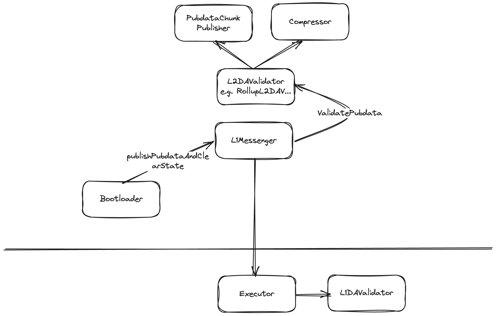

# Custom DA Support

## Intro

We introduced modularity into our contracts to support multiple DA layers, to support Validium and Rollup modes more easily, and to enable settlement via the Gateway




### Background

**Pubdata** – information published by the ZK Chain that can be used to reconstruct its state; it consists of L2→L1 logs, L2→L1 messages, contract bytecodes, and compressed state diffs.

```solidity
struct PubdataInput {
    pub(crate) user_logs: Vec<L1MessengerL2ToL1Log>,
    pub(crate) l2_to_l1_messages: Vec<Vec<u8>>,
    pub(crate) published_bytecodes: Vec<Vec<u8>>,
    pub(crate) state_diffs: Vec<StateDiffRecord>,
}
```

The current version of ZK Chains supports the following Data Availability commitment schemes:

- EMPTY_NO_DA (Validium)  
  No on-chain DA enforcement: all commitments are `bytes32(0)`.

- PUBDATA_KECCAK256  
  Commitment =  
  ```solidity
  keccak256(uncompressedStateDiffHash || keccak256(pubdata))
  ```  
  Suitable for calldata or external DA layers that can verify a simple keccak-based proof.

- BLOBS_AND_PUBDATA_KECCAK256
  Includes EIP-4844 blobs. Commitment =  
  ```solidity
  keccak256(
    uncompressedStateDiffHash ||
    keccak256(pubdata) ||
    uint8(blobLinearHashes.length) ||
    blobLinearHashes
  )
  ```

- NONE 
  A placeholder for “no scheme” (should never be chosen).

This means that a separate solution like AvailDA, EigenDA, Celestia, etc. could be used to store the pubdata. Each DA layer provides an inclusion proof of our pubdata in its storage, and that proof can later be verified on Ethereum. This gives stronger guarantees than `No DA Validium`, but lower fees than `Blobs` when Ethereum usage grows.

This allows for a general-purpose solution that ensures DA consistency and verifiability, on top of which we build what partners need—on-chain games, DEXes, and more: **Validium with Abstract DA**.

## Implementation overview

1. Configuration
   In Admin facet of ZK Chain, the desired pair of `L2DACommitmentScheme` and the address of the L1 DA validator can be set by admin.

2. L2 commitment generation  
   All commitment logic lives in the `L2DAValidator` library, which computes the `pubdataDACommitment` based on the chosen scheme.

3. Emission
	Bootloader performs L1 Messenger pubdata "publishing" call to `L1Messenger` after executing the batch. 
   `L1Messenger.publishPubdataAndClearState()` emits two DA-related system logs per batch: 
   - `USED_L2_DA_VALIDATION_COMMITMENT_SCHEME_KEY` (the scheme index)
   - `L2_DA_VALIDATOR_OUTPUT_HASH_KEY` (the commitment) 

4. L1 verification  
	On L1 the Executor facet will call L1 DA validator, providing it with chain ID and batch number of the chain for which the DA must be verified, along with `l2DAValidatorOutputHash`, `operatorDAInput` and `_maxBlobsSupported` value. It's then L1 DA Validator job to verify the correctness of the DA on L1.
