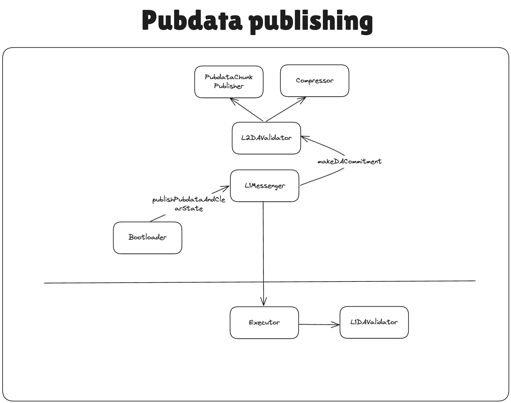

# Rollup DA

## Prerequisites

Before reading this document, it is recommended to understand how the [custom DA](./custom_da.md) works in general.

## EIP-4844 Support

EIP-4844, commonly known as Proto-Danksharding, is an upgrade to the Ethereum protocol that introduces a new data availability solution embedded in layer 1. More information about it can be found [here](https://ethereum.org/en/roadmap/danksharding/).

To facilitate EIP-4844 blob support, our circuits allow providing two arrays in our public input to the circuit:

- `blobCommitments` -- the commitment that helps to check the correctness of the blob content. The formula on how it is computed will be explained below in the document.
- `blobHash` -- the `keccak256` hash of the inner contents of the blob.

Note that our circuits require that each blob contains exactly `4096 * 31` bytes. The maximal number of blobs that are supported by our proving system is 16, but the system contracts support only 6 blobs at most for now.

When committing a batch, the `L1DAValidator` is called with the data provided by the operator and it should return the two arrays described above. These arrays are put inside the batch commitment and then the correctness of the commitments will be verified at the proving stage.

Note that the `Executor.sol` (and the contract itself) is not responsible for checking that the provided `blobHash` and `blobCommitments` in any way correspond to the pubdata inside the batch as it is the job of the DA Validation in corresponding contracts on L1 (`L1DAValidator`) and L2 (`L2DAValidator` library).

## Publishing pubdata to L1

Let's see an example of how the approach above works in rollup DA validators.

### Rollup use case of L2DAValidator library



Let's consider `BLOBS_AND_PUBDATA_KECCAK256` commitment scheme. This is the one that's being used in default `RollupL1DAValidator`. In this case, the following will happen:

`L2DAValidator` library accepts the preimages for the data to publish as well as their compressed format. After verifying the compression, it forms the `_totalPubdata` bytes array, which represents the entire blob of data that should be published to L1.

It calls the `PubdataChunkPublisher` system contract to split this pubdata into multiple "chunks" of size `4096 * 31` bytes and return the `keccak256` hash of those, These will be the `blobHash` of from the section before.

To give the flexibility of checking different DA, we send the following data to L1:

- `l2DAValidatorOutputHash` that was returned by `L2DAValidator` library. This hash includes `uncompressedStateDiffHash`, `pubdata`, the number of blobs, and `blobLinearHashes`. This hash, alongside the `_operatorDAInput` will be provided to `L1DAValidator` (`RollupL1DAValidator.sol` is the one that accepts `BLOBS_AND_PUBDATA_KECCAK256`, for example).
- `_l2DACommitmentScheme` that denotes the commitment scheme that was used. In the case we're looking into, it's the `BLOBS_AND_PUBDATA_KECCAK256`.

### RollupL1DAValidator

When committing the batch, the operator will provide the `_operatorDAInput` and `_l2DAValidatorOutputHash`. Using these values, `RollupL1DAValidator` parses the input that the L2 DA validator has provided to it into `stateDiffHash`, `fullPubdataHash`, `blobsLinearHashes`, `blobsProvided`, `l1DaInput`. This `l1DaInput` will be used to prove that the pubdata was indeed provided in this batch.

The first byte of the `l1DaInput` denotes which way of pubdata publishing was used: calldata or blobs.

In case it is calldata it will be just checked that the provided calldata matches the hash of the `fullPubdataHash` that was sent by the L2 counterpart. Note that calldata may still contain the blob information as we typically start generating proofs before we know which way of calldata will be used. Note that in case the calldata is used for DA, we do not verify the `blobCommitments` as the presence of the correct pubdata has been verified already.

In case it is blobs, we need to construct the `blobCommitment`s correctly for each of the blob of data.

For each of the `blob`s the operator provides so called `_commitment` that consists of the following packed structure: `opening point (16 bytes) || claimed value (32 bytes) || commitment (48 bytes) || proof (48 bytes)`.

The verification of the `_commitment` can be summarized in the following snippet:

```solidity
// The opening point is passed as 16 bytes as that is what our circuits expect and use when verifying the new batch commitment
// PUBDATA_COMMITMENT_SIZE = 144 bytes
pubdata_commitments <- [opening point (16 bytes) || claimed value (32 bytes) || commitment (48 bytes) || proof (48 bytes)] from calldata
opening_point = bytes32(pubdata_commitments[:16])
versioned_hash <- from BLOBHASH opcode

// Given that we needed to pad the opening point for the precompile, append the data after.
point_eval_input = versioned_hash || opening_point || pubdata_commitments[16: PUBDATA_COMMITMENT_SIZE]

// this part handles the following:
// verify versioned_hash == hash(commitment)
// verify P(z) = y
res <- point_valuation_precompile(point_eval_input)

assert uint256(res[32:]) == BLS_MODULUS
```

The final `blobCommitment` is calculated as the hash between the `blobVersionedHash`, `opening point` and the `claimed value`. The zero knowledge circuits will verify that the opening point and the claimed value were calculated correctly and correspond to the data that was hashed under the `blobHash`.

## Structure of the pubdata

Rollups maintain the same structure of pubdata and apply the same rules for compression as those that were used in the previous versions of the system. These can be read [here](./compression.md).
