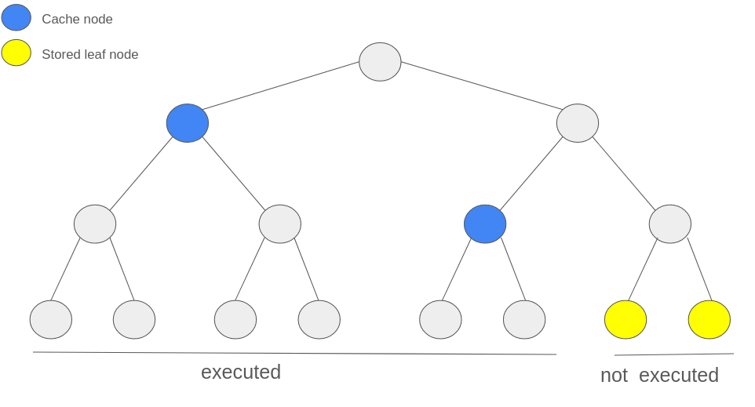

# Priority Queue to Merkle Tree

## Overview of the current implementation

Priority queue is a data structure in Era contracts that is used to handle L1->L2 priority operations. It supports the following:

- inserting a new operation into the end of the queue
- checking that an newly executed batch executed some n first priority operations from the queue (and not some other ones) in correct order

The queue itself only stores the following:

```solidity
struct PriorityOperation {
  bytes32 canonicalTxHash;
  uint64 expirationTimestamp;
  uint192 layer2Tip;
}
```

of which we only care about the canonical hash.

### Inserting new operations

The queue is implemented as a [library](https://github.com/matter-labs/era-contracts/blob/b43cf6b3b069c85aec3cd61d33dd3ae2c462c896/l1-contracts/contracts/state-transition/libraries/PriorityQueue.sol#L22).
For each incoming priority operation, we simply `pushBack` its hash, expiration and layer2Tip.

### Checking validity

When a new batch is executed, we need to check that operations that were executed there match the operations in the priority queue. The batch header contains `numberOfLayer1Txs` and `priorityOperationsHash` which is a rolling hash of all priority operations that were executed in the batch. Bootloader check that this hash indeed corresponds to all priority operations that have been executed in that batch. The contract only checks that this hash matches the operations stored in the queue:

```solidity
/// @dev Pops the priority operations from the priority queue and returns a rolling hash of operations
function _collectOperationsFromPriorityQueue(uint256 _nPriorityOps) internal returns (bytes32 concatHash) {
    concatHash = EMPTY_STRING_KECCAK;

    for (uint256 i = 0; i < _nPriorityOps; i = i.uncheckedInc()) {
        PriorityOperation memory priorityOp = s.priorityQueue.popFront();
        concatHash = keccak256(abi.encode(concatHash, priorityOp.canonicalTxHash));
    }
}

bytes32 priorityOperationsHash = _collectOperationsFromPriorityQueue(_storedBatch.numberOfLayer1Txs);
require(priorityOperationsHash == _storedBatch.priorityOperationsHash); // priority operations hash does not match to expected
```

As can be seen, this is done in `O(n)` compute, where `n` is the number of priority operations in the batch.

## Motivation for migration to Merkle Tree

Since we will be introducing Gateway, we will need to support one more operation:

- migrating priority queue from L1 to Gateway (and back)

Current implementation takes `O(n)` space and is vulnerable to spam attacks during migration
(e.g. an attacker can insert a lot of priority operations and we won't be able to migrate all of them due to gas limits).

Hence, we need an implementation with a small (constant- or log-size) space imprint that we can migrate to Gateway and back that would still allow us to perform the other 2 operations.

Merkle tree of priority operations is perfect for this since we can simply migrate the latest root hash to Gateway and back.

- It can still efficiently (in `O(height)`) insert new operations.
- It can also still efficiently (in `O(n)` compute and `O(n + height)` calldata) check that the batch’s `priorityOperationsHash` corresponds to the operations from the queue.

Note that `n` here is the number of priority operations in the batch, not `2^height`.

The implementation details are described below.

### FAQ

- Q: Why can't we just migrate the rolling hash of the operations in the existing priority queue?
- A: The rolling hash is not enough to check that the operations from the executed batch are indeed from the priority queue. We would need to store all historical rolling hashes, which would be `O(n)` space and would not solve the spam attack problem.

## Implementation

The implementation will consist of two parts:

- Merkle tree on L1 contracts, to replace the existing priority queue (while still supporting the existing operations)
- Merkle tree off-chain on the server, to generate the merkle proofs for the executed priority operations.

### Contracts

On the contracts, the Merkle tree will be implemented as an Incremental (append-only) Merkle Tree ([example implementation](https://github.com/tornadocash/tornado-core/blob/master/contracts/MerkleTreeWithHistory.sol)), meaning that it can efficiently (in `O(height)` compute) append new elements to the right, while only storing `O(height)` nodes at all times.

It will also be dynamically sized, meaning that it will double in size when the current size is not enough to store the new element.

### Server

On the server, the Merkle tree will be implemented as an extension of `MiniMerkleTree` currently used for L2->L1 logs.

It will have the following properties:

- in-memory: the tree will be stored in memory and will be rebuilt on each restart (details below).
- dynamically sized (to match the contracts implementation)
- append-only (to match the contracts implementation)

The tree does not need to be super efficient, since we process on average 7 operations per batch.

### Why in-memory?

Having the tree in-memory means rebuilding the tree on each restart. This is fine because on mainnet after >1 year since release we have only 3.2M priority operations. We only have to fully rebuild the tree _once_ and then simply cache the already executed operations (which are the majority). Having the tree in-memory has an added benefit of not having to have additional infrastructure to store it on disk and not having to be bothered to rollback its state manually if we ever have to (as we do for e.g. for the storage logs tree).

Note: If even rebuilding it once becomes a problem, it can be easily mitigated by only persisting the cache nodes.

### Caching

**Why do we need caching?** After a batch is successfully executed, we will no longer need to have the ability to generate merkle paths for those operations. This means that we can save space and compute by only fully storing the operations that are not yet executed, and caching the leaves
corresponding to the already executed operations.

We will only cache some prefix of the tree, meaning nodes in the interval [0; N) where N is the number of executed priority operations. The cache will store the rightmost cached left-child node on each level of the tree (see diagrams).




This means that we will not be able to generate merkle proofs for the cached nodes (and since they are already executed, we don't need to). This structure allows us to save a lot of space, since it only takes up `O(height)` space instead of linear space for all executed operations. This is a big optimization since there are currently 3.2M total operations but <10 non-executed operations in the mainnet priority queue, which means most of the tree will be cached.

This also means we don’t really have to store non-leaf nodes other than cache, since we can calculate merkle root / merkle paths in `O(n)` where `n` is the number of non-executed operations (and not total number of operations), and since `n` is so small, it is really fast.

### Adding new operations

On the contracts, appending a new operation to the tree is done by simply calling `append` on the Incremental Merkle Tree, which will update at most `height` slots. Actually, it works almost exactly like the cache described above. Once again: [tornado-cash implementation](https://github.com/tornadocash/tornado-core/blob/1ef6a263ac6a0e476d063fcb269a9df65a1bd56a/contracts/MerkleTreeWithHistory.sol#L68).

On the server, `eth_watch` will listen for `NewPriorityOperation` events as it does now, and will append the new operation to the tree on the server.

### Checking validity

To check that the executed batch indeed took its priority operations from the queue, we have to make sure that if we take first `numberOfL1Txs` non-executed operations from the tree, their rolling hash will match `priorityOperationsHash` . Since will not be storing the hashes of these operations onchain anymore, we will have to provide them as calldata. Additionally in calldata, we should provide merkle proofs for the **first and last** operations in that batch (hence `O(n + height)` calldata). This will make it possible to prove onchain that that contiguous interval of hashes indeed exists in the merkle tree.

This can be done simply by constructing the part of the tree above this interval using the provided paths to first and last elements of the interval checking that computed merkle root matches with stored one (in `O(n)` where `n` is number of priority operations in a batch). We will also need to track the `index` of the first unexecuted operation onchain to properly calculate the merkle root and ensure that batches don’t execute some operations out of order or multiple times.

We will also need to prove that the rolling hash of provided hashes matches with `priorityOperationsHash` which is also `O(n)`

It is important to note that we should store some number of historical root hashes, since the Merkle tree on the server might lag behind the contracts a bit, and hence merkle paths generated on the server-side might become invalid if we compare them to the latest root hash on the contracts. These historical root hashes are not necessary to migrate to and from Gateway though.
