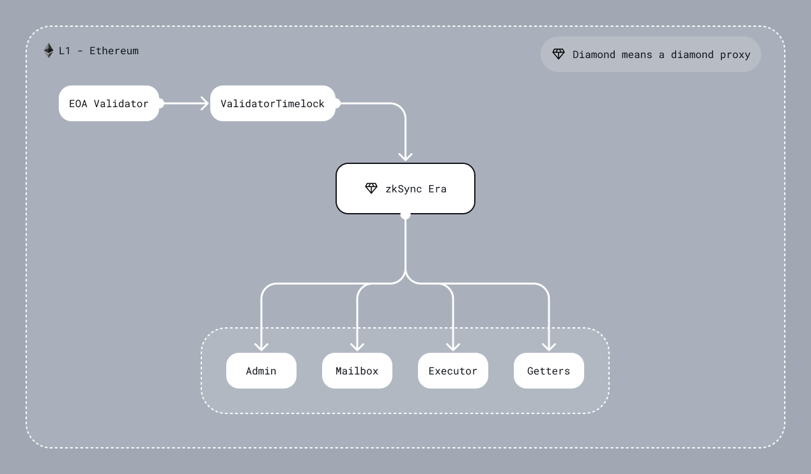

<!--- WIP --->

# L1 smart contract of an individual chain

## Diamond (also mentioned as State Transition contract)

Technically, this L1 smart contract acts as a connector between Ethereum (L1) and ZK Chain (L2). It checks the
validity proof and data availability, handles L2 <-> L1 communication, finalizes L2 state transition, and more.

There are also important contracts deployed on the L2 that can also execute logic called _system contracts_. Using L2
<-> L1 communication can affect both the L1 and the L2.



### DiamondProxy

The main contract uses [EIP-2535](https://eips.ethereum.org/EIPS/eip-2535) diamond proxy pattern. It is an in-house
implementation that is inspired by the [mudgen reference implementation](https://github.com/mudgen/Diamond). It has no
external functions, only the fallback that delegates a call to one of the facets (target/implementation contract). So
even an upgrade system is a separate facet that can be replaced.

One of the differences from the reference implementation is access freezability. Each of the facets has an associated
parameter that indicates if it is possible to freeze access to the facet. Privileged actors can freeze the **diamond**
(not a specific facet!) and all facets with the marker `isFreezable` should be inaccessible until the governor or admin
unfreezes the diamond. Note that it is a very dangerous thing since the diamond proxy can freeze the upgrade system and then
the diamond will be frozen forever.

The diamond proxy pattern is very flexible and extendable. For now, it allows splitting implementation contracts by their logical meaning, removes the limit of bytecode size per contract and implements security features such as freezing. In the future, it can also be viewed as [EIP-6900](https://eips.ethereum.org/EIPS/eip-6900) for [zkStack](https://blog.matter-labs.io/introducing-the-zk-stack-c24240c2532a), where each ZK Chain can implement a sub-set of allowed implementation contracts.

### GettersFacet

Separate facet, whose only function is providing `view` and `pure` methods. It also implements
[diamond loupe](https://eips.ethereum.org/EIPS/eip-2535#diamond-loupe) which makes managing facets easier.
This contract must never be frozen.

### AdminFacet

This facet responsible for the configuration setup and upgradability, handling tasks such as:

- Privileged Address Management: Updating key roles, including the governor and validators.
- System Parameter Configuration: Adjusting critical system settings, such as the L2 bootloader bytecode hash, verifier address, changing DA layer or fee configurations.
- Freezability: Executing the freezing/unfreezing of facets within the diamond proxy to safeguard the ecosystem during upgrades or in response to detected vulnerabilities.

Control over the AdminFacet is divided between two main entities:

- Chain Type Manager - Separate smart contract that can perform critical changes to the system as protocol upgrades. For more detailed information on its function and design, refer to [this document](../chain_management/chain_type_manager.md). Although currently only one version of the CTM exists, the architecture allows for future versions to be introduced via subsequent upgrades. The owner of the CTM is the [decentralized governance](https://blog.zknation.io/introducing-zk-nation/), while for non-critical an Admin entity is used (see details below).
- Chain Admin - Multisig smart contract managed by each individual chain that can perform non-critical changes to the system such as granting validator permissions.

### MailboxFacet

The facet that handles L2 <-> L1 communication.

The Mailbox performs three functions:

- L1 ↔ L2 Communication: Enables data and transaction requests to be sent from L1 to L2 and vice versa, supporting the implementation of multi-layer protocols.
- Bridging Native Tokens: Allows the bridging of either ether or ERC20 tokens to L2, enabling users to use these assets within the L2 ecosystem.
- Censorship Resistance Mechanism: Currently in the research stage.

L1 -> L2 communication is implemented as requesting an L2 transaction on L1 and executing it on L2. This means a user
can call the function on the L1 contract to save the data about the transaction in some queue. Later on, a validator can
process it on L2 and mark it as processed on the L1 priority queue. Currently, it is used for sending information from
L1 to L2 or implementing multi-layer protocols. Users pays for the transaction execution in the native token when requests L1 -> L2 transaction.

_NOTE_: While user requests the transaction from L1, the initiated transaction on L2 will have such a `msg.sender`:

```solidity
  address sender = msg.sender;
  if (sender != tx.origin) {
      sender = AddressAliasHelper.applyL1ToL2Alias(msg.sender);
  }
```

where

```solidity
uint160 constant offset = uint160(0x1111000000000000000000000000000000001111);

function applyL1ToL2Alias(address l1Address) internal pure returns (address l2Address) {
  unchecked {
    l2Address = address(uint160(l1Address) + offset);
  }
}
```

For most of the rollups the address aliasing needs to prevent cross-chain exploits that would otherwise be possible if
we simply reused the same L1 addresses as the L2 sender. In ZKsync Era address derivation rule is different from the
Ethereum, so cross-chain exploits are already impossible. However, ZKsync Era may add full EVM support in the future, so
applying address aliasing leaves room for future EVM compatibility.

The L1 -> L2 communication is also used for bridging **base tokens**. If base token is ether (the case for ZKsync Era) - user should include a `msg.value` when initiating a
transaction request on the L1 contract, if base token is an ERC20 then contract will spend users allowance. Before executing a transaction on L2, the specified address will be credited
with the funds. To withdraw funds user should call `withdraw` function on the `L2BaseToken` system contracts. This will
burn the funds on L2, allowing the user to reclaim them through the `finalizeWithdrawal` function on the
`SharedBridge` (more in ZK Chain section).

More about L1->L2 operations can be found [here](./priority_queue/l1_l2_communication/l1_to_l2.md).

L2 -> L1 communication, in contrast to L1 -> L2 communication, is based only on transferring the information, and not on
the transaction execution on L1. The full description of the mechanism for sending information from L2 to L1 can be found [here](./data_availability/standard_pubdata_format.md).

The Mailbox facet also facilitates L1<>L2 communications for those chains that settle on top of Gateway. The user interfaces for those are identical to the L1<>L2 communication described above. To learn more about L1<>L2 communication works, check out [this document](../settlement_contracts/data_availability/custom_da.md) and [this one][TODO].

### ExecutorFacet

A contract that accepts L2 batches, enforces data availability via DA validators and checks the validity of zk-proofs. You can read more about DA validators [in this document](../settlement_contracts/data_availability/custom_da.md).

The state transition is divided into three stages:

- `commitBatches` - check L2 batch timestamp, process the L2 logs, save data for a batch, and prepare data for zk-proof.
- `proveBatches` - validate zk-proof.
- `executeBatches` - finalize the state, marking L1 -> L2 communication processing, and saving Merkle tree with L2 logs.

Each L2 -> L1 system log will have a key that is part of the following:

```solidity
enum SystemLogKey {
  L2_TO_L1_LOGS_TREE_ROOT_KEY,
  PACKED_BATCH_AND_L2_BLOCK_TIMESTAMP_KEY,
  CHAINED_PRIORITY_TXN_HASH_KEY,
  NUMBER_OF_LAYER_1_TXS_KEY,
  PREV_BATCH_HASH_KEY,
  L2_DA_VALIDATOR_OUTPUT_HASH_KEY,
  USED_L2_DA_VALIDATOR_ADDRESS_KEY,
  EXPECTED_SYSTEM_CONTRACT_UPGRADE_TX_HASH_KEY
}
```

When a batch is committed, we process L2 -> L1 system logs. Here are the invariants that are expected there:

- In a given batch there will be either 7 or 8 system logs. The 8th log is only required for a protocol upgrade.
- There will be a single log for each key that is contained within `SystemLogKey`
- Three logs from the `L2_TO_L1_MESSENGER` with keys:
- `L2_TO_L1_LOGS_TREE_ROOT_KEY`
- `L2_DA_VALIDATOR_OUTPUT_HASH_KEY`
- `USED_L2_DA_VALIDATOR_ADDRESS_KEY`
- Two logs from `L2_SYSTEM_CONTEXT_SYSTEM_CONTRACT_ADDR` with keys:
  - `PACKED_BATCH_AND_L2_BLOCK_TIMESTAMP_KEY`
  - `PREV_BATCH_HASH_KEY`
- Two or three logs from `L2_BOOTLOADER_ADDRESS` with keys:
  - `CHAINED_PRIORITY_TXN_HASH_KEY`
  - `NUMBER_OF_LAYER_1_TXS_KEY`
  - `EXPECTED_SYSTEM_CONTRACT_UPGRADE_TX_HASH_KEY`
- None logs from other addresses (may be changed in the future).

### DiamondInit

It is a one-function contract that implements the logic of initializing a diamond proxy. It is called only once on the
diamond constructor and is not saved in the diamond as a facet.

Implementation detail - function returns a magic value just like it is designed in
[EIP-1271](https://eips.ethereum.org/EIPS/eip-1271), but the magic value is 32 bytes in size.

## ValidatorTimelock

An intermediate smart contract between the validator EOA account and the ZK chain diamond contract. Its primary purpose is
to provide a trustless means of delaying batch execution without modifying the main ZKsync contract. ZKsync actively
monitors the chain activity and reacts to any suspicious activity by freezing the chain. This allows time for
investigation and mitigation before resuming normal operations.

It is a temporary solution to prevent any significant impact of the validator hot key leakage, while the network is in
the Alpha stage.

This contract consists of four main functions `commitBatches`, `proveBatches`, `executeBatches`, and `revertBatches`, which can be called only by the validator.

When the validator calls `commitBatches`, the same calldata will be propagated to the ZKsync contract (`DiamondProxy` through
`call` where it invokes the `ExecutorFacet` through `delegatecall`), and also a timestamp is assigned to these batches to track
the time these batches are committed by the validator to enforce a delay between committing and execution of batches. Then, the
validator can prove the already committed batches regardless of the mentioned timestamp, and again the same calldata (related
to the `proveBatches` function) will be propagated to the ZKsync contract. After the `delay` is elapsed, the validator
is allowed to call `executeBatches` to propagate the same calldata to ZKsync contract.

The owner of the ValidatorTimelock contract is the decentralized governance. Note, that all the chains share the same ValidatorTimelock for simplicity.
