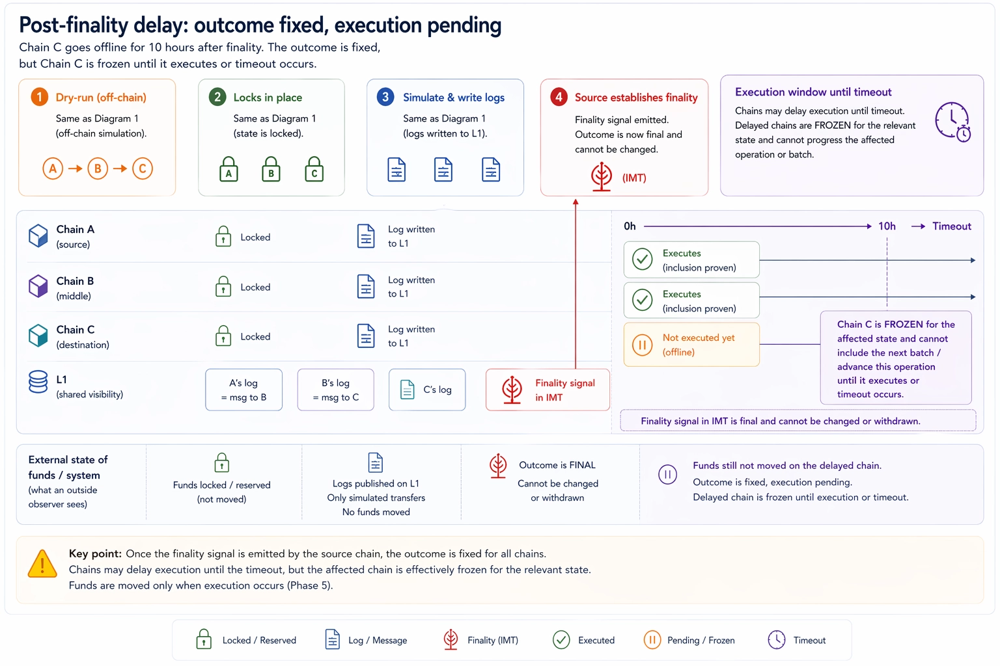
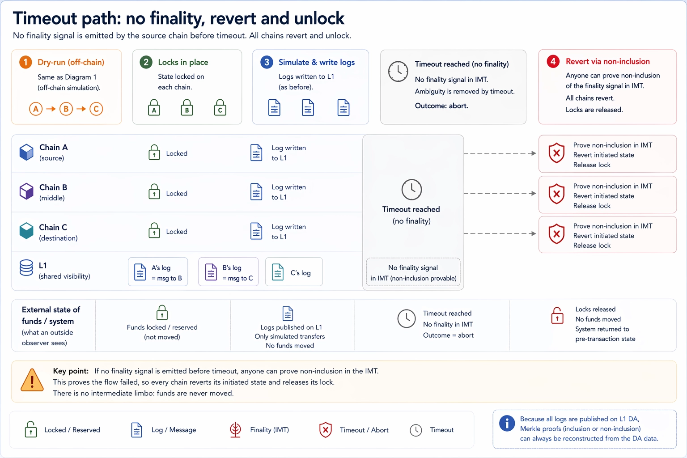
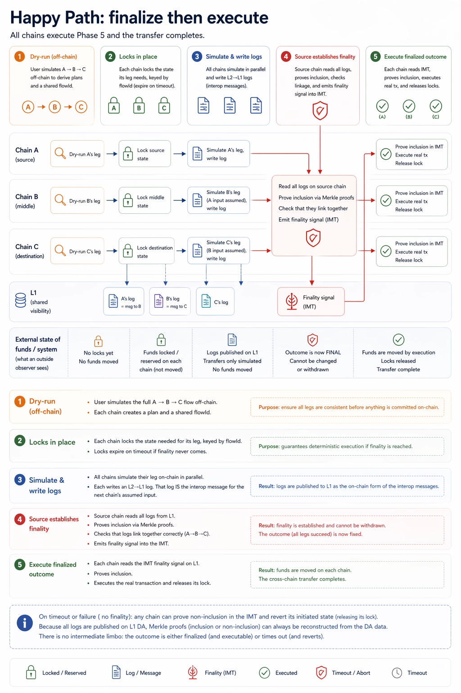

# Atomicity using DA and On-chain Simulation

## Observation

There is a real tradeoff between speed, cost, and trustlessness.

If atomicity depends directly on L1 settlement, then chains that settle slowly to L1 will also finalize slowly. Gateway
changes this if it has fast and cheap settlement. This note assumes that we are on Gateway and optimizes for:

- scalability,
- quick implementation.

The framing is **async atomicity**: chains do not coordinate execution at the block level (that would be sync atomicity,
e.g. shared sequencing or based-rollup designs like EEZ — out of scope here). Instead, the atomic decision is made once,
observed by all participants through shared DA, and applied locally and in parallel.

## Main Idea

Do not use an `L1 FinalityBeacon` that sends `L1 -> L2` transactions.

Instead:

- users lock funds on all participating chains,
- users simulate the flow sequentially offchain and derive all interop data,
- users submit the simulation transactions onchain in parallel,
- the source chain `A` links the simulated interop events,
- `A` emits `FinalitySignal` into the indexed MT,
- all chains monitor that signal and finalize together.

So simulation can still be computed sequentially, but the onchain simulation transactions do not need to be executed
sequentially.

Conceptually interop is split into two steps:

- **preparation** — simulate, lock, and prime each chain so it is waiting for the matching finalization,
- **finalization** — publish the finalization decision, let the other chains observe it through Gateway DA, and execute
  the real state changes everywhere in parallel.

The atomic decision happens before the real state changes. No chain executes for real and then hopes the rest agrees
later.

## Locked State

The first version should support only asset transfers, not generic transaction execution.

The lock is:

- users agree on a `flowId`,
- users lock the required assets into their local `Simulator` contracts under that `flowId`,
- the locks have a timeout,
- the assets stay in `Simulator` custody until finalization or expiry.

Locking is necessary because simulation alone is not enough: a simulation only tells us a call would succeed under the
state observed during simulation. If that state changes before the real call executes, the result may no longer hold.
Locking eliminates this state-drift window for the duration of the flow.

## Contract States

Each `Simulator` entry for a `flowId` moves through explicit states:

- `initiated` — assets locked, simulation recorded, waiting for `FinalitySignal`,
- `finalized` — `FinalitySignal` observed and proven, real state changes applied,
- `expired` / `reverted` — timeout elapsed without `FinalitySignal`; locked funds are released back.

This is contract-level atomicity, not chain-level rollback. The DA layer only gives all chains a common source of truth
for observing whether the required preparation and finalization steps happened.

Once `FinalitySignal` is emitted on `A`, the outcome is fixed even before each chain has finished its local execution —
the chains are then in a `finalized`-decided / execution-pending state, and replay or further input cannot change it:

## Freeze Path

We also need a freeze path if `FinalitySignal` never appears.

That requires proving non-inclusion on `A`. The mechanism is an indexed Merkle tree.

We should use a separate IMT fact contract:

- atomicity contracts record facts into the IMT,
- the IMT root is published via `L2 -> L1` logs,
- other chains prove inclusion or non-inclusion of the required fact.

The timeout is essential because this design does not rely on Gateway/L1 to actively push finalization. Chains observe
Gateway DA themselves, so they also need a clean rule for what happens if the expected data never appears. If the
timeout elapses with no `FinalitySignal`, every chain proves non-inclusion against `A`'s IMT root and unlocks
independently:

## Detailed Flow

1. the users on all participating chains agree on a shared `flowId`,
2. the users lock the required assets into `Simulator` on each chain under that `flowId` with a timeout,
3. the user simulates the whole flow offchain, sequentially, and derives the full interop plan,
4. that offchain simulation produces the interop payloads for `A`, `B`, `C`, and any confirmation path back to `A`,
5. after the offchain plan is fixed, the user submits the simulation transactions onchain on all participating chains in
   parallel,[^simulation-mode]
6. on each chain, the onchain simulation is executed with `staticcall`,
7. if a simulated interop action would have emitted an interop event, that simulated event is recorded in transient
   storage during the onchain simulation,
8. after simulation completes on a chain, `Simulator` reads the recorded simulated interop event and emits it as the
   durable simulation result for that chain,
9. on `B`, simulated local asset operations must read from `Simulator` state under the agreed `flowId`,
10. on `C`, the destination-side checks must also run against the locked assets referenced by the same `flowId`,
11. all simulated interop logs are read on the source chain `A`,
12. those logs are proven by Merkle inclusion proofs and checked to link together into one atomic flow,
13. if the linked simulated flow is complete, `A` records `FinalitySignal` in the indexed MT,
14. `A` publishes the corresponding IMT root via `L2 -> L1` logs,
15. all chains monitor `A` for `FinalitySignal`,
16. each chain fetches proof of inclusion of that signal against the published IMT root,
17. once inclusion is proven, all chains finalize together,
18. finalization consumes the assets already locked in `Simulator` under that `flowId`,
19. if `FinalitySignal` does not appear before timeout, chains use non-inclusion proof against `A`'s IMT root and freeze
    the flow,
20. after freeze or expiry, locked funds can be unlocked according to the timeout rules.

So the important separation is:

- offchain simulation is sequential and computes the whole plan,
- onchain simulation transactions are submitted in parallel,
- finalization happens only after `A` links the simulated events and emits `FinalitySignal`.

## Topologies

The basic case is `A -> B`, but the same mechanism extends naturally:

- **Branching `A -> B, C`** — `A` waits until the simulated legs from both `B` and `C` are visible, links them together,
  and only then emits `FinalitySignal` covering the whole set. Both destinations finalize against the same signal.
- **Chained `A -> B -> C`** — same mechanism, with extra bookkeeping in the simulation phase: the destination of one hop
  is the source of the next, so the linked dependency set on `A` covers all hops before `FinalitySignal` is emitted.

In all cases the structure is: parallel onchain simulation on each participating chain, one finalization decision
recorded on `A`, parallel finalization everywhere once that decision is observed.

## Why Gateway DA Instead of an L1 Atomicity Contract

The main reason is scalability.

If atomicity were driven by a contract on Gateway/L1 that had to process every atomic bundle and then send `GW -> L2`
(or `L1 -> L2`) transactions back out, the atomicity system would become a bottleneck concentrated on that one contract.

This design avoids that:

- chains publish only the relevant logs as DA,
- Gateway acts as the common visibility layer,
- each chain reads what it needs from that DA,
- and each chain finalizes locally.

Nothing about the atomicity itself is executed on Gateway. Gateway only provides shared data availability and
observability.

## Platform Support

This requires server-side support:

- servers on the other chains must monitor `InteropCenter` on chain `A` for `FinalitySignal`,
- they must fetch and provide inclusion or non-inclusion proofs for that signal against the published indexed MT root,
- if inclusion is proven, the chain may finalize,
- if non-inclusion is proven after timeout, the chain must freeze the flow.

## Open Items

**Merkle proof determinism.** The Merkle proofs that link simulated events on `A` may not be deterministic across
re-derivations, which is a problem if other chains must independently re-verify the exact dependency set. A worst-case
fallback is to have `A` (or a Gateway-side contract) send `GW -> L2` transactions to the participating chains as the
finalization signal, instead of relying on the chains to re-derive proofs from DA. That falls back toward the
contract-driven model and partially loses the scalability benefit, so it should only be used if proof determinism cannot
be solved cleanly.

[^simulation-mode]:
    In simulation mode only direct calls and indirect calls to `Simulator` are allowed. `Simulator` may execute whatever
    indirect call it needs. Those simulator-mediated indirect calls are expected to be idempotent, same in simulation
    and real execution.
