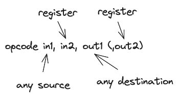

# ZkSync Virtual Machine primer

Unlike EVM, zkEVM is a register machine. EVM instructions operate on a stack. Instead, zkEVM operates primarily on
sixteen registers and memory like most modern computers. That simplifies zero-knowledge proofs, which largely rely on
building arithmetic circuits.

This document describes zkEVM assembly language, then the aspects of VM related to smart-contracts. Its purpose is not
to be a complete reference, but to guide you through the main ideas.

## VM architecture

The native type for zkEVM is a 256-bits wide unsigned integer, we call it a _word_.

Contracts are sequences of instructions. To support the execution of contracts, VM provides the following transient
state:

- **registers**: 16 general-purpose registers: `r0`, `r1`, …, `r15`.  
  `r0` is a special constant register: reading it yields 0, storing to it is ignored.
- **flags**: three distinct boolean registers LT (less-than), EQ (equals, the result is zero) and GT (greater-than).
  Instructions may set or clear flags depending on computation results.
- **data** **stack**: holds $2^{16}$ words, is free to use.
- **heap**: for data that we want to pass around between functions and contracts. Heap is bounded, accesses are only
  free inside the bound, and we have to pay for growing the bound.
- **code memory**: stores code of currently running contracts. May also be used as a constant pool.

VM is aware of two data types:

- raw integers
- pointers (to fragments of other contracts’ heaps).

Registers and data stack are tagged: VM keeps track of whether they hold pointers or raw integer values. Some
instructions will only accept operands tagged as pointers.

Heap and storage are not tagged, so if we store a pointer to the heap, its tag is lost.

Contracts have key-value storages, where keys and values are untagged 256-bit integers. Instructions can change
persistent contract storage.

VM is capable of both near calls (to the code within the same contract) and far calls (to other contracts).

Let us now gradually introduce the VM functionality guided by the instruction set.

## Basic instructions

Contract code consists of instructions, they are executed sequentially.

Instructions usually operate with registers. For example, an instruction `add` may look like that:

```nasm
; this is a comment
add 5, r2, r8  ; store (5 + r2) to r8
```

Or like that:

```nasm
add 5, r0, r8  ; store (5 + 0) to r8
```

Notice that register `r0` is used to feed constant zero values to instructions; this allows to use `add X, r0, Y` to
copy a value `X` to `Y` .

Commonly, instructions accept two inputs and one output operands, following the schema:



The first operand can be taken from:

- registers
- an immediate 16-bit value, like in the example above `add 5, r2, r8`. To use bigger numbers put them as constants in
  the code memory, see section **Code Addressing**.
- directly from the code memory
- stack in various ways, e.g. `add stack=[2], r2, r8` takes the first element from the stack memory area, by an absolute
  address 2.
- code memory

Only registers can be the source of the second operand.

```nasm
add r0, 5, r8  ; error: 5 is an immediate value,
               ; but only register is allowed as second operand
```

There is usually at most one output operand. Similarly, the first output operand can be stored to registers or stack. If
there is a second output operand, it can only be stored to a register.

Instructions are executed one after another, and every instruction has a gas cost measured in _gas_. A program that runs
out of gas panics and none of its side effects are performed.

Every contract may have at most $2^{16}$ instructions.

### Arithmetic instructions

Besides `add`, zkEVM implements `sub` for subtraction, `and`/ `or` / `xor` for bitwise logics, `shl`/ `shr` for logical
shifts, `rol`/ `ror` for circular shifts. These instructions follow the same format, e.g.:

```nasm
shl r1, r4, r3 ; right shift r1 by value of r4, store result in r3
```

Instructions `mul` and `div` are particular: they have two output operands:

- `mul r1, r2, r3, r4` stores the low 256 bits of r1*r2 in r3, high 256 bits of r1*r2 in r4
- `div r1, r2, r3, r4` stores the quotient in `r3` and remainder in `r4`.

### Modifiers

Most instructions support modifiers that alter their behaviour. The modifiers are appended to the name of the
instruction, separated by a dot e.g. `sub.s` . Three basic modifier types are: `set_flags` , predicates, and `swap`.

#### Set flags

By default, most instructions preserve flags.

```nasm
sub r1, r2, r3 ; r3 <- (r1 - r2), no flags are affected
```

The instruction `sub` is implemented so that it sets `EQ` if the result is zero (that is, if `r1` == `r2`). But in this
case, even if `r1-r2` is zero, the EQ flag is not set, because we did not allow it explicitly. We allow instruction to
set flags by appending a “set flags” modifier to them, like that:

```nasm
sub! r1, r2, r3 ; r3 <- (r1 - r2); EQ = 1
```

You can learn more in the
[formal specification](https://github.com/code-423n4/2023-10-zksync/blob/main/docs/VM%20Section/EraVM%20Formal%20specification.pdf).

#### Predicates

Another type of modifiers allows transforming any instruction into a _predicated_, conditional instruction. Predicated
instructions are only executed if flags satisfy their condition.

Recall the three flags: LT, EQ and GT.

For example, this `sub` instruction is only executed if EQ is set:

```nasm
sub.if_eq r1, r2, r5
```

Here is how we can execute `jump` to a label `.label_if_equals` only if `r1 == r2` :

```nasm
sub! r1, r2, r3 ; r3 <- (r1 - r2); EQ = 1 if r1 == r2
jump.if_eq .label_if_equals
```

If the condition is not satisfied, we skip the instruction, but still pay its basic cost in gas.

Here is a full list of available predicates:

- `if_gt`
- `if_eq`
- `if_lt`
- `if_ge` (short for “GT or EQ”)
- `if_le` (short for “LT or EQ”)
- `if_not_eq`
- `if_gt_or_eq`

You can learn more in the
[formal specification](https://github.com/code-423n4/2023-10-zksync/blob/main/docs/VM%20Section/EraVM%20Formal%20specification.pdf).

#### Swap

Recall that instructions may only accept data from stack as their first operand. What if we need the second operand from
stack? For commutative operation, like `add` , `mul`, or `and`, the order of operands does not matter and we can just
write `add x,y,z` instead of `add y,x,z`. However, for operations like `sub` or `div` we implement a special “swap”
modifier which exchanges the operand values before executing the instruction. This is useful to work around the
restriction that the second source operand has to be a register.

For example:

```nasm
sub   r1, r2, r3 ; r3 <- r1 - r2
sub.s r1, r2, r3 ; r3 <- r2 - r1

```

Finally, here is an example of an instruction adorned with all possible modifiers:

```nasm
sub.s.if_lt! r8, r4, r12
```

Here is a breakdown of modifiers:

- `.if_lt` : is only executed if the LT flag is set
- `.s` : computes `r4 - r8` instead of `r8 - r4`
- `!` : sets flags

$$
\begin{aligned}
LT &\leftarrow r_4 < r_8 \\
EQ &\leftarrow r_4 - r_8 = 0 \\
GT &\leftarrow r_4 > r_8
\end{aligned}
$$

Other modifiers are instruction-specific. They are described in full in the instruction reference.

## Calls and returns

The `jump` instruction allows to continue execution from a different place, but it does not allow to return back. An
alternative is using calls; zkEVM supports calling code inside the contract itself (near calls) as well as calling other
contracts (far calls).

### Far calls

Far calls are the equivalent of calls in EVM.

Each call gets its own stack, heap, code memories, and allocated gas.

It is impossible to allocate more than 63/64 of the currently available gas to a far call.

Calls can revert or panic (on executing an illegal instruction for example), which undoes all the changes to storage and
events emitted during the call, and burns all remaining gas allocated to this call.

Suppose we far called a contract $C$. After the execution of $C$, the register `r1` holds a pointer to the return value,
allowing a read-only access to a fragment of $C$’s heap. Alternatively, `r1` can hold a pointer to the heap of some
other contract that $C$ called internally. More on that in Pointers section.

**Delegate calls.** Beside normal `far_call`, there is a variant `far_call.delegate`. Delegate calls are a variation of
far calls allowing to call a contract with the current storage space.

For example, suppose we have contracts A,B,C. Contract A calls B normally, then B delegates to C. Then C’s code is
executed in a context of B’s storage, as if contract A called contract C. If C returns normally, the execution will
proceed from the next instruction of B after delegate call. In case of `revert` or `panic` in C, all the usual rules
apply.

**Mimic calls.** The last variant of far calls is `far_call.mimic`; it is inaccessible to users and only allowed in
system contracts.

Any of far call variants can be additionally marked as `.static` to call a contract in static mode — see section
**Static Mode**.

### Return, revert, panic

There are three types of situations where control returns to the caller:

- Return: a normal way of returning to the caller when no errors occurred. The instruction is `ret`.
- Revert: a recoverable error happened. Unspent gas is returned to the caller, which will execute the exception handler.
  The instruction is `revert`.
- Panic: an irrecoverable error happened. Same as revert, but unspent gas is burned. The instruction is `ret.panic`.

### Near calls

Instruction `near_call reg, address` passes the control to a different address inside the same contract, like `jump`.
Additionally, it remembers the context of execution in a special _call stack_ (it is different from data stack and not
accessible to assembly programmers).

Here is an example of calling function `f` .

```nasm
.text

; here will be the code of exception handler
eh:

; caller function
main:
near_call r2, @f, @eh ; refer to labels in code using '@' symbol

; callee function
f:
ret

```

Additional two arguments:

- label `@eh` is the address of exception handler. Functions, like contracts, may revert or panic, which leads to the
  execution of the exception handler.
- register `r2` holds how much gas we allocate to the function.

As we see, zkEVM supports allocating ergs not only for far calls, but also for near calls. Passing zero will allocate
all available gas. Unlike in far calls, near calls do not limit the amount of gas passed to 63/64 of available gas.

- On revert, unspent gas of the function is **returned**
- On panic, unspent gas of the function is **lost**

All near calls inside the contract are sharing the same memory space (heap, stack), and do not roll back the changes to
this memory if they fail. They do, however, roll back the changes to storage and events.

Near calls cannot be used from Solidity to their full extent. Compiler generates them, but makes sure that if functions
revert or panic, the whole contract reverts of panics. Explicit exception handlers and allocating just a portion of
available gas are reserved for low-level code.

## Accessing data outside registers

### Stack addressing

As we already know, instructions may accept data not only in registers or as immediate 16-bit values, but also on stack.

Data stack is a collection of $2^{16}$ words with a pointer SP. This pointer contains the next address after the topmost
stack element, so the topmost element has the address SP-1. Stack grows towards maximal address, i.e. pushing an element
to stack increases SP.

On far call, SP starts in a new stack memory at 1024.

#### Reading from stack

There are several ways of accessing stack cells:

```nasm
.text
main:

; r0 <- stack word by absolute index (r1+42), unrelated to SP
add stack=[r1+42], r0, r2

; r0 <- stack word by index (SP - (r1 + 42))
add stack[r1+42], r0, r2

; r2 <- stack word by index (SP - (r1 + 42)); additionally, SP += (r1+42)
add stack-=[r1+42], r0, r2
```

As we see there are three stack address modes for input operands; all of them use (register + offset).

Currently, the last mode is only used in a `nop` instruction as a way to rewind stack:

```nasm
; effectively, SP -= reg+imm
nop stack-=[reg+imm]
```

#### Writing to stack

Storing results on stack is also possible:

```nasm
.text
main:

; r1 -> word by absolute index (r2 + 42)
add r1, r0, stack=[r2 + 42]

; r1 ->  word by absolute index SP - (r2 + 42)
add r1, r0, stack[r2 + 42]

; r1 ->  word by absolute index SP + (r2 + 42)
; additionally, SP += r2 + 42
add r1, r0, stack+=[r2 + 42]
```

Currently, the last mode is only used in a `nop` instruction as a way to forward stack pointer:

```nasm
; effectively, SP += reg+imm
nop r0, r0, stack+=[reg+imm]
```

### Code addressing

Sometimes we might need to work with larger immediates that do not fit into 16-bit. In this case we can use the
(read-only) code memory as a constant pool and read 256-bit constants from there.

```nasm
.rodata

datavar:
 .cell 42
 .cell 999
.text
somelabel:

; r2 <- word by index (r0+0)  code memory
add @datavar[0], r0, r2
add @datavar[r2], r0, r2
```

Note: instructions are 64-bit wide, but when accessing data in code memory, this memory is treated as word-addressable.
Therefore, e.g. reading the 0-th 256-bit word from this memory will yield a binary representation of the four first
64-bit instructions in the contract.

There is no distinction between static data and code: code can be read, data can be executed, but instructions that are
not correctly encoded will trigger panic.

Contracts always need to be divisible by 32 bytes (4 instructions) because of this addressing mode.

### Using heap

Heap is a bounded memory region to store data between near calls, and to communicate data between contracts.

#### Heap boundary growth

Accessing an address beyond the heap bound leads to heap growth: the bound is adjusted to accommodate this address. The
difference between old and new bounds is paid in gas.

#### Instructions to access heap

Most instructions can not use heap directly. Instructions `ld.1` and `st.1` are used to load and store data on heap:

```nasm
; take a 32-bit number from r1, use it as an offset in heap,
; load the word from heap by this offset to r4
ld.1 r1, r4

; take a 32-bit number from r3, use it as an offset in heap,
; store the word from r5 to heap by this offset
st.1 r3, r5
```

Heap is byte-addressable, but reads and writes operate in words. To read two consecutive words in heap starting at an
address A, first, read from A, and then read from A+32. Reading any addresses in between is valid too.

One of the modifiers allows to immediately form a new offset like that:

```nasm
; same as ld, but additionally r5 <- r1 + 32
ld.1.inc r1, r4, r5
```

This allows reading several consecutive words in a row:

```nasm
; reads four consecutive words from heap starting at address in r8
; into registers r1, r2, r3, r4
ld.1.inc r8, r1, r8
ld.1.inc r8, r2, r8
ld.1.inc r8, r3, r8
ld.1.inc r8, r4, r8
```

In theory, heap can hold nearly $2^{32}$ bytes, but growing a heap so large is not affordable: the maximum gas allocated
is $2^{32}-1$.

The topmost 32 bytes of heap are considered forbidden addresses, trying to access them results in panic no matter how
much gas is available.

#### Heap and Auxheap

In zkEVM, there are two heaps; every far call allocates memory for both of them.

Heaps are selected with modifiers `.1` or `.2` :

- `ld.1` reads from heap;
- `ld.2` reads from auxheap.

The reason why we need two heaps is technical. Heap contains calldata and returndata for calls to user contracts, while
auxheap contains calldata and returndata for calls to system contracts. This ensures better compatibility with EVM as
users should be able to call zkEVM-specific system contracts without them affecting calldata or returndata.

## Fat pointers

A fat pointer is the second type of values in zkEVM, beside raw integers.

As we noted, registers and stacks are internally tagged by VM to keep track of the cells containing pointers in their
low 128 bits. Only cells with a set pointer tag are considered fat pointers.

Fat pointers are used to pass read-only data between contracts. When choosing how to pass data to a contract (whether
when calling or returning from a call) we have a choice:

- pass an existing fat pointer, or
- create a new fat pointer from a fragment of heap/auxheap.

Fat pointers combine two aspects:

- Delimit a fragment accessible to other contract. Accesses outside this fragment through a pointer yield zero.
- Provide an offset inside this fragment. This offset can be increased or decreased.

The restrictions on fat pointers provide allows to pass data between contracts safely and without excessive copying.

**Implementation note.** Internally, fat pointers hold four 32-bit values:

- bits 0..31 : offset
- bits 32..63: internal memory page ID
- bits 64…95 : starting address of the fragment
- bits 96…127 : length of the fragment

#### Instructions to manipulate fat pointers

Only special instructions can manipulate fat pointers without automatically clearing its pointer tag.

- `ptr.add`, `ptr.sub` modify the offset inside pointer
- `ptr.shrink` reduces the associates fragment, so if we get a fat pointer from contract A, we can then shrink it and
  pass to another contract B up the call chain, again without copying data.
- `ptr.pack` allows putting data in the top 128 bit of the pointer value without clearing the pointer tag.

Doing e.g. `add r1, 0, r2` on a pointer in `r1` clears its tag, and it is now considered as a raw integer.

Instructions `ld` and `[ld.inc](http://ld.inc)` (without indices 1 or 2) allow loading data by fat pointers, possibly
incrementing the pointer. It is impossible to write by a fat pointer.

## Contracts and storage

All accounts are associated with contracts. There are $2^{160}$ valid account addresses.

In zkEVM, contracts may have multiple **functions** in them; a contract may execute its functions by using `near_call` ;
it may call other contracts by using `far_call` or its variations `delegate_call` / `mimic_call` (mimic is reserved for
system contracts).

Size of a contract should be divisible by 32 bytes (4 instructions).

### Storage of contracts

Every account has a storage. Storage maps $2^{256}$ keys to values; both keys and values are 256-bit untagged words.

Contracts may write to their own storage by using `sstore key, value` and read from storage using `sload key, dest`.

### Static mode

Static mode prevents contracts from modifying their storage and emitting events. In static mode, executing an
instruction like `sstore` sends VM into panic.

To execute a contract C in static mode, use a `static` modifier: `far_call.static`. All contracts, called by C
recursively, will also be executed in static mode. VM exits static mode automatically when C terminates.

### System contracts

Part of Era’s functionality is implemented through system contracts. These contracts have addresses from 0 to $2^{64}$
and are executed in kernel mode, where they have access to privileged instructions. An example of such instruction is
mimic call, a variant of far call where the caller can pretend to be another contract. This is useful for hiding the
fact that something is implemented via a system contract but in the hands of users it would mean being able to steal
anyone’s tokens.

System contracts implement contract deployment, extensions such as keccak256, decommitting code etc.

## Server and VM environment

### Decommitter

Decommitter is a module external to zkEVM allowing accessing deployed code by its hash.


The system contracts at the address $2^{15}+2$ , called Deployer, keeps hashes of code of each contract in its storage.
Far calls to a contract with address $C$ perform as follows:

- VM internally accesses the storage of `Deployer` contract by key $C$. This storage yields the hash value $H$**.**
- then VM queries the decommitter, providing $H$. Decommitter answers with the contract code.

If decommitter does not have the code for the requested hash, one of two things happen:

- if C is a system contract (i.e. address of $C < 2^{16}$), the call will fail
- otherwise, VM will call the `DefaultAccount` contract.

### Server

The VM is controlled by a _server._ When the server needs to build a new batch, it starts an instance of zkEVM and feeds
the transactions to the [Bootloader](#bootloader).

zkEVM accepts three parameters:

1. Bootloader’s hash. It is used to fetch the bootloader code from decommitter.
2. Code hash of `DefaultAccount` contract code. It is used to fetch the default code from Decommitter in case of a far
   call to a contract without any associated code.
3. A boolean flag `is_porter_available`, to determine the number of shards (two if zkPorter is available, one
   otherwise).

zkEVM retrieves the code of bootloader from Decommitter and proceeds with sequential execution of instructions on the
bootloader’s code page.

#### Failures and rollbacks

There are three types of behaviour triggered by execution failures.

1. Skipping a malformed transaction. It is a mechanism implemented by the server, external to zkEVM. Server makes a
   snapshot of zkEVM state after completing every transaction. If the bootloader encounters a malformed transaction, it
   fails, and the server restarts zkEVM from the most recent snapshot, skipping this transaction.

   This behaviour is specific to server/bootloader; the contract code has no ways of invoking it.

2. Revert is triggered by the contract code explicitly by executing `revert`. zkEVM saves its persistent state on every
   near or far call. If the contract code identifies a recoverable error, it may execute `revert`; then zkEVM rolls the
   storage and event queues back to the last checkpoint and executes the exception handler.
3. Panic is triggered either explicitly by executing `panic` or internally when some execution invariants are violated
   e.g. attempt to use raw integer in `ptr.add` instruction.

   On panic, the persistent state of zkEVM is rolled back in the same way as on revert.

### Bootloader

Bootloader is a system contract in charge of block construction
(**[sources](https://github.com/matter-labs/era-system-contracts/blob/main/bootloader/bootloader.yul)**).

Formally, bootloader is assigned an address BOOTLOADER_SYSTEM_CONTRACT_ADDRESS = $2^{15}+1$, but zkEVM decommits its
code directly by its hash.

The heap of the bootloader is special: it acts as an interface between server and zkEVM. Server gradually fills the
bootloader’s heap with transaction data, formatted according to an implementation-defined convention.

The bootloader then acts roughly as the following code (not an actual implementation):

```solidity
contract Bootloader {
  function executeBlock(address operatorAddress, Transaction[2] memory transactions) {
    for (uint256 i = 0; i < transactions.length; i++) {
      validateTransaction(transactions[i]);
      chargeFee(operatorAddress, transactions[i]);
      executeTransaction(transactions[i]);
    }
  }

  function validateTransaction(Transaction memory tx) {
    // validation logic
  }

  function chargeFee(address operatorAddress, Transaction memory tx) {
    // charge fee
  }

  function executeTransaction(Transaction memory tx) {
    // execution logic
  }
}

```

The bootloader is therefore responsible for:

- validating transactions;
- executing transactions to form a new block;
- setting some of the transaction- or block-wide transaction parameters (e.g. `blockhash`, `tx.origin`).

Server makes a snapshot of zkEVM state after completing every transaction. When the bootloader encounters a malformed
transaction, it fails, and the server restarts zkEVM from the most recent snapshot, skipping this transaction. If a
transaction is well-formed, zkEVM may still panic while handling it outside the bootloader code. This is a normal
situation and is handled by zkEVM in a regular way, through panics.

The exact code of the bootloader is a part of a protocol; its hash is included in the block header.

### Context value

A part of the zkEVM state is a 128-bit _context value_. It implements `msg.value` standing for the amount of wei sent in
a transaction. In assembly, it is used as follows:

1. Execute `context.set_context_u128 reg` to set the value;
2. Perform a far call — it captures the context value;
3. In a called contract, access the context value through `context.get_context_u128 reg`.

Context value can not be set in static mode.

The system contract `MsgValueSimulator` ensures that whenever this context value is set to *C*, there are indeed *C* wei
transferred to the callee.
