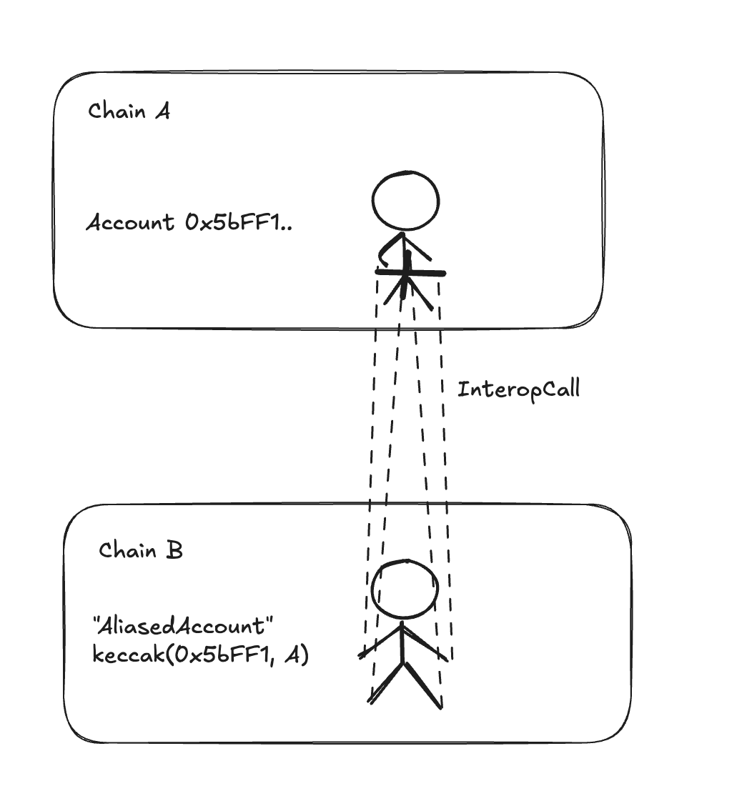
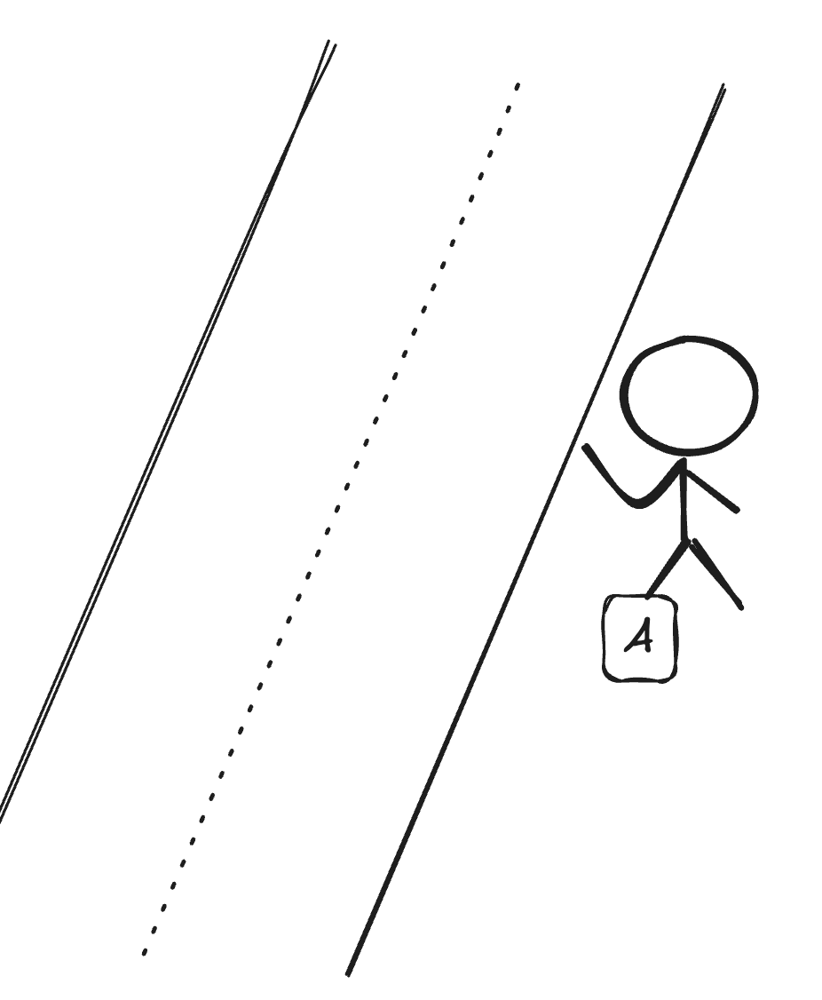

# Bundles and Calls

## Basics Calls

Interop Calls are the next level of interfaces, built on top of Interop Messages, enabling you to call contracts on
other chains.


At this level, the system handles replay protection—once a call is successfully executed, it cannot be executed again
(eliminating the need for your own nullifiers or similar mechanisms).

Additionally, these calls originate from aliased accounts, simplifying permission management (more details on this
below).

Cancellations and retries are managed at the next level (Bundles), which are covered in the following section.

### Interface

On the sending side, the interface provides the option to send this "call" to the destination contract.

```solidity
struct InteropCall {
 address sourceSender,
 address destinationAddress,
 uint256 destinationChainId,
 calldata data,
 uint256 value
}
contract InteropCenter {
 // On source chain.
  // Sends a 'single' basic internal call to destination chain & address.
  // Internally, it starts a bundle, adds this call and sends it over.
  function sendCall(destinationChain, destinationAddress, calldata, msgValue) returns bytes32 bundleId;
}
```

In return, you receive a `bundleId` (we’ll explain bundles later, but for now, think of it as a unique identifier for
your call).

On the destination chain, you can execute the call using the execute method:

```solidity
contract InteropCenter {
  // Executes a given bundle.
  // interopMessage is the message that contains your bundle as payload.
  // If it fails, it can be called again.
  function executeInteropBundle(interopMessage, proof);

  // If the bundle didn't execute succesfully yet, it can be marked as cancelled.
  // See details below.
  function cancelInteropBundle(interopMessage, proof);
}

```

You can retrieve the `interopMessage` (which contains your entire payload) from the Gateway, or you can construct it
yourself using L1 data.

Under the hood, this process calls the `destinationAddress` with the specified calldata.

This leads to an important question: **Who is the msg.sender for this call?**

## `msg.sender` of the Destination Call

The `msg.sender` on the destination chain will be the **AliasedAccount** — an address created as a hash of the original
sender and the original source chain.

(Normally, we’d like to use `sourceAccount@sourceChain`, but since Ethereum limits the size of addresses to 20 bytes, we
compute the Keccak hash of the string above and use this as the address.)

One way to think about it is this: You (as account `0x5bFF1...` on chain A) can send a call to a contract on a
destination chain, and for that contract, it will appear as if the call came locally from the address
`keccak(0x5bFF1 || A)`. This means you are effectively "controlling" such an account address on **every ZK Chain** by
sending interop messages from the `0x5bFF1...` account on chain A.



## Simple Example

Imagine you have contracts on chains B, C, and D, and you’d like them to send "reports" to the Headquarters (HQ)
contract on chain A every time a customer makes a purchase.

```solidity
// Deployed on chains B, C, D.
contract Shop {
 /// Called by the customers when they buy something.
 function buy(uint256 itemPrice) {
   // handle payment etc.
   ...
   // report to HQ
   InteropCenter(INTEROP_ADDRESS).sendCall(
    324,       // chain id of chain A,
    0xc425..,  // HQ contract on chain A,
    createCalldata("reportSales(uint256)", itemPrice), // calldata
    0,         // no value
  );
 }
}

// Deployed on chain A
contract HQ {
  // List of shops
  mapping (address => bool) shops;
  mapping (address => uint256) sales;
  function addShop(address addressOnChain, uint256 chainId) onlyOwner {
    // Adding aliased accounts.
   shops[address(keccak(addressOnChain || chainId))] = true;
  }

  function reportSales(uint256 itemPrice) {
    // only allow calls from our shops (their aliased accounts).
   require(shops[msg.sender]);
   sales[msg.sender] += itemPrice;
  }
}
```

#### Who is paying for gas? How does this Call get to the destination chain

At this level, the **InteropCall** acts like a hitchhiker — it relies on someone (anyone) to pick it up, execute it, and
pay for the gas!



While any transaction on the destination chain can simply call `InteropCenter.executeInteropBundle`, if you don’t want
to rely on hitchhiking, you can create one yourself. We’ll discuss this in the section about **Interop Transactions**.

## Bundles

Before we proceed to discuss **InteropTransactions**, there is one more layer in between: **InteropBundles**.


**Bundles Offer:**

- **Shared Fate**: All calls in the bundle either succeed or fail together.
- **Retries**: If a bundle fails, it can be retried (e.g., with more gas).
- **Cancellations**: If a bundle has not been successfully executed yet, it can be cancelled.

If you look closely at the interface we used earlier, you’ll notice that we were already discussing the execution of
**Bundles** rather than single calls. So, let’s dive into what bundles are and the role they fulfill.

The primary purpose of a bundle is to ensure that a given list of calls is executed in a specific order and has a shared
fate (i.e., either all succeed or all fail).

In this sense, you can think of a bundle as a **"multicall"**, but with two key differences:

1. You cannot "unbundle" items—an individual `InteropCall` cannot be run independently; it is tightly tied to the
   bundle.

2. Each `InteropCall` within a bundle can use a different aliased account, enabling separate permissions for each call.

```solidity
contract InteropCenter {
 struct InteropBundle {
  // Calls have to be done in this order.
  InteropCall calls[];
  uint256 destinationChain;

  // If not set - anyone can execute it.
  address executionAddresses[];
  // Who can 'cancel' this bundle.
  address cancellationAddress;
 }

 // Starts a new bundle.
 // All the calls that will be added to this bundle (potentially by different contracts)
 // will have a 'shared fate'.
 // The whole bundle must be going to a single destination chain.
 function startBundle(destinationChain) returns bundleId;
 // Adds a new call to the opened bundle.
 // Returns the messageId of this single message in the bundle.
 function addToBundle(bundleId, destinationAddress, calldata, msgValue) return msgHash;
 // Finishes a given bundle, and sends it.
 function finishAndSendBundle(bundleId) return msgHash;
}
```

### Cross Chain Swap Example

Imagine you want to perform a swap on chain B, exchanging USDC for PEPE, but all your assets are currently on chain A.

This process would typically involve four steps:

1. Transfer USDC from chain A to chain B.
2. Set allowance for the swap.
3. Execute the swap.
4. Transfer PEPE back to chain A.

Each of these steps is a separate "call," but you need them to execute in exactly this order and, ideally, atomically.
If the swap fails, you wouldn’t want the allowance to remain set on the destination chain.

Below is an example of how this process could look (note that the code is pseudocode; we’ll explain the helper methods
required to make it work in a later section).

```solidity
bundleId = InteropCenter(INTEROP_CENTER).startBundle(chainD);
// This will 'burn' the 1k USDC, create the special interopCall
// when this call is executed on chainD, it will mint 1k USDC there.
// BUT - this interopCall is tied to this bundle id.
USDCBridge.transferWithBundle(
  bundleId,
  chainD,
  aliasedAccount(this(account), block.chain_id),
  1000);


// This will create interopCall to set allowance.
InteropCenter.addToBundle(bundleId,
            USDCOnDestinationChain,
            createCalldata("approve", 1000, poolOnDestinationChain),
            0);
// This will create interopCall to do the swap.
InteropCenter.addToBundle(bundleId,
            poolOnDestinationChain,
            createCalldata("swap", "USDC_PEPE", 1000, ...),
            0)
// And this will be the interopcall to transfer all the assets back.
InteropCenter.addToBundle(bundleId,
            pepeBridgeOnDestinationChain,
            createCalldata("transferAll", block.chain_id, this(account)),
            0)


bundleHash = interopCenter.finishAndSendBundle(bundleId);
```

In the code above, we created a bundle that anyone can execute on the destination chain. This bundle will handle the
entire process: minting, approving, swapping, and transferring back.

### Bundle Restrictions

When starting a bundle, if you specify the `executionAddress`, only that account will be able to execute the bundle on
the destination chain. If no `executionAddress` is specified, anyone can trigger the execution.

## Retries and Cancellations

If bundle execution fails — whether due to a contract error or running out of gas—none of its calls will be applied. The
bundle can be re-run on the **destination chain** without requiring any updates or notifications to the source chain.
More details about retries and gas will be covered in the next level, **Interop Transactions**.

This process can be likened to a "hitchhiker" (or in the case of a bundle, a group of hitchhikers) — if the car they’re
traveling in doesn’t reach the destination, they simply find another ride rather than returning home.

However, there are cases where the bundle should be cancelled. Cancellation can be performed by the
`cancellationAddress` specified in the bundle itself.

#### For our cross chain swap example

1. Call `cancelInteropBundle(interopMessage, proof)` on the destination chain.
   - A helper method for this will be introduced in the later section.
2. When cancellation occurs, the destination chain will generate an `InteropMessage` containing cancellation
   information.
3. Using the proof from this method, the user can call the USDC bridge to recover their assets:

```solidity
USDCBridge.recoverFailedTransfer(bundleId, cancellationMessage, proof);
```

### Some details on our approach

#### Destination Contract

- On ElasticChain, the destination contract does not need to know it is being called via an interop call. Requests
  arrive from `aliased accounts'.

#### Batching

- ElasticChain supports bundling of messages, ensuring shared fate and strict order.

#### Execution Permissions

- ElasticChain allows restricting who can execute the call or bundle on the destination chain.

#### Cancellations

- ElasticChain supports restricting who can cancel. Cancellation can happen at any time.
