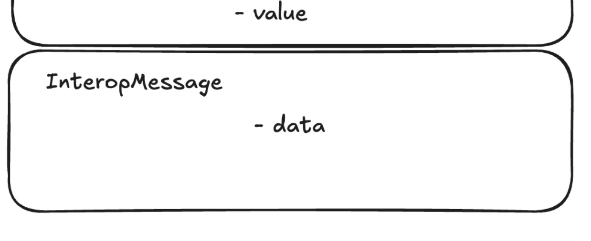
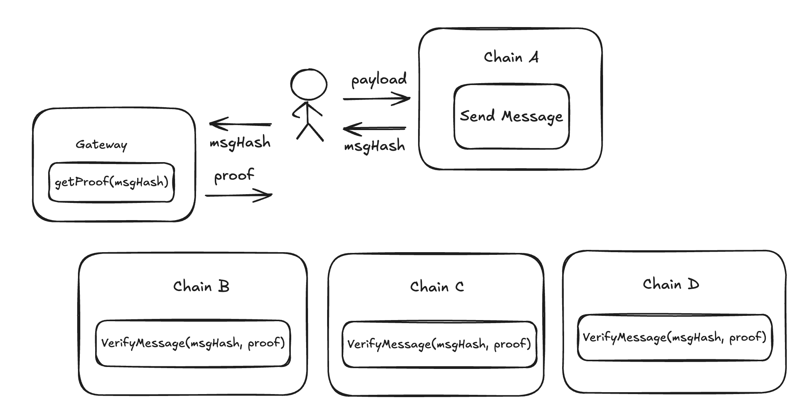
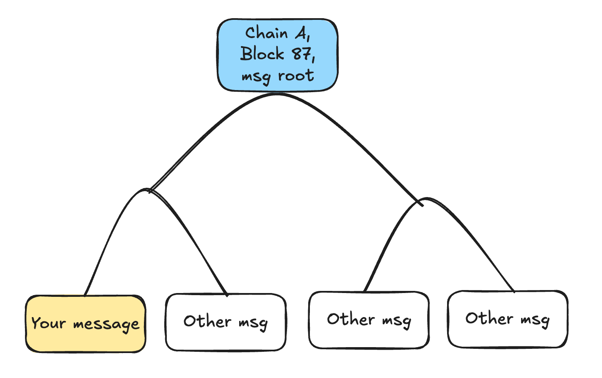

# Interop Messages

In this section, we’re going to cover the lowest level of the interop stack: **Interop Messages** — the interface that forms the foundation for everything else.

We’ll explore the details of the interface, its use cases, and how it compares to similar interfaces from Superchain/Optimism.

This is an advanced document. While most users and app developers typically interact with higher levels of interop, it’s still valuable to understand how the internals work.
## Basics



Interop Messages are the lowest level of our stack.

An **InteropMessage** contains data and offers two methods:

- Send a message
- Verify that a given message was sent on some chain

Notice that the message itself doesn’t have any ‘destination chain’ or address—it is simply a payload that a user (or contract) is creating. Think of it as a broadcast.

The `InteropCenter` is a contract that is pre-deployed on all chains at a fixed address `0x00..1234`.

```solidity
contract InteropCenter {
  // Sends interop message. Can be called by anyone.
  // Returns the unique interopHash.
	function sendInteropMessage(bytes data) returns interopHash;

  // Interop message - uniquely identified by the hash of the payload.
	struct InteropMessage {
	  bytes data;
	  address sender; // filled by InteropCenter
	  uint256 sourceChainId; // filled by InteropCenter
	  uint256 messageNum; // a 'nonce' to guarantee different hashes.
	}
	
	// Verifies if such interop message was ever producted.
	function verifyInteropMessage(bytes32 interopHash, Proof merkleProof) return bool;
}
```

When you call `sendInteropMessage`, the `InteropCenter` adds additional fields, such as your sender address, source chain ID, and messageNum (a nonce ensuring the hash of this structure is globally unique). It then returns the `interopHash`.

This `interopHash` serves as a globally unique identifier that can be used on any chain in the network to call `verifyInteropMessage`.




#### How do I get the proof?
You’ll notice that **verifyInteropMessage** has a second argument — a proof that you need to provide. This proof is a Merkle tree proof (more details below). You can obtain it by querying the Settlement Layer (Gateway) or generating it off-chain by examining the Gateway state on L1.

#### How does the interop message differ from other layers (InteropTransactions, InteropCalls)?
As the most basic layer, an interop message doesn’t include any advanced features — it lacks support for selecting destination chains, nullifiers/replay, cancellation, and more.

If you need these capabilities, consider integrating with a higher layer of interop, such as Call or Bundle, which provide these additional functionalities.

## Simple Use Case
Before we dive into the details of how the system works, let’s look at a simple use case for a DApp that decides to use InteropMessage.

For this example, imagine a basic cross-chain contract where the `signup()` method can be called on chains B, C, and D only if someone has first called `signup_open()` on chain A.

```solidity
// Contract deployed on chain A.
contract SignupManager {
  public bytes32 sigup_open_msg_hash;
  function signup_open() onlyOwner {
    // We are open for business
    signup_open_msg_hash = InteropCenter(INTEROP_CENTER_ADDRESS).sendInteropMessage("We are open");
  }
}

// Contract deployed on all other chains.
contract SignupContract {
  public bool signupIsOpen;
  // Anyone can call it.
  function openSignup(InteropMessage message, InteropProof proof) {
    InteropCenter(INTEROP_CENTER_ADDRESS).verifyInteropMessage(keccak(message), proof);
    require(message.sourceChainId == CHAIN_A_ID);
    require(message.sender == SIGNUP_MANAGER_ON_CHAIN_A);
    require(message.data == "We are open");
	  signupIsOpen = true;
  }
  
  function signup() {
     require(signupIsOpen);
     signedUpUser[msg.sender] = true;  
  }
}
```

In the example above, the `signupManager` on chain A calls the `signup_open` method. After that, any user on other chains can retrieve the `signup_open_msg_hash`, obtain the necessary proof from the Gateway (or another source), and call the `openSignup` function on any destination chain.

## Deeper Technical Dive

Let’s break down what happens inside the InteropCenter when a new interop message is created:

```solidity
function sendInteropMessage(bytes data) {
  messageNum += 1;
  msg = InteropMessage({data, msg.sender, block.chain_id, messageNum});
  // Does L2->L1 Messaging.
  sendToL1(abi.encode(msg));
  return keccak(msg);
}
```

As you can see, it populates the necessary data and then calls the `sendToL1` method.

The `sendToL1` method is part of a system contract that gathers all messages during a batch, constructs a Merkle tree from them at the end of the batch, and sends this tree to the SettlementLayer (Gateway) when the batch is committed.



The Gateway will verify the hashes of the messages to ensure it has received the correct preimages. Once the proof for the batch is submitted (or more accurately, during the "execute" step), it will add the root of the Merkle tree to its `globalRoot`.


The `globalRoot` is the root of the Merkle tree that includes all messages from all chains. Each chain regularly reads the globalRoot value from the Gateway to stay synchronized.


If a user wants to call `verifyInteropMessage` on a chain, they first need to query the Gateway for the Merkle path from the batch they are interested in up to the `globalRoot`. Once they have this path, they can provide it as an argument when calling a method on the destination chain (such as the `openSignup` method in our example).


#### What if the Gateway doesn’t respond?

If the Gateway doesn’t respond, users can manually re-create the Merkle proof using data available on L1. Every interopMessage is also sent to L1.

#### Global roots change frequently

Yes, global roots update continuously as new chains prove their blocks. However, chains retain historical global roots for a reasonable period (around 24 hours) to ensure that recently generated Merkle paths remain valid.


#### Is this secure? Could a chain operator, like Chain D, use a different global root?

Yes, it’s secure. If a malicious operator on Chain D attempted to use a different global root, they wouldn’t be able to submit the proof for their new batch to the Gateway. This is because the proof’s public inputs must include the valid global root.

#### What if the Gateway is malicious?

If the Gateway behaves maliciously, it wouldn’t be able to submit its batches to L1, as the proof would fail verification. A separate section will cover interop transaction security in more detail.

## ElasticChain vs SuperChain
Optimism’s SuperChain and ElasticChain offer similar interfaces, but there are notable differences. Let’s compare them.

### Main Contract

- **SuperChain:** `CrossL2Inbox` – predeployed at 0x42…..22.

- **ElasticChain:** `InteropCenter` – predeployed at a TBD address.

Note: SuperChain also provides a `L2ToL2CrossDomainMessenger`, which will be compared with ElasticChain’s `InteropCall` in the next section.

### Sending Messages
- **SuperChain:** Any existing event can implicitly act as a message. There is no explicit "send" mechanism; you simply rely on existing Ethereum events.

- **ElasticChain:** Requires explicitly calling a method to send the message: `SendInteropMessage`.

#### Why the Difference?

ElasticChain performs additional operations, such as creating Merkle trees and transmitting message content to the Gateway and L1. Applying these processes to all Ethereum events would increase costs significantly.

Additionally, in privacy validium setups, not all events can be shared with the settlement layers, necessitating a more deliberate approach.


### Receiving Messages

- **SuperChain:** `validateMessage(Identifier identifier, bytes32 msgHash)`

- **ElasticChain:** `verifyInteropMessage(bytes32 identifier, Proof proof)`

#### Why the Difference?
In SuperChain, a larger identifier is required to specify which chain and block should be queried for event data. However, the msgHash (derived from Ethereum logs) is not guaranteed to be globally unique.

In ElasticChain, the identifier is globally unique because it’s derived from the hash of a struct that includes the source chain ID. ElasticChain also requires the caller to provide a proof, such as the Merkle path to the globalRoot.

The main difference lies in the fact that SuperChain relies on the honesty of its sequencers. In the future, it plans to implement cross-chain FaultProofs, though these mechanisms are not yet fully designed.


### Message Struct  & Identifier

- **SuperChain:**

```solidity
// Message
ethereum Log.

// Identifier
struct Identifier {
    address origin;
    uint256 blocknumber;
    uint256 logIndex;
    uint256 timestamp;
    uint256 chainid;
}
```

- **ElasticChain:** 

```solidity
	// Message
	struct InteropMessage {
	  bytes data;
	  address sender; 
	  uint256 sourceChainId; 
	  uint256 messageNum; // a 'nonce' to guarantee different hashes.
	}
	
	// Identifier
	keccak(InteropMessage)
```

### Other Features

#### Dependency Set

- **SuperChain:** SuperChain introduces a concept of a dependency set, which defines a list of chains from which a chain will accept messages. This forms a directed graph, meaning chain A can receive messages from chain B, but chain B may not receive messages from chain A.

- **ElasticChain:** In ElasticChain, this is implicitly handled by the Gateway. Any chain that is part of the global root can exchange messages with any other chain, effectively forming an undirected graph.

#### Timestamps and Expiration
- **SuperChain:** SuperChain includes the concept of message expiration, preventing verification of events that are too old (though the exact details are still TBD).

- **ElasticChain:** In ElasticChain, older messages become increasingly difficult to validate as it becomes harder to gather the data required to construct a Merkle proof. Expiration is also being considered for this reason, but the specifics are yet to be determined.

