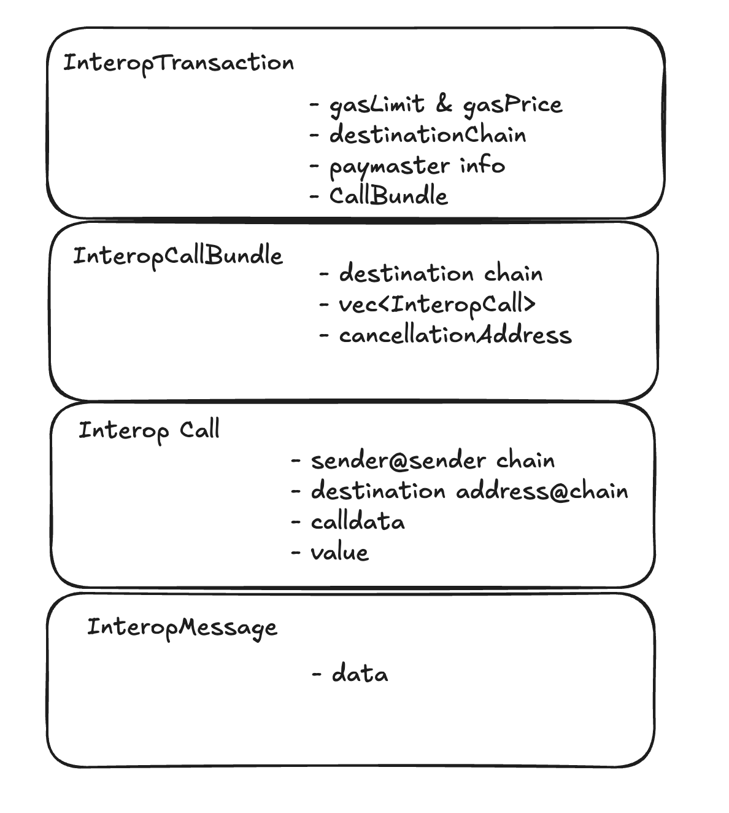

# Intro Guide to Interop

## What is Interop

Interop is a way to communicate and transact between two ZK Stack chains. It allows you to:

**1. Observe messages:** Track when an interop message (think of it as a special event) is created on the source chain.

**2. Send assets:** Transfer ERC20 tokens and other assets between chains.

**3. Execute calls:** Call a contract on a remote chain with specific calldata and value.

With interop, you automatically get an account (a.k.a. aliasedAccount) on each chain, which you can control from the
source chain.

**4. Execute bundles of calls:** Group multiple remote calls into a single bundle, ensuring all of them execute at once.

**5. Execute transactions:** Create transactions on the source chain, which will automatically get executed on the
destination chain, with options to choose from various cross-chain Paymaster solutions to handle gas fees.

## How to Use Interop

Here’s a simple example of calling a contract on a destination chain:

```solidity
cast send source-chain-rpc.com INTEROP_CENTER_ADDRESS sendInteropWithSingleCall(
 0x1fa72e78 // destination_chain_id,
 0xb4AB2FF34fa... // destination_contract,
 0x29723511000000... // destination_calldata,
 0, // value
 100_000, // gasLimit
 250_000_000, // gasPrice
 )
```

While this looks very similar to a 'regular' call, there are some nuances, especially around handling failures and
errors.

Let’s explore these key details together.

## Common Questions and Considerations

#### 1. Who pays for gas

When using this method, your account must hold `gasLimit * gasPrice` worth of destination chain tokens on the source
chain.

For example, if you’re sending the request from Era and the destination chain is Sophon (with SOPH tokens), you’ll need
SOPH tokens available on Era.

Additional payment options are available, which will be covered in later sections.

#### 2. How does the destination contract know it’s from me

The destination contract will see `msg.sender` as `keccak(source_account, source_chain)[:20]`.

Ideally, we would use something like `source_account@source_chain` (similar to an email format), but since Ethereum
addresses are limited to 20 bytes, we use a Keccak hash to fit this constraint.

#### 3. Who executes it on the destination chain

The call is auto-executed on the destination chain. As a user, you don’t need to take any additional actions.

#### 4. What if it runs out of gas or the gasPrice is set too low

In either scenario, you can retry the transaction using the `retryInteropTransaction` method:

```solidity
   cast send source-chain.com INTEROP_CENTER_ADDRESS retryInteropTransaction(
     0x2654.. // previous interop transaction hash from above
     200_000, // new gasLimit
     300_000_000 // new gasPrice
    )
```

**Important** : Depending on your use case, it’s crucial to retry the transaction rather than creating a new one with
`sendInteropWithSingleCall`.

For example, if your call involves transferring a large amount of assets, initiating a new `sendInteropWithSingleCall`
could result in freezing or burning those assets again.

#### 5. What if my assets were burned during the transaction, but it failed on the destination chain? How do I get them back

If your transaction fails on the destination chain, you can either:

1. Retry the transaction with more gas or a higher gas limit (refer to the retry method above).

2. Cancel the transaction using the following method:

```solidity
cast send source-chain INTEROP_CENTER_ADDRESS cancelInteropTransaction(
    0x2654.., // previous interop transaction
    100_000, // gasLimit (cancellation also requires gas, but only to mark it as cancelled)
    300_000_000 // gasPrice
)
```

After cancellation, call the claimFailedDeposit method on the source chain contracts to recover the burned assets. Note
that the details for this step may vary depending on the contract specifics.

## Complex Scenario

#### 6. What if I want to transfer USDC to the Sophon chain, swap it for PEPE coin, and transfer the results back

To accomplish this, you’ll need to:

- Create multiple **InteropCalls** (e.g., transferring USDC, executing the swap).
- Combine these calls into a single **InteropBundle**.
- Execute the **InteropTransaction** on the destination chain.

The step-by-step process and exact details will be covered in the next section.

## Technical Details

### How does native bridging differ from a third party bridging

Bridges generally fall into two categories: Native and Third-Party.

#### 1. Native Bridges

Native bridges enable asset transfers “up and down” (from L2 to L1 and vice versa), but interop (which is also a form of
native bridging) allows you to move them between different L2s.

Instead of doing a "round trip" (L2 → L1 → another L2), interop lets you move assets directly between two L2s, saving
both time and cost.

#### 2. Third-Party Bridging

Third-party bridges enable transfers between two L2s, but they rely on their own liquidity. While you, as the user,
receive assets on the destination chain instantly, these assets come from the bridge’s liquidity pool.

Bridge operators then rebalance using native bridging, which requires maintaining token reserves on both sides. Without
interop this adds costs for the bridge operators, often resulting in higher fees for users.

The good news is that third-party bridges can use interop to improve their token transfers by utilizing the
**InteropMessage** layer.

More details on this will follow below.

### How Fast is It

Interop speed is determined by its lowest level: **InteropMessage** propagation speed. This essentially depends on how
quickly the destination chain can confirm that the message created by the source chain is valid.

- **Default Mode:** To prioritize security, the default interop mode waits for a ZK proof to validate the message, which
  typically takes around 10 minutes.

- **Fast Mode (Planned):** We are developing an alternative **INTEROP_CENTER** contract (using a different address but
  the same interface) that will operate within 1 second. However, this faster mode comes with additional risks, similar
  to the approach used by optimistic chains.

### 4 Levels of Interop

When analyzing interop, it can be broken into four levels, allowing you to choose the appropriate level for integration:

- **InteropMessages:** The lowest level, directly used by third-party bridges and other protocols.

- **InteropCall:** A medium level, designed for use by "library" contracts.

- **InteropCallBundle:** A higher level, intended for use by "user-visible" contracts.

- **InteropTransaction:** The highest level, designed for use in UX and frontends.



We will be covering the details of each layer in the next section.
