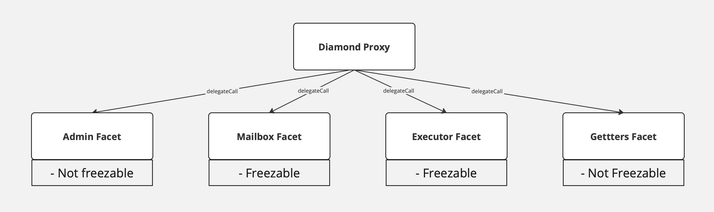

<!--- WIP --->

# L1 Smart contracts

This document presumes familiarity with Rollups. For a better understanding, consider reading the overview
[here](./overview.md).

Rollups inherit security and decentralization guarantees from Ethereum, on which they store information about changes in
their own state, providing validity proofs for state transition, implementing a communication mechanism, etc. In
practice, all this is achieved by Smart Contracts built on top of Ethereum. This document details the architecture of
the L2 contracts on Ethereum Layer 1. We also have contracts that support the ZK Chain ecosystem, we cover those in the
[Shared Bridge][TODO] section. The Shared Bridge relies on these individual contracts.

## Diamond

Technically, this L1 smart contract acts as a connector between Ethereum (L1) and a single L2. It checks the validity
proof and data availability, handles L2 <-> L1 communication, finalizes L2 state transition, and more.



### DiamondProxy

The main contract uses [EIP-2535](https://eips.ethereum.org/EIPS/eip-2535) diamond proxy pattern. It is an in-house
implementation that is inspired by the [mudgen reference implementation](https://github.com/mudgen/Diamond). It has no
external functions, only the fallback that delegates a call to one of the facets (target/implementation contract). So
even an upgrade system is a separate facet that can be replaced.

One of the differences from the reference implementation is access freezable. Each of the facets has an associated
parameter that indicates if it is possible to freeze access to the facet. Privileged actors can freeze the **diamond**
(not a specific facet!) and all facets with the marker `isFreezable` should be inaccessible until the governor or admin
unfreezes the diamond. Note that it is a very dangerous thing since the diamond proxy can freeze the upgrade system and
then the diamond will be frozen forever.

The diamond proxy pattern is very flexible and extendable. For now, it allows splitting implementation contracts by
their logical meaning, removes the limit of bytecode size per contract and implements security features such as
freezing. In the future, it can also be viewed as [EIP-6900](https://eips.ethereum.org/EIPS/eip-6900) for
[ZK Stack](https://blog.matter-labs.io/introducing-the-zk-stack-c24240c2532a), where each ZK Chain can implement a
sub-set of allowed implementation contracts.

### GettersFacet

Separate facet, whose only function is providing `view` and `pure` methods. It also implements
[diamond loupe](https://eips.ethereum.org/EIPS/eip-2535#diamond-loupe) which makes managing facets easier. This contract
must never be frozen.

### AdminFacet

Controls changing the privileged addresses such as governor and validators or one of the system parameters (L2
bootloader bytecode hash, verifier address, verifier parameters, etc), and it also manages the freezing/unfreezing and
execution of upgrades in the diamond proxy.

The admin facet is controlled by two entities:

- Governance - Separate smart contract that can perform critical changes to the system as protocol upgrades. This
  contract controlled by two multisigs, one managed by Matter Labs team and another will be multisig with well-respected
  contributors in the crypto space. Only together they can perform an instant upgrade, the Matter Labs team can only
  schedule an upgrade with delay.
- Admin - Multisig smart contract managed by Matter Labs that can perform non-critical changes to the system such as
  granting validator permissions. Note, that the Admin is the same multisig as the owner of the governance.

### MailboxFacet

The facet that handles L2 <-> L1 communication, an overview for which can be found in
[docs](https://docs.zksync.io/build/developer-reference/l1-l2-interoperability).

The Mailbox performs three functions:

- L1 <-> L2 communication.
- Bridging native Ether to the L2 (with the launch of the Shared Bridge this will be moved)
- Censorship resistance mechanism (in the research stage).

L1 -> L2 communication is implemented as requesting an L2 transaction on L1 and executing it on L2. This means a user
can call the function on the L1 contract to save the data about the transaction in some queue. Later on, a validator can
process it on L2 and mark it as processed on the L1 priority queue. Currently, it is used for sending information from
L1 to L2 or implementing multi-layer protocols.

_NOTE_: While user requests the transaction from L1, the initiated transaction on L2 will have such a `msg.sender`:

```solidity
  address sender = msg.sender;
  if (sender != tx.origin) {
      sender = AddressAliasHelper.applyL1ToL2Alias(msg.sender);
  }
```

where

```solidity
uint160 constant offset = uint160(0x1111000000000000000000000000000000001111);

function applyL1ToL2Alias(address l1Address) internal pure returns (address l2Address) {
  unchecked {
    l2Address = address(uint160(l1Address) + offset);
  }
}

```

For most of the rollups the address aliasing needs to prevent cross-chain exploits that would otherwise be possible if
we simply reused the same L1 addresses as the L2 sender. In zkEVM address derivation rule is different from the
Ethereum, so cross-chain exploits are already impossible. However, the zkEVM may add full EVM support in the future, so
applying address aliasing leaves room for future EVM compatibility.

The L1 -> L2 communication is also used for bridging ether. The user should include a `msg.value` when initiating a
transaction request on the L1 contract. Before executing a transaction on L2, the specified address will be credited
with the funds. To withdraw funds user should call `withdraw` function on the `L2EtherToken` system contracts. This will
burn the funds on L2, allowing the user to reclaim them through the `finalizeEthWithdrawal` function on the
`MailboxFacet`.

More about L1->L2 operations can be found
[here](https://github.com/code-423n4/2023-10-zksync/blob/main/docs/Smart%20contract%20Section/Handling%20L1→L2%20ops%20on%20zkSync.md).

L2 -> L1 communication, in contrast to L1 -> L2 communication, is based only on transferring the information, and not on
the transaction execution on L1. The full description of the mechanism for sending information from L2 to L1 can be
found
[here](https://github.com/code-423n4/2023-10-zksync/blob/main/docs/Smart%20contract%20Section/Handling%20pubdata%20in%20Boojum.md).

### ExecutorFacet

A contract that accepts L2 batches, enforces data availability and checks the validity of zk-proofs.

The state transition is divided into three stages:

- `commitBatches` - check L2 batch timestamp, process the L2 logs, save data for a batch, and prepare data for zk-proof.
- `proveBatches` - validate zk-proof.
- `executeBatches` - finalize the state, marking L1 -> L2 communication processing, and saving Merkle tree with L2 logs.

Each L2 -> L1 system log will have a key that is part of the following:

```solidity
enum SystemLogKey {
  L2_TO_L1_LOGS_TREE_ROOT_KEY,
  TOTAL_L2_TO_L1_PUBDATA_KEY,
  STATE_DIFF_HASH_KEY,
  PACKED_BATCH_AND_L2_BLOCK_TIMESTAMP_KEY,
  PREV_BATCH_HASH_KEY,
  CHAINED_PRIORITY_TXN_HASH_KEY,
  NUMBER_OF_LAYER_1_TXS_KEY,
  EXPECTED_SYSTEM_CONTRACT_UPGRADE_TX_HASH_KEY
}

```

When a batch is committed, we process L2 -> L1 system logs. Here are the invariants that are expected there:

- In a given batch there will be either 7 or 8 system logs. The 8th log is only required for a protocol upgrade.
- There will be a single log for each key that is contained within `SystemLogKey`
- Three logs from the `L2_TO_L1_MESSENGER` with keys:
- `L2_TO_L1_LOGS_TREE_ROOT_KEY`
- `TOTAL_L2_TO_L1_PUBDATA_KEY`
- `STATE_DIFF_HASH_KEY`
- Two logs from `L2_SYSTEM_CONTEXT_SYSTEM_CONTRACT_ADDR` with keys:
  - `PACKED_BATCH_AND_L2_BLOCK_TIMESTAMP_KEY`
  - `PREV_BATCH_HASH_KEY`
- Two or three logs from `L2_BOOTLOADER_ADDRESS` with keys:
  - `CHAINED_PRIORITY_TXN_HASH_KEY`
  - `NUMBER_OF_LAYER_1_TXS_KEY`
  - `EXPECTED_SYSTEM_CONTRACT_UPGRADE_TX_HASH_KEY`
- None logs from other addresses (may be changed in the future).

### DiamondInit

It is a one-function contract that implements the logic of initializing a diamond proxy. It is called only once on the
diamond constructor and is not saved in the diamond as a facet.

Implementation detail - function returns a magic value just like it is designed in
[EIP-1271](https://eips.ethereum.org/EIPS/eip-1271), but the magic value is 32 bytes in size.

## Bridges

Bridges are completely separate contracts from the Diamond. They are a wrapper for L1 <-> L2 communication on contracts
on both L1 and L2. Upon locking assets on L1, a request is sent to mint these bridged assets on L2. Upon burning assets
on L2, a request is sent to unlock them on L2.

Unlike the native Ether bridging, all other assets can be bridged by the custom implementation relying on the trustless
L1 <-> L2 communication.

### L1ERC20Bridge

The "legacy" implementation of the ERC20 token bridge. Works only with regular ERC20 tokens, i.e. not with
fee-on-transfer tokens or other custom logic for handling user balances.

- `deposit` - lock funds inside the contract and send a request to mint bridged assets on L2.
- `claimFailedDeposit` - unlock funds if the deposit was initiated but then failed on L2.
- `finalizeWithdrawal` - unlock funds for the valid withdrawal request from L2.

The owner of the L1ERC20Bridge is the Governance contract.

### L1AssetRouter

The main bridge implementation handles transfers Ether, ERC20 tokens and of WETH tokens between the two domains. It is
designed to streamline and enhance the user experience for bridging WETH tokens by minimizing the number of transactions
required and reducing liquidity fragmentation thus improving efficiency and user experience.

This contract accepts WETH deposits on L1, unwraps them to ETH, and sends the ETH to the L2 WETH bridge contract, where
it is wrapped back into WETH and delivered to the L2 recipient.

Thus, the deposit is made in one transaction, and the user receives L2 WETH that can be unwrapped to ETH.

For withdrawals, the contract receives ETH from the L2 WETH bridge contract, wraps it into WETH, and sends the WETH to
the L1 recipient.

The owner of the L1WethBridge contract is the Governance contract.

### L2SharedBridge

The L2 counterpart of the L1 Shared bridge.

- `withdraw` - initiate a withdrawal by burning funds on the contract and sending a corresponding message to L1.
- `finalizeDeposit` - finalize the deposit and mint funds on L2. The function is only callable by L1 bridge.

The owner of the L2SharedBridge and the contracts related to it is the Governance contract.

## Governance

This contract manages calls for all governed zkEVM contracts on L1 and L2. Mostly, it is used for upgradability an
changing critical system parameters. The contract has minimum delay settings for the call execution.

Each upgrade consists of two steps:

- Scheduling - The owner can schedule upgrades in two different manners:
  - Fully transparent data. All the targets, calldata, and upgrade conditions are known to the community before upgrade
    execution.
  - Shadow upgrade. The owner only shows the commitment to the upgrade. This upgrade type is mostly useful for fixing
    critical issues in the production environment.
- Upgrade execution - the Owner or Security council can perform the upgrade with previously scheduled parameters.
  - Upgrade with delay. Scheduled operations should elapse the delay period. Both the owner and Security Council can
    execute this type of upgrade.
  - Instant upgrade. Scheduled operations can be executed at any moment. Only the Security Council can perform this type
    of upgrade.

Please note, that both the Owner and Security council can cancel the upgrade before its execution.

The diagram below outlines the complete journey from the initiation of an operation to its execution.


## ValidatorTimelock

An intermediate smart contract between the validator EOA account and the ZKsync smart contract. Its primary purpose is
to provide a trustless means of delaying batch execution without modifying the main ZKsync contract. ZKsync actively
monitors the chain activity and reacts to any suspicious activity by freezing the chain. This allows time for
investigation and mitigation before resuming normal operations.

It is a temporary solution to prevent any significant impact of the validator hot key leakage, while the network is in
the Alpha stage.

This contract consists of four main functions `commitBatches`, `proveBatches`, `executeBatches`, and `revertBatches`,
which can be called only by the validator.

When the validator calls `commitBatches`, the same calldata will be propagated to the ZKsync contract (`DiamondProxy`
through `call` where it invokes the `ExecutorFacet` through `delegatecall`), and also a timestamp is assigned to these
batches to track the time these batches are committed by the validator to enforce a delay between committing and
execution of batches. Then, the validator can prove the already committed batches regardless of the mentioned timestamp,
and again the same calldata (related to the `proveBatches` function) will be propagated to the ZKsync contract. After
the `delay` is elapsed, the validator is allowed to call `executeBatches` to propagate the same calldata to ZKsync
contract.

The owner of the ValidatorTimelock contract is the same as the owner of the Governance contract - Matter Labs multisig.

## Allowlist

The auxiliary contract controls the permission access list. It is used in bridges and diamond proxies to control which
addresses can interact with them in the Alpha release. Currently, it is supposed to set all permissions to public.

The owner of the Allowlist contract is the Governance contract.

## Deposit Limitation

The amount of deposit can be limited. This limitation is applied on an account level and is not time-based. In other
words, each account cannot deposit more than the cap defined. The tokens and the cap can be set through governance
transactions. Moreover, there is an allow listing mechanism as well (only some allow listed accounts can call some
specific functions). So, the combination of deposit limitation and allow listing leads to limiting the deposit of the
allow listed account to be less than the defined cap.

```solidity
struct Deposit {
  bool depositLimitation;
  uint256 depositCap;
}

```

Currently, the limit is used only for blocking deposits of the specific token (turning on the limitation and setting the
limit to zero). And on the near future, this functionality will be completely removed.
