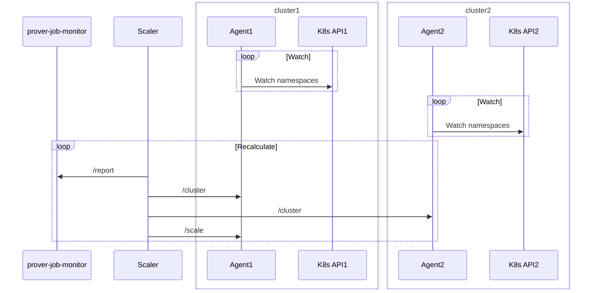

# Prover Autoscaler

Prover Autoscaler is needed to automatically scale Prover related Kubernetes Deployments according to the load in a
cluster with higher chances to get Nodes to run. If the cluster runs out of resources it moves the load to next one.

## Design

Prover Autoscaler has the main Scaler part and Agents running in each cluster.

### Agent

Agents watch via Kubernetes API status of Deployments, Pods and out of resources Events; perform scaling by requests
from Scaler. They watch only specified in config namespaces. Agent provides listens on 2 ports: `prometheus_port` to
export metrics (path is `/metrics`), and `http_port` with 3 paths: `/healthz`, `/cluster` to get the cluster status and
`/scale` to scale Deployments up or down.

### Scaler

Scaler collects cluster statuses from Agents, job queues from prover-job-monitor, calculates needed number of replicas
and sends scale requests to Agents.

Requests flow diagram:



Scaler supports 2 types of scaling algorithms: GPU and Simple. GPU usually is prover itself and all other Deployments
are using Simple algorithm.

Simple algorithm tries to scale the Deployment up to `queue / speed` replicas (rounded up) in the best cluster. If there
is not enough capacity it continue in the next best cluster and so on. On each run it selects "best cluster" using
priority, number of capacity issues and cluster size. The capacity is limited by config `max_replicas` and also by
availability of machines in the cluster. Autoscaler detects that a cluster is running out of particular machines by
watching for `FailedScaleUp` events and also by checking if a Pod stuck in Pending for longer than
`long_pending_duration`. If not enough capacity is detected not running Pods will be moved.

GPU algorithm works similar to Simple one, but it also recognise different GPU types and distribute load across L4 GPUs
first, then T4, V100, P100 and A100, if available.

Different namespaces are running different protocol versions and completely independent. Normally only one namespace is
active, and only during protocol upgrade both are active. Each namespace has to have correct version of binaries
installed, see `protocol_versions` config option.

## Dependencies

- [prover-job-monitor](.../prover_job_monitor/)
- Kubernetes API
- GCP API (optional)

## Permissions

Agents need the following Kubernetes permissions:

```yaml
- apiGroups:
    - ''
  resources:
    - pods
    - events
    - namespaces
    - nodes
  verbs:
    - get
    - watch
    - list
- apiGroups:
    - apps
  resources:
    - deployments
    - replicasets
  verbs:
    - get
    - list
    - watch
    - patch
    - update
```

## Configuration

Prover Autoscaler requires a config file provided via `--config-path` flag, supported format: YAML. Also you need to
specify which job to run Scaler or Agent using `--job=scaler` or `--job=agent` flag correspondingly.

### Common configuration

- `graceful_shutdown_timeout` is time to wait for all the task to finish before force shutdown. Default: 5s.
- `observability` section configures type of `log_format` (`plain` or `json`) and log levels per module with
  `log_directives`.

Example:

```yaml
graceful_shutdown_timeout: 5s
observability:
  log_format: plain
  log_directives: 'zksync_prover_autoscaler=debug'
```

### Agent configuration

`agent_config` section configures Agent parameters:

- `prometheus_port` is a port for Prometheus metrics to be served on (path is `/metrics`).
- `http_port` is the main port for Scaler to connect to.
- `namespaces` is list of namespaces to watch.
- `dry_run` if enabled, Agent will not change number of replicas, just report success. Default: true.
- `pod_check_interval` interval to find and remove stale pods from watcher status. Default: 1h.

Example:

```yaml
agent_config:
  prometheus_port: 8080
  http_port: 8081
  namespaces:
    - prover-old
    - prover-new
  dry_run: true
  pod_check_interval: 60m
```

### Scaler configuration

`scaler_config` section configures Scaler parameters:

- `dry_run` if enabled, Scaler will not send any scaler requests. Default: false.
- `prometheus_port` is a port for Prometheus metrics to be served on (path is `/metrics`).
- `prover_job_monitor_url` is full URL to get queue report from prover-job-monitor.
- `agents` is Agent list to send requests to.
- `scaler_run_interval` is interval between re-calculations. Default: 10s.
- `protocol_versions` is a map namespaces to protocol version it processes. Should correspond binary versions running
  there!
- `cluster_priorities` is a map cluster name to priority, the lower will be used first.
- `apply_min_to_namespace` specifies current primary namespace to run min number of provers in it.
- `long_pending_duration` is time after a pending pod considered long pending and will be relocated to different
  cluster. Default: 10m.
- `scale_errors_duration` defines the time window for including scale errors in Autoscaler calculations. Clusters will
  be sorted by number of the errors. It should be between 20m and 2h. Default: 1h.
- `need_to_move_duration` defines the time window for which Autoscaler forces pending pod migration due to scale errors.
  This prevents pending pods from indefinitely waiting for nodes in a busy cluster. Should be at least x2 of
  `scaler_run_interval`. Default: 4m.
- `scaler_targets` subsection is a list of non-GPU targets:
  - `scaler_target_type` specifies the type, possible options: `Simple` (default) and `Gpu`.
  - `queue_report_field` is name of corresponding queue report section. See example for possible options.
  - `deployment` is name of a Deployment to scale.
  - `min_replicas` is a minimum number of replicas to run even if the queue is empty. Default: 0.
  - `max_replicas` is a map of cluster name to maximum number of replicas. Note: it can be a number of map of GPU types
    to a number.
  - `speed` is a divider for corresponding queue. Note: it can be a number of map of GPU types to a number.

Example:

```yaml
scaler_config:
  dry_run: true
  prometheus_port: 8082
  prover_job_monitor_url: http://prover-job-monitor.default.svc.cluster.local:3074/queue_report
  agents:
    - http://prover-autoscaler-agent.cluster1.com
    - http://prover-autoscaler-agent.cluster2.com
    - http://prover-autoscaler-agent.cluster3.com
  scaler_run_interval: 30s
  protocol_versions:
    prover-old: 0.24.2
    prover-new: 0.25.0
  cluster_priorities:
    cluster1: 0
    cluster2: 100
    cluster3: 200
  apply_min_to_namespace: prover-new
  long_pending_duration: 10m
  scale_errors_duration: 1h
  need_to_move_duration: 4m
  scaler_targets:
    - queue_report_field: prover_jobs
      scaler_target_type: Gpu
      deployment: circuit-prover-gpu
      min_replicas: 1
      max_replicas:
        cluster1:
          L4: 1
          T4: 200
        cluster2:
          L4: 100
          T4: 200
        cluster3:
          L4: 100
          T4: 100
      speed:
        L4: 500
        T4: 400
    - queue_report_field: basic_witness_jobs
      deployment: witness-generator-basic-fri
      min_replicas: 1
      max_replicas:
        cluster1: 10
        cluster2: 20
      speed: 4
    - queue_report_field: leaf_witness_jobs
      deployment: witness-generator-leaf-fri
      max_replicas:
        cluster1: 10
      speed: 10
    - queue_report_field: node_witness_jobs
      deployment: witness-generator-node-fri
      max_replicas:
        cluster1: 10
      speed: 10
    - queue_report_field: recursion_tip_witness_jobs
      deployment: witness-generator-recursion-tip-fri
      max_replicas:
        cluster1: 10
      speed: 10
    - queue_report_field: scheduler_witness_jobs
      deployment: witness-generator-scheduler-fri
      max_replicas:
        cluster1: 10
      speed: 10
    - queue_report_field: proof_compressor_jobs
      deployment: proof-fri-gpu-compressor
      max_replicas:
        cluster1: 10
        cluster2: 20
      speed: 5
```
