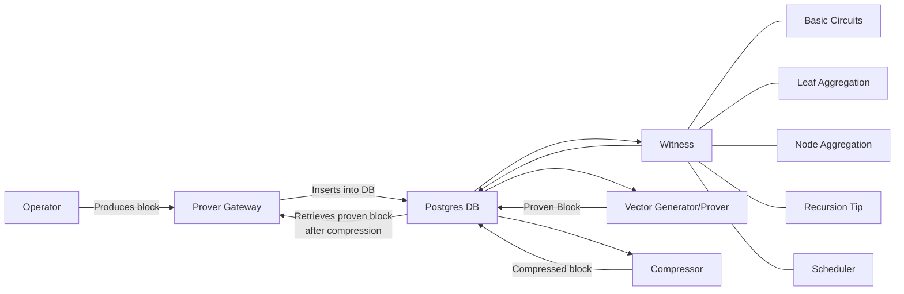

# FRI Prover

## Overview of the pipeline

These are the main components to this process:

- Sequencer
- Prover gateway
- Witness
- Prover
- Compressor

All of them will be sharing information through a SQL database and GCS bucket. The general idea is that the sequencer
will produce blocks and the gateway will place them into the database to be proven. Then, the rest of the components
will pull jobs from the database and do their part of the pipeline, loading intermediary artifacts from GCS.



## Prerequisites

Make sure these dependencies are installed and available on your machine:
[Installing dependencies](../../docs/guides/setup-dev.md). Make sure you go through all steps, including setting
environment variables for `zk`. Same work is done at the bottom of this doc, if you want a TL;DR; for running GPU
provers on GCP.

## Proving a block using GPU prover locally

Below steps can be used to prove a block on local machine using GPU prover. Running a GPU prover requires a CUDA 12.0
installation as a pre-requisite, alongside these machine specs:

- CPU: At least 16 physical cores
- RAM: 85GB of RAM
- Disk: 200GB of free disk (lower might be fine, depending on how many proofs you want to generate)
- GPU: NVIDIA GPU with CUDA support and at least 6GB of VRAM, we recommend to use GPUs with at least 16GB VRAM for
  optimal performance. In our GPU picks for datacenters while running on Google Cloud Platform, the L4 takes the top
  spot in terms of price-to-performance ratio, with the T4 coming in second.

1. Initialize DB and run migrations (make sure you're in the root of the repo): `zk && zk init`
2. Run the server. In the root of the repository:

   ```console
   zk server --components=api,eth,tree,state_keeper,housekeeper,commitment_generator,proof_data_handler,vm_runner_bwip
   ```

   Note that it will produce a first l1 batch that can be proven (should be batch 0).

3. Generate the GPU setup data (no need to regenerate if it's already there). If you want to use this with the GPU
   compressors, you need to change the key in the file from `setup_2^26.key` to `setup_2^24.key`. This will consume
   around 20GB of disk. You need to be in the `prover/` directory (for all commands from here onwards, you need to be in
   the `prover/` directory) and run:

   ```console
   ./setup.sh gpu
   ```

4. Run prover gateway to fetch blocks to be proven from server:

   ```console
   zk f cargo run --release --bin zksync_prover_fri_gateway
   ```

5. Run 4 witness generators to generate witness for each round:

   ```console
   API_PROMETHEUS_LISTENER_PORT=3116 zk f cargo run --release --bin zksync_witness_generator -- --round=basic_circuits
   API_PROMETHEUS_LISTENER_PORT=3117 zk f cargo run --release --bin zksync_witness_generator -- --round=leaf_aggregation
   API_PROMETHEUS_LISTENER_PORT=3118 zk f cargo run --release --bin zksync_witness_generator -- --round=node_aggregation
   API_PROMETHEUS_LISTENER_PORT=3119 zk f cargo run --release --bin zksync_witness_generator -- --round=recursion_tip
   API_PROMETHEUS_LISTENER_PORT=3120 zk f cargo run --release --bin zksync_witness_generator -- --round=scheduler
   ```

   or alternatively (recommended), start all of them with

   ```console
   API_PROMETHEUS_LISTENER_PORT=3116 zk f cargo run --release --bin zksync_witness_generator -- --all_rounds
   ```

   Note that this will automatically open four ports: 3116 (the starting port), 3117, 3118 and 3119 for subsequent
   provers.

6. Run witness vector generators to feed jobs to GPU prover:

   ```console
   FRI_WITNESS_VECTOR_GENERATOR_PROMETHEUS_LISTENER_PORT=3420 zk f cargo run --release --bin zksync_witness_vector_generator
   ```

   Note that you may run multiple of them (as 1 prover roughly can be fed by 10 vector generators). Make sure to use a
   different port!

7. Run prover to perform actual proving: `zk f cargo run --features "gpu" --release --bin zksync_prover_fri`

8. Finally, run proof compressor to compress the proof to be sent on L1:
   `zk f cargo run --release --bin zksync_proof_fri_compressor`

## Block proving with CPU

We don't recommend using this method, as at the moment none are ran in production and may be broken. There will be
investment in the future, but for the time being, please use GPU provers. That said, instructions are left below for
brave adventurers.

Below steps can be used to prove a block on local machine using CPU prover. This is useful for debugging and testing
Machine specs:

- CPU: At least 8 physical cores
- RAM: 80GB of RAM (enable swap if your machine has less RAM)
- Disk: 400GB of free disk

1. Install Rust (correct version from rust-toolchain file should be used automatically if you don't have any local
   overrides)
2. Initialize DB and run migrations. Go into the root of the repository, then run

   ```console
   zk init
   ```

3. Generate the CPU setup data (no need to regenerate if it's already there). This will consume around 300GB of disk.
   For this, move to the `prover` directory, and run

   ```console
   ./setup.sh
   ```

   For the following steps, we recommend using `tmux` to run every command on a separate session, so you can attach to
   and monitor logs for each one.

4. Run the sequencer/operator. In the root of the repository:

   ```console
   zk server --components=api,eth,tree,state_keeper,housekeeper,commitment_generator,proof_data_handler
   ```

   to produce blocks to be proven

5. Move again into the `prover` directory. The rest of the steps will be performed from there. Run prover gateway to
   fetch blocks to be proven from server:

   ```console
   zk f cargo run --release --bin zksync_prover_fri_gateway
   ```

6. Run 4 witness generators to generate witness for each round:

7. Run prover to perform actual proving:

   ```console
   zk f cargo run --release --bin zksync_prover_fri
   ```

8. Finally, run proof compressor to compress the proof to be sent on L1:

   ```console
   zk f cargo run --release --bin zksync_proof_fri_compressor
   ```

## Running GPU compressors

There is an option to run compressors with the GPU, which will significantly improve the performance.

1. The hardware setup should be the same as for GPU prover
2. Install and compile `era-bellman-cuda` library

   ```console
   git clone https://github.com/matter-labs/era-bellman-cuda
   cmake -Bera-bellman-cuda/build -Sera-bellman-cuda/ -DCMAKE_BUILD_TYPE=Release
   cmake --build bellman-cuda/build/
   ```

3. Set path of library as environmental variable

   ```console
   export BELLMAN_CUDA_DIR=$PWD/bellman-cuda
   ```

4. GPU compressor uses `setup_2^24.key`. Download it by using:

   ```console
   wget https://storage.googleapis.com/matterlabs-setup-keys-us/setup-keys/setup_2^24.key
   ```

5. Set the env variable with it's path:

   ```console
   export CRS_FILE=$PWD/setup_2^24.key
   ```

6. Run the compressor using:

   ```console
   zk f cargo run --features "gpu" --release --bin zksync_proof_fri_compressor
   ```

## Checking the status of the prover

Once everything is running (either with the CPU or GPU prover), the server should have at least three blocks, and you
can see the first one by running

```console
curl -X POST -H 'content-type: application/json' localhost:3050 -d '{"jsonrpc": "2.0", "id": 1, "method": "zks_getBlockDetails", "params": [0]}'
```

and then similarly for blocks number `1` and `2` by changing the parameters.

The prover gateway will then fetch block number 1 to prove and start the entire proving pipeline, which starts out by
generating the witness, then passing it to the prover, then to the compressor to wrap it inside a SNARK to send to L1.

You can follow the status of this pipeline by running

```console
zk status prover
```

This might take a while (around an hour and a half on my machine using the CPU prover), you can check on it once in a
while. A successful flow should output something like

```console
==== FRI Prover status ====
State keeper: First batch: 0, recent batch: 1
L1 state: block verified: 1, block committed: 1
Verification key hash on contract is 0x4be443afd605a782b6e56d199df2460a025c81b3dea144e135bece83612563f2
Verification key in database is 0x4be443afd605a782b6e56d199df2460a025c81b3dea144e135bece83612563f2
Verifier hash matches.
Verifier params on contract are 0x5a3ef282b21e12fe1f4438e5bb158fc5060b160559c5158c6389d62d9fe3d080, 0x72167c43a46cf38875b267d67716edc4563861364a3c03ab7aee73498421e828, 0x0000000000000000000000000000000000000000000000000000000000000000
Verification params match.
Next block that should be verified is: 2
Checking status of the proofs...
Proof progress for 1 : 111 successful, 0 failed, 0 in progress, 0 queued.  Compression job status: successful
```

The most important thing here is the following line

```console
L1 state: block verified: 1, block committed: 1
```

which means the proof for the block was verified on L1.

## Performing circuit upgrade

Performing circuit upgrade requires crypto library to be updated and generating new setup data, verification key,
finalization hints if the circuit changes. Below steps can be used to perform circuit upgrade:

1. checkout if the circuit geometry has changed in the new version of the circuit by running the
   [workflow](https://github.com/matter-labs/era-zkevm_test_harness/blob/v1.4.0/.github/workflows/.github/workflows/geometry-config-generator.yml)
   in harness and merge the generated PR.
2. update the relevant crypto dependencies(boojum, zkevm_circuit, harness, etc) in `Cargo.lock`, for example:
   `cargo update -p zkevm_test_harness@1.4.0`
3. prepare an PR with the updated dependencies [sample PR](https://github.com/matter-labs/zksync-2-dev/pull/2481).
4. Run the verification key
   [workflow](https://github.com/matter-labs/zksync-era/actions/workflows/fri-vk-generator.yaml) against the PR to
   generate the verification key and finalization hints for the new circuit.
5. Only once the above verification key workflow is successful, start the setup-data generation(CPU, GPU setup data
   generation can be done in parallel), this step is important, since the setup data requires the new VK, we need to
   wait for it to finish.
6. Run the CPU setup data generation
   [workflow](https://github.com/matter-labs/zksync-era/actions/workflows/fri-setup-data-generator.yml) against the PR
   to generate the CPU setup data.
7. Run the GPU setup data generation
   [workflow](https://github.com/matter-labs/zksync-era/actions/workflows/fri-gpu-setup-data-generator.yml) against the
   PR to generate the GPU setup data.
8. Once the setup data generation workflows are successful, update the PR with `setup_keys_id` id in
   [build-docker-from-tag.yml](../../.github/workflows/build-docker-from-tag.yml) and in
   [build-prover-fri-gpu-gar.yml](https://github.com/matter-labs/zksync-era/blob/main/.github/workflows/build-prover-fri-gpu-gar.yml),
   make sure to only do it from `FRI prover` not old.

## Quick Machine Setup for GPU proving on GCP

```
# As of 11th of March, 2024

# Go to GCP -> pick a project -> compute engine -> create instance
# Give the machine a name
# Go to GPUs and select Nvidia L4, g2-standard-32 (32 vCPUs, 16 core, 128 GB memory)
# Boot disk, select Ubuntu, Ubuntu 22.04 (x86), select SSD persistent disk and change size to 200GB

# You should have the machine available, that you can SSH into. Assuming you're SSHed in from this point forward

# Install Rust
curl --proto '=https' --tlsv1.2 -sSf https://sh.rustup.rs | sh

# Install cMake from https://apt.kitware.com/ -- not listing steps as they may change
...

# Install cuda -- again not listing steps as they may change -- https://developer.nvidia.com/cuda-downloads -- make sure to select Linux, x86_64, Ubuntu, 22.04, deb(network) and follow through
...

# Make sure to make the nvidia software available
echo 'export PATH=/usr/local/cuda/bin${PATH:+:${PATH}}' >> ~/.bashrc

# Reboot for the drivers to kick-in
sudo reboot

# From here, you can follow-up the instructions from the main setup doc `core/docs/guides/setup-dev.md`; a TL;DR; is:

# Install NVM
curl -o- https://raw.githubusercontent.com/nvm-sh/nvm/v0.39.5/install.sh | bash

# Install dependencies
sudo apt-get install -y build-essential pkg-config cmake clang lldb lld libssl-dev postgresql docker docker-compose-v2 axel

# Make docker work
sudo usermod -aG docker YOUR_USER

# Make sure you have all binaries loaded in your environment
source ~/.bashrc

# Setup the node part
nvm install 18
npm install -g yarn
yarn set version 1.22.19

# Install SQLX for database management
cargo install sqlx-cli --version 0.8.0

# Get solidity working
sudo add-apt-repository ppa:ethereum/ethereum
sudo apt-get update
sudo apt-get install solc

# Make zk work -- insert below into ~/.bashrc
export ZKSYNC_HOME=/path/to/zksync

export PATH=$ZKSYNC_HOME/bin:$PATH

# Let's get the last bits of the environment in the desired state (stop postgres, as we use it in docker and start docker)
sudo systemctl stop postgresql
sudo systemctl disable postgresql
sudo systemctl start docker

sudo reboot

# Of course, let's get the code
git clone https://github.com/matter-labs/zksync-era.git

# Load everything in the env and you're good to go
source ~/.bashrc && cd ~/zksync-era
```
