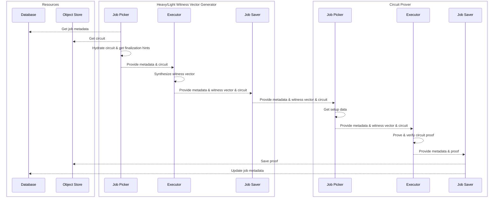

# Circuit Prover Service

This crate provides the building blocks for running circuit provers. Circuit proving is the heaviest part of the proving
process, being both the most time intensive and resource heavy part.

The primitives exported by this lib are job runners, namely:

- light_wvg_runner
- heavy_wvg_runner
- circuit_prover_runner

The rest of the codebase simply covers the internals of creating a runner, which is an implementation of
`ProverJobProcessor`.

## Witness Vector Generator Runner

Runners related to synthesizing Witness Vector (the CPU heavy part of circuit proving). They are tied to
`prover_jobs_fri` table and operate over `ProverJobsFri` object storage bucket.

Witness Vector Generators have big gaps in resource usages. Node proofs are the heavy jobs (~9GB RAM), whilst all others
are rather light (~2GB RAM).

There are 2 ways to deal with this:

1. run RAM left over / 9 which will result in RAM under utilization but simplify implementation
2. run multiple light WVG jobs, with a small amount of heavy WVG jobs.

This implementation favors number 2. As such, `MetadataLoader` abstraction was introduced to force loading lighter and
heavier jobs. Heavier picker will try to prioritize nodes. If none are available, it falls back to light jobs in order
to maximize usage.

### Job Picker

Interacts with the database to get a job (as described above), loads the data from object store and then hydrates the
circuit. In current implementation, Ram Permutation circuits are sent separately in order to save RAM in basic witness
generation & reduce the amount of storage used by object store. A further optimization will be introduced later on,
which will remove the necessity of witness hydration on circuits.

### Executor

Straight forward, synthesizes witness vector from circuit.

### Job Saver

If successful, will provide data to GPU circuit prover over a channel. If it fails, will mark the database as such and
will later be retried (as marked by Prover Job Monitor).

## GPU Circuit Prover

Runners related to generating the circuit proof & verifying it. They are tied to `prover_jobs_fri` table and operate
over `ProverJobs` object storage bucket.

### Job Picker

Waits on information from (multiple) WVGs sent via a channel.

### Executor

Generates & verifies the circuit proof (on GPU).

### Job Saver

Persists information back to `prover_jobs_fri` table. Note that a job is picked by WVG & finished by CP.

## Diagram

