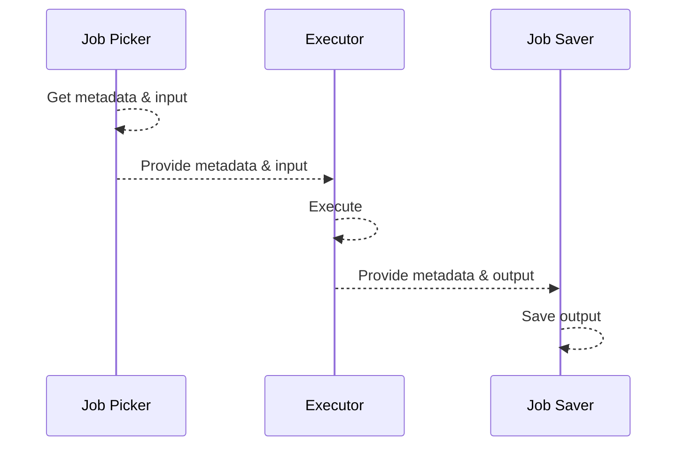

# Prover Job Processor

Prover Job Processor aims to be a small "framework" that allows building prover components at break-neck speeds.

## Context

Previously, prover components were hand tailored and had similar issues spread across the codebase. The "framework"'s
purpose is to standardize implementations and lift the undifferentiated work from prover component developers.

## How it works

The "framework" exports 4 main primitives:

- executor
- job_picker
- job_saver
- job_runner

### Executor

This is the most important trait. It is meant to execute the crypto primitives (or any other payloads) and defines what
the inputs are, what is the metadata that has to travel with it and what the output will be. Executors will receive
information from Job Picker and will provide it further to Job Saver.

For example, this could witness vector generator (synthesis of witness vector) or circuit prover (GPU circuit proving &
verification). Each would define what they need as input to operate and what they'll output.

### Job Picker

The starting point of the process. This trait is tied to Executor and will pick a metadata & input that corresponds to
the Executor. Job Picker picks information and provides it to Executor.

As examples, for witness vector generator it would be a query to the database & a query to object storage. For circuit
prover, it would be waiting on the communication channel between witness vector generator and circuit prover.

### Job Saver

The final point of the process. This trait is tied to Executor and will receive metadata & output that corresponds to
the Executor. Job Saver receives information from Executor and saves it.

Continuing with the same examples, for witness vector generator it would send the information to the communication
channel between witness vector generator & circuit prover. For circuit prover example, it would simply store the
information to database & object store.

### Job Runner

A wrapper over all 3 traits above, ensuring they communicate to each other as expected & they are spawned as
long-running threads.

## Diagram

## How to use it

If you want to create a new prover component, you'd need to first define what are the communication boundaries:

- metadata
- input
- output

With these out of the way, you can specify the Executor and even integrate the crypto primitive. At this point in time
you could fully cover it with unit tests to make sure the functionality works as intended.

Moving forward, you'll need to understand where you get this information and where you store it. These are your Job
Picker & Job saver. NOTE: Just like the executor, you need to implement the logic of executing/picking/saving a single
job, the "framework" will take care of looping it over and transmitting the details from one end to another.

Once done, provide them as arguments to JobRunner, call `your_job_runner.run()` and you're good to go.

TODO: Add example once testing is in place.

## More (internal) details

There are a few things that we've glossed over, let's get into details:

### Back-offs & cancelling

As you might've guessed, from a production point of view, you need to make sure that the process can die gracefully (k8s
sigterm), without being a nuisance to your dependencies (think DB or object store). As such, job picker can have an
optional component responsible for back-off & cancelling.

### How do components communicate

Internally, `JobRunner` wraps all 3 primitives into a task that are looping in a `while channel.recv() {}`. Each task is
slightly special, but the logic is far from complex.

### Limitations

Back off & cancelling is implemented only for job picker. Whilst it might sound inconvenient, in practice it works
great. When the cancel is received, the job picker will stop picking jobs, the executor will keep executing until there
are no more jobs in the receiver and the saver will save all jobs until there are no more jobs received from executor.

Backoff is currently hardcoded, but it is trivial to make it more configurable.

Whilst not a limitation, the first version is applied only to `circuit_provers`. It's very likely that more enhancements
will be needed to accommodate the rest of the codebase. Treat this as work in progress.

## Objectives

The "framework" wants to achieve the following:

1. Reduce code complexity & technical debt (modularize the codebase)
2. Empower testability of the prover codebase
3. Optimize prover components for speed and multi-datacenter/multi-cloud setups
4. Increase speed of delivery of prover components
5. Enable external shops to implement their own flavors of prover components

### 1. Reduce code complexity & technical debt (modularize the codebase)

Previously, most prover components were custom written. This meant that the same logic was reimplemented across multiple
components. Whilst the "framework" doesn't fully solve the problem, it drastically reduces the amount of code needed to
start a new components.

The rest of the code duplication can be tackled in the future as part of the node framework.

### 2. Empower testability of the prover codebase

Due to the entangled nature of the code, prover codebase was difficult to test. Current modular setup enables testing in
isolation each component. (not exactly true, given cryptography dependencies are too heavy - but will be true in the new
prover implementation)

### 3. Optimize prover components for speed and multi-datacenter/multi-cloud setups

Previously, provers were running "sync". Load job, once loaded, execute it, once executed, save its result. Whilst this
is fine, all steps can be done in parallel. This becomes super important when database and running machine are far away
and the round trip to database can cause up to 50% of the entire time. In a multi-cloud (read as future) setup, this
becomes even more painful. For free, we remove the current bottleneck from database (which was previous bottleneck, due
to # of connections).

### 4. Increase speed of delivery of prover components

Boojum release was rather slow and even releasing the current `circuit_prover` took longer than anticipated. Given
upcoming prover updates, this release sets us for success going forward. Furthermore, experimenting with different
setups becomes a matter of days, rather than months.

### 5. Enable external shops to implement their own flavors of prover components

Most external folks have to fork zksync-era and keep an up-to-date fork if anything needs to be modified. The framework
allows using the executors, whilst defining custom pickers/savers. This will be a massive time-save for any external
shop that wants to innovate on top of zksync-era's provers.
