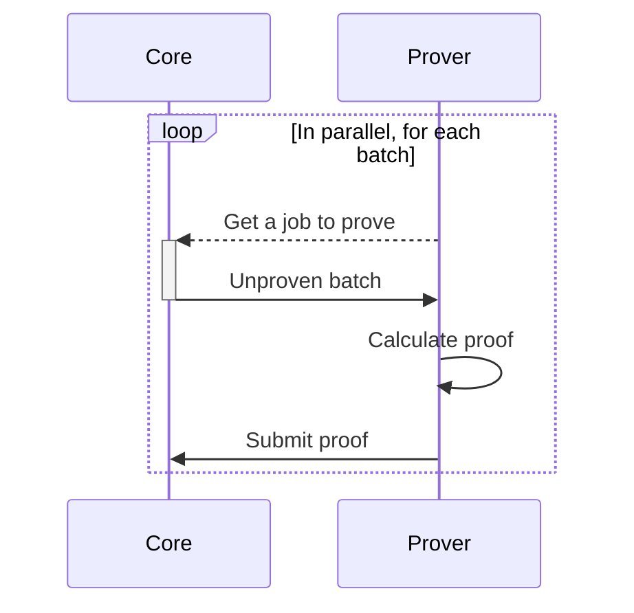
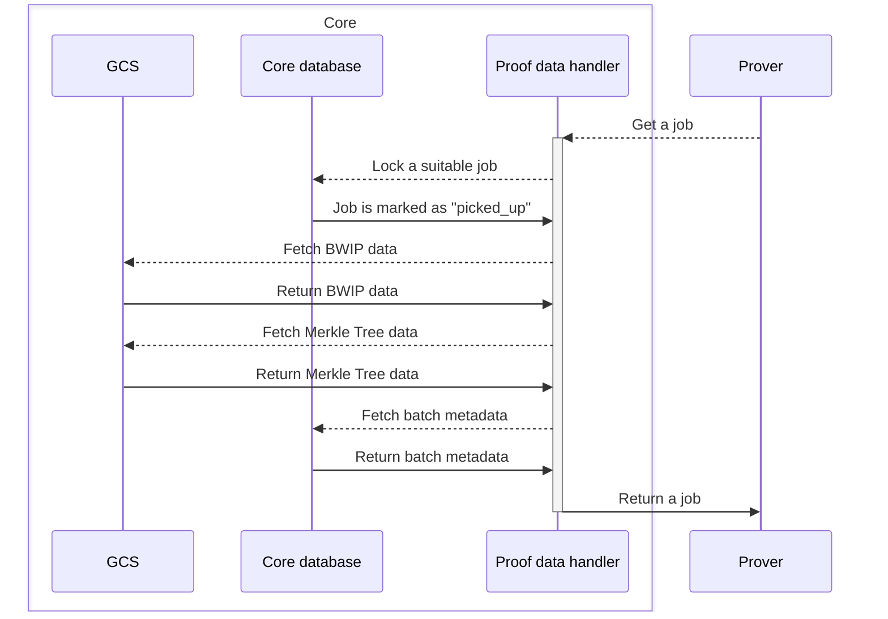
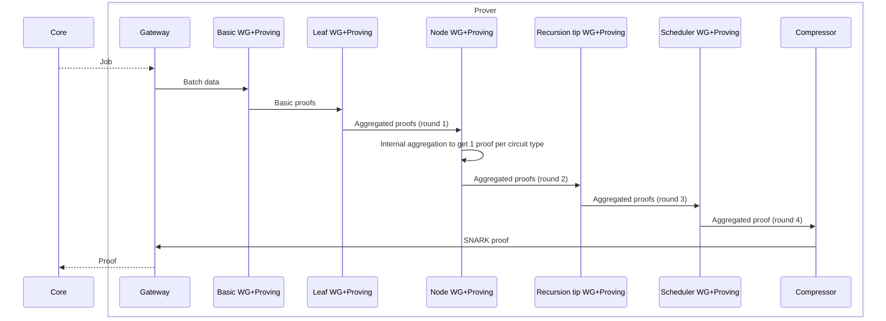
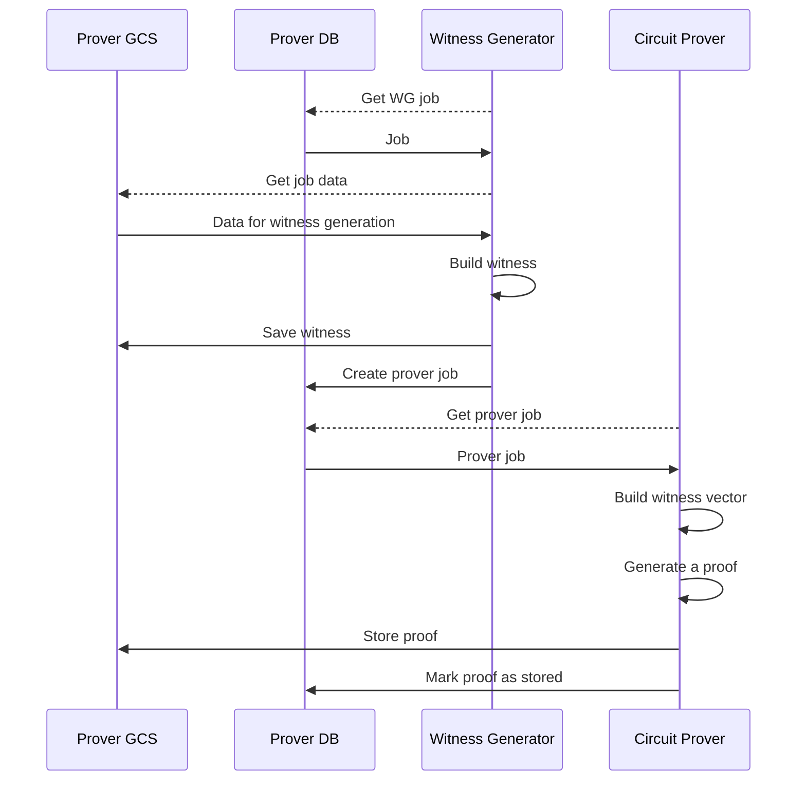

# Prover flow

In this section, we're going to learn what stages does the proof generation process have. It's a complex process, so
we'll be looking at it from four perspectives:

- Core<->Prover subsystem interactions.
- Core side of workflow.
- Prover pipeline.
- Batch proof generation.
- Infrastructure distribution.

After that, we will touch on how this flow is mapped on the actual production infrastructure.

## Core <-> Prover subsystem interactions

Core and prover subsystem are built in such a way that they are mostly isolated from each other. Each side has its own
database and GCS buckets, and both have "gateway" components they use for interaction.

The only exception here is the `house_keeper`: it's a component that exists as a part of the server, it's main purpose
is to manage jobs (and emit metrics for job management) in the prover workspace, but at the same time it has access to
both core and prover databases. The component will probably be split in the future and most of it will be moved to the
prover workspace.

Otherwise, the interaction between subsystems can be expressed as follows:



Core exposes an API, and Prover repeatedly polls this API, fetching new batch proof jobs and submitting batch proofs.

## Core side of workflow

Despite the fact that the prover is isolated from the core, the core has multiple components specifically designed to
prepare _inputs_ for proving.

The following diagram shows what happens under the hood when the prover subsystem requests a new job:



First of all, `proof_data_handler` will check if all the data required for the proof generation is already prepared by
the core. If so, it will lock the job so that it's not assigned twice, and will fetch required information from multiple
sources. Then this data is given to the prover together with the batch number.

## Prover pipeline

Once job is received by the prover, it has to go through several different stages. Consider this a mental model of the
pipeline, since in reality some stages happen in parallel, and some have different degree of sequencing.



When we process the initial job (during basic witness generation) we create many sub-jobs for basic proof generation.
Once they are processed, we start to aggregate generated proofs, and we do it in "levels". With each aggregation level,
we reduce the number of jobs.

Aggregation levels are commonly referred by numbers in the prover workspace, from 0 to 4. So if someone mentions
"aggregation round 2", they refer to the "node" stage, and round 4 corresponds to the "scheduler" stage. Proof
compression is considered separate operation, and doesn't have a numeric value.

Jobs within the aggregation round may also have different types, but this will be covered later.

The actual numbers may vary, but just for example there might exist a batch, so that it initially creates 10000 jobs,
which are processed as follows:

- On round 0, we also emit 10000 jobs. We aren't doing "actual" aggregation here.
- On round 1, we're turning 10000 jobs into 100.
- On round 2, we should turn these 100 jobs into at most 16. Depending on the batch parameters, it may required
  additional "iterations" of the stage. For example, after we processed the initial 100 jobs, we may get 35 proofs.
  Then, additional node level jobs will be created, until we reduce the number to at most 16.
- On round 3, we're turning 16 jobs into 1.
- On round 4, we already have just 1 job, and we produce a single aggregated proof.
- Finally, the proof is processed by the proof compressor and sent back to the core.

Once again, these numbers are just for example, and don't necessarily represent the actual state of affairs. The exact
number of jobs depend on number of txs in a batch (and what's done inside those txs) while the aggregation split
(mapping of `N circuits of level X` to `M circuits of level X + 1`) is determined by the config geometry.

## Actual proof generation

Every "job" we mentioned has several sub-stages. More precisely, it receives some kind of input, which is followed by
witness generation, witness vector generation, and circuit proving. The output of circuit proving is passed as an input
for the next "job" in the pipeline.

For each aggregation level mentioned above the steps are the same, though the inputs and outputs are different.



## Circuits

Finally, even within the same level, there may be different circuit types. Under the hood, they prove the correctness of
different parts of computations. From a purely applied point of view, it mostly means that initially we receive X jobs
of N types, which cause Y jobs of M types, and so on.

So, in addition to the aggregation layer, we also have a circuit ID. A tuple of aggregation round and circuit ID form an
unique job identifier, which allows us to understand which inputs we should receive, what processing logic we should
run, and which outputs we should produce.

As of Jul 2024, we have 35 circuit types mapped to 5 aggregation layers.

```admonish note
The specifics of each circuit type and aggregation layers are out of scope for this document, but you can find more
information on that in the [further reading](99_further_reading.md) section.
```

## Protocol versions

Finally, ZKsync has protocol versions, and it has upgrades from time to time. Each protocol version upgrade is defined
on L1, and the version follows SemVer convention, e.g. each version is defined as `0.x.y`. During the protocol version
upgrade, one of three things can change:

- Protocol _behavior_. For example, we add new functionality and our VM starts working differently.
- Circuits _implementation_. For example, VM behavior doesn't change, but we add more constraints to the circuits.
- Contracts changes. For example, we add a new method to the contract, which doesn't affect neither VM or circuits.

For the first two cases, there will be changes in circuits, and there will be new verification keys. It means, that the
proving process will be different. The latter has no implications for L2 behavior.

As a result, after upgrade, we may need to generate different proofs. But given that upgrades happen asynchronously, we
cannot guarantee that all the "old" batched will be proven at the time of upgrade.

Because of that, prover is protocol version aware. Each binary that participates in proving is designed to only generate
proofs for a single protocol version. Once the upgrade happens, "old" provers continue working on the "old" unproven
batches, and simultaneously we start spawning "new" provers for the batches generated with the new protocol version.
Once all the "old" batches are proven, no "old" provers will be spawned anymore.

## Recap

That's a quite sophisticated infrastructure, and it may be hard to understand it in one go. Here's a quick recap of this
page:

- Main components of the prover subsystem are house keeper, prover gateway, witness generator, circuit prover, and proof
  compressor.
- House keeper and prover gateway don't perform any significant computations, and there is just one instance of each.
- Witness generator, witness vector generator, and GPU prover work together as a "sub-pipeline".
- As of Jul 2024, the pipeline consists of 5 aggregation rounds, which are further split into 35
  `(aggregation_round, circuit_id)` pairs, followed by the proof compression.
- Provers are versioned according to the L1 protocol version. There may be provers with different versions running at
  the same time.
