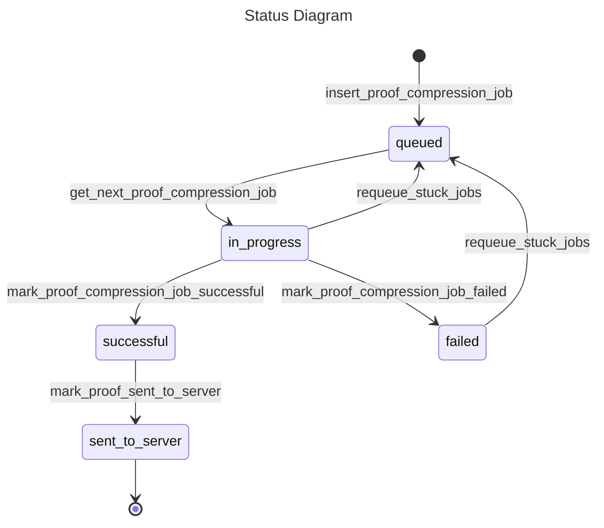

# FriProofCompressorDal

## Table Name

proof_compression_jobs_fri

## `status` Diagram

```mermaid
---
title: Status Diagram
---
stateDiagram-v2
[*] --> queued : insert_proof_compression_job
queued --> in_progress : get_next_proof_compression_job
in_progress --> successful : mark_proof_compression_job_successful
in_progress --> failed : mark_proof_compression_job_failed
failed --> queued : requeue_stuck_jobs
in_progress --> queued : requeue_stuck_jobs

successful --> sent_to_server : mark_proof_sent_to_server
sent_to_server --> [*]

```
