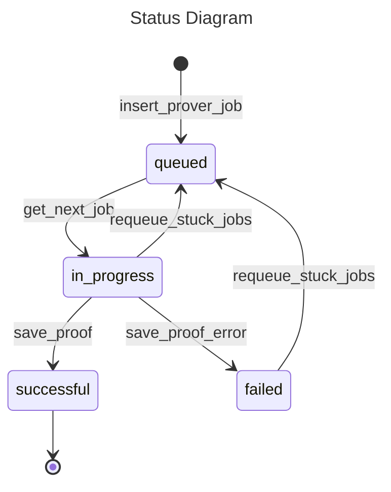

# FriProverDal

## Table Name

prover_jobs_fri

## `status` Diagram

```mermaid
---
title: Status Diagram
---
stateDiagram-v2
[*] --> queued : insert_prover_job
queued --> in_progress : get_next_job
in_progress --> successful : save_proof
successful --> [*]
in_progress --> failed : save_proof_error
failed --> queued : requeue_stuck_jobs
in_progress --> queued : requeue_stuck_jobs

```
