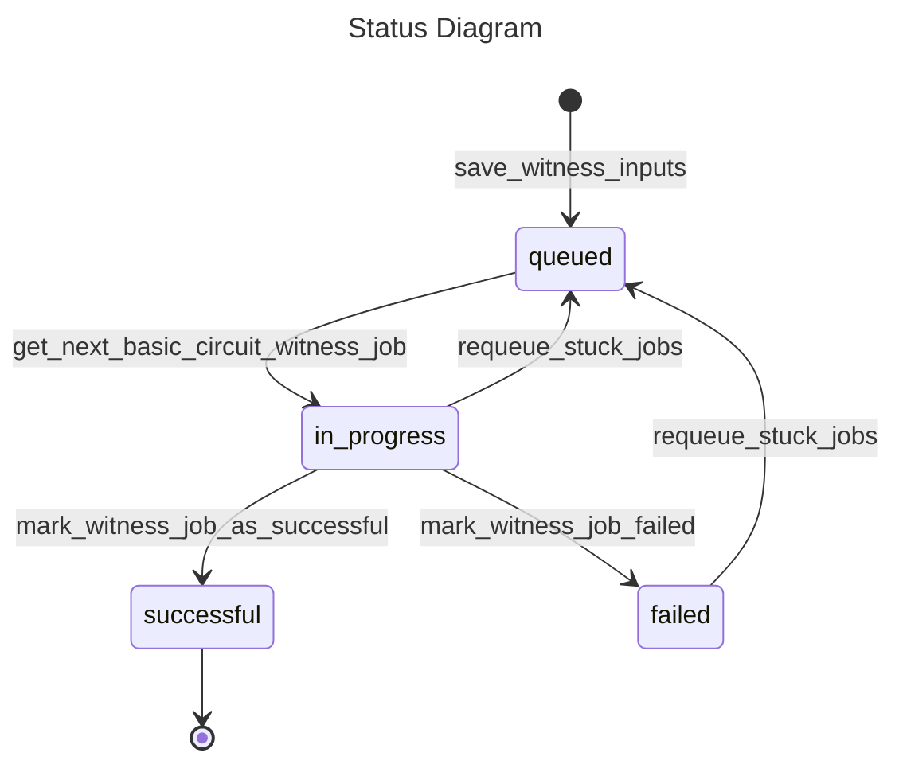
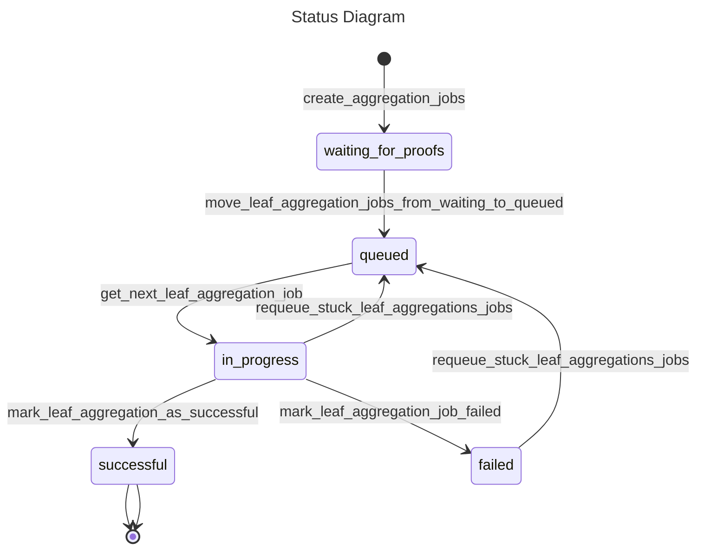
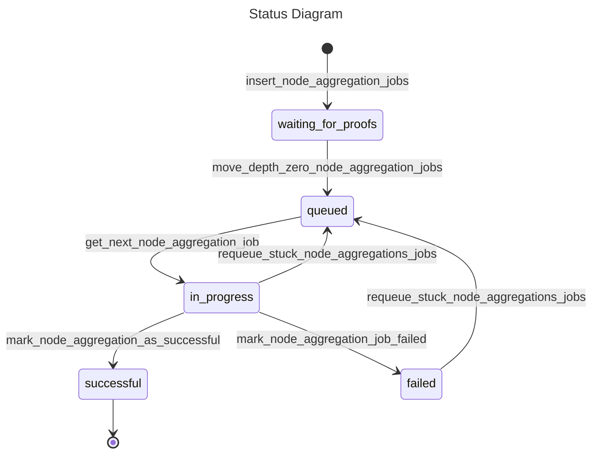
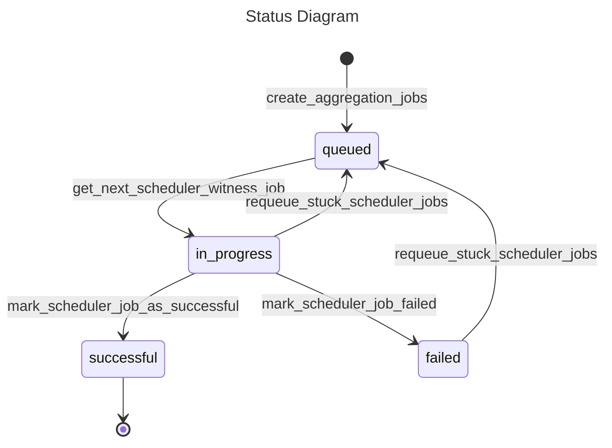

# FriWitnessGeneratorDal

## Table Name

witness_inputs_fri leaf_aggregation_witness_jobs_fri node_aggregation_witness_jobs_fri scheduler_witness_jobs_fri
scheduler_dependency_tracker_fri

### witness_inputs_fri

#### `status` Diagram

### leaf_aggregation_witness_jobs_fri

#### `status` Diagram

### node_aggregation_witness_jobs_fri

#### `status` Diagram

### scheduler_witness_jobs_fri

#### `status` Diagram

