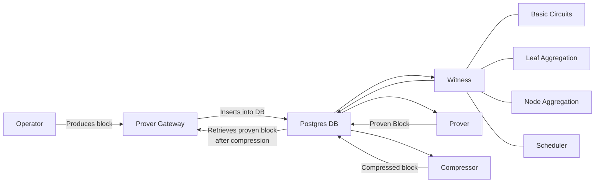

# FRI Prover

## running cpu prover

`zk f cargo +nightly-2023-08-21 run --release --bin zksync_prover_fri`

## running gpu prover(requires CUDA 12.0+)

`zk f cargo +nightly-2023-08-21 run --release --features "gpu" --bin zksync_prover_fri`

## Proving a block using CPU prover locally

### Overview of the pipeline

These are the main components to this process:

- Sequencer
- Prover gateway
- Witness
- Prover
- Compressor

All of them will be sharing information through a SQL database. The general idea is that the sequencer will produce
blocks and the gateway will place them into the database to be proven. Then, the rest of the components will pull jobs
from the database and do their part of the pipeline.



### Prerequisites

Make sure these dependencies are installed and available on your machine: [Installing dependencies](./setup-dev.md) Once
that is done, before starting, make sure you go into the root of the repository, then run

```
export ZKSYNC_HOME=$(pwd)
```

The whole setup below will NOT work if you don't have this environment variable properly set, as the entirety of the
`zk` CLI tool depends on it.

### Block proving with CPU

Below steps can be used to prove a block on local machine using CPU prover. This is useful for debugging and testing
Machine specs:

- CPU: At least 8 physical cores
- RAM: 60GB of RAM (if you have lower RAM machine enable swap)
- Disk: 400GB of free disk

1. Install the correct nightly version using command: `rustup install nightly-2023-07-21`
2. Initialize DB and run migrations. Go into the root of the repository, then run

   ```
   zk init
   ```

3. Generate the cpu setup data (no need to regenerate if it's already there). This will consume around 300Gb of disk.
   For this, move to the `prover` directory, and run

   ```
   ./setup.sh
   ```

   For the following steps, we recommend using `tmux` to run every command on a separate session, so you can attach to
   and monitor logs for each one.

4. Run the sequencer/operator. In the root of the repository:

   ```
   zk server --components=api,eth,tree,state_keeper,housekeeper,proof_data_handler
   ```

   to produce blocks to be proven

5. Run prover gateway to fetch blocks to be proven from server:

   ```
   zk f cargo run --release --bin zksync_prover_fri_gateway
   ```

6. Run 4 witness generators to generate witness for each round:

   ```
   API_PROMETHEUS_LISTENER_PORT=3116 zk f cargo run --release --bin zksync_witness_generator -- --round=basic_circuits
   API_PROMETHEUS_LISTENER_PORT=3117 zk f cargo run --release --bin zksync_witness_generator -- --round=leaf_aggregation
   API_PROMETHEUS_LISTENER_PORT=3118 zk f cargo run --release --bin zksync_witness_generator -- --round=node_aggregation
   API_PROMETHEUS_LISTENER_PORT=3119 zk f cargo run --release --bin zksync_witness_generator -- --round=scheduler
   ```

   These 4 steps can be reduced to a single command

   ```
   API_PROMETHEUS_LISTENER_PORT=3116 zk f cargo run --release --bin zksync_witness_generator -- --all_rounds
   ```

   Note that this will automatically open the three ports after the one specified in environmental variable, in this
   case 3117, 3118 and 3119.

7. Run prover to perform actual proving:

   ```
   zk f cargo run --release --bin zksync_prover_fri
   ```

8. Finally, run proof compressor to compress the proof to be sent on L1:

   ```
   zk f cargo run --release --bin zksync_proof_fri_compressor
   ```

## Proving a block using GPU prover locally

Below steps can be used to prove a block on local machine using GPU prover. Running a GPU prover requires a Cuda 12.0
installation as a pre-requisite, alongside these machine specs:

- CPU: At least 8 physical cores
- RAM: 16GB of RAM(if you have lower RAM machine enable swap)
- Disk: 30GB of free disk
- GPU: 1x Nvidia L4/T4 with 16GB of GPU RAM

1. Install the correct nightly version using command: `rustup install nightly-2023-07-21`
2. Initialize DB and run migrations: `zk init`
3. Generate the GPU setup data (no need to regenerate if it's already there). This will consume around 300Gb of disk.
   For this, move to the `prover` directory, and run

   ```
   ./setup.sh gpu
   ```

4. Run the sequencer/operator. In the root of the repository:

   ```
   zk server --components=api,eth,tree,state_keeper,housekeeper,proof_data_handler
   ```

   to produce blocks to be proven

5. Run prover gateway to fetch blocks to be proven from server:

   ```
   zk f cargo run --release --bin zksync_prover_fri_gateway
   ```

6. Run 4 witness generators to generate witness for each round:

   ```
   API_PROMETHEUS_LISTENER_PORT=3116 zk f cargo run --release --bin zksync_witness_generator -- --round=basic_circuits
   API_PROMETHEUS_LISTENER_PORT=3117 zk f cargo run --release --bin zksync_witness_generator -- --round=leaf_aggregation
   API_PROMETHEUS_LISTENER_PORT=3118 zk f cargo run --release --bin zksync_witness_generator -- --round=node_aggregation
   API_PROMETHEUS_LISTENER_PORT=3119 zk f cargo run --release --bin zksync_witness_generator -- --round=scheduler
   ```

7. Run prover to perform actual proving: `zk f cargo run --features "gpu" --release --bin zksync_prover_fri`

8. Run 5 witness vector generators to feed jobs to GPU prover:

   ```
   FRI_WITNESS_VECTOR_GENERATOR_PROMETHEUS_LISTENER_PORT=3416 zk f cargo run --release --bin zksync_witness_vector_generator
   FRI_WITNESS_VECTOR_GENERATOR_PROMETHEUS_LISTENER_PORT=3417 zk f cargo run --release --bin zksync_witness_vector_generator
   FRI_WITNESS_VECTOR_GENERATOR_PROMETHEUS_LISTENER_PORT=3418 zk f cargo run --release --bin zksync_witness_vector_generator
   FRI_WITNESS_VECTOR_GENERATOR_PROMETHEUS_LISTENER_PORT=3419 zk f cargo run --release --bin zksync_witness_vector_generator
   FRI_WITNESS_VECTOR_GENERATOR_PROMETHEUS_LISTENER_PORT=3420 zk f cargo run --release --bin zksync_witness_vector_generator
   ```

9. Finally, run proof compressor to compress the proof to be sent on L1:
   `zk f cargo run --release --bin zksync_proof_fri_compressor`

## Checking the status of the prover

Once everything is running (either with the CPU or GPU prover), the server should have at least three blocks, and you
can see the first one by running

```
curl -X POST -H 'content-type: application/json' localhost:3050 -d '{"jsonrpc": "2.0", "id": 1, "method": "zks_getBlockDetails", "params": [0]}'
```

and then similarly for blocks number `1` and `2` by changing the parameters.

The prover gateway will then fetch block number 1 to prove and start the entire proving pipeline, which starts out by
generating the witness, then passing it to the prover, then to the compressor to wrap it inside a SNARK to send to L1.

You can follow the status of this pipeline by running

```
zk status prover
```

This might take a while (around an hour and a half on my machine using the CPU prover), you can check on it once in a
while. A successful flow should output something like

```
==== FRI Prover status ====
State keeper: First batch: 0, recent batch: 1
L1 state: block verified: 1, block committed: 1
Verification key hash on contract is 0x4be443afd605a782b6e56d199df2460a025c81b3dea144e135bece83612563f2
Verification key in database is 0x4be443afd605a782b6e56d199df2460a025c81b3dea144e135bece83612563f2
Verifier hash matches.
Verifier params on contract are 0x5a3ef282b21e12fe1f4438e5bb158fc5060b160559c5158c6389d62d9fe3d080, 0x72167c43a46cf38875b267d67716edc4563861364a3c03ab7aee73498421e828, 0x0000000000000000000000000000000000000000000000000000000000000000
Verification params match.
Next block that should be verified is: 2
Checking status of the proofs...
Proof progress for 1 : 111 successful, 0 failed, 0 in progress, 0 queued.  Compression job status: successful
```

The most important thing here is the following line

```
L1 state: block verified: 1, block committed: 1
```

which means the proof for the block was verified on L1.

## Performing circuit upgrade

Performing circuit upgrade requires crypto library to be updated and generating new setup data, verification key,
finalization hints if the circuit changes. Below steps can be used to perform circuit upgrade:

1. checkout if the circuit geometry has changed in the new version of the circuit by running the
   [workflow](https://github.com/matter-labs/zkevm_test_harness/actions/workflows/geometry-config-generator.yml) in
   harness and merge the generated PR.
2. update the relevant crypto dependencies(boojum, zkevm_circuit, harness, etc) in `Cargo.lock`, for example:
   `cargo update -p zkevm_test_harness@1.4.0`
3. prepare an PR with the updated dependencies [sample PR](https://github.com/matter-labs/zksync-2-dev/pull/2481).
4. Run the verification key
   [workflow](https://github.com/matter-labs/zksync-era/actions/workflows/fri-vk-generator.yaml) against the PR to
   generate the verification key and finalization hints for the new circuit.
5. Only once the above verification key workflow is successful, start the setup-data generation(cpu, gpu setup data
   generation can be done in parallel), this step is important, since the setup data requires the new VK, we need to
   wait for it to finish.
6. Run the cpu setup data generation
   [workflow](https://github.com/matter-labs/zksync-era/actions/workflows/fri-setup-data-generator.yml) against the PR
   to generate the cpu setup data.
7. Run the gpu setup data generation
   [workflow](https://github.com/matter-labs/zksync-era/actions/workflows/fri-gpu-setup-data-generator.yml) against the
   PR to generate the gpu setup data.
8. Once the setup data generation workflows are successful, update the PR with `setup_keys_id` id in
   [build-docker-from-tag.yml](../../.github/workflows/build-docker-from-tag.yml) and in
   [fri-gpu-prover-integration-test.yml](../../.github/workflows/fri-gpu-prover-integration-test.yml), make sure to only
   do it from `FRI prover` not old.
9. Run the GPU integration test
   [workflow](https://github.com/matter-labs/zksync-era/actions/workflows/fri-gpu-prover-integration-test.yml) against
   the PR to verify the GPU prover is working fine with new circuits.
